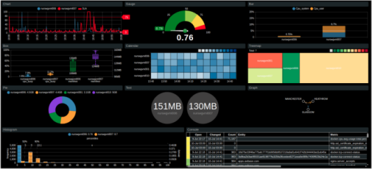

# Introduction

**Axibase Charts** is a graphics library for visualizing time series data with [widgets](./widgets/README.md).

Charts implement a simple, yet powerful, syntax which is closely integrated with [ATSD](https://axibase.com/docs/atsd/) schema to build [real-time dashboards](https://apps.axibase.com/chartlab/2ef08f32) with declarative settings.

## Interactive Analytics

* Create [derived series](https://apps.axibase.com/chartlab/62e6c18f/3/).
* Join [multiple metrics](https://apps.axibase.com/chartlab/e0e0be77).
* Re-compute aggregates [on the fly](https://apps.axibase.com/chartlab/57b0a961/3/).

## Historical and Streaming Data

* Streaming parsing of compressed historical data.
* [Incremental](https://apps.axibase.com/chartlab/cc79ed62) real-time data loading.

## Development Tools

### Sandbox Apps

* [ChartLab](https://axibase.com/use-cases/tutorials/shared/chartlab.html)
* [Trends](https://axibase.com/use-cases/tutorials/shared/trends.html)

### Plugins

The [Axibase Charts plugin](https://marketplace.visualstudio.com/items?itemName=Axibase.axibasecharts-syntax) for the Microsoft [VSCode editor](https://code.visualstudio.com/) is a design tool that simplifies portal development and data exploration.

The [plugin](https://marketplace.visualstudio.com/items?itemName=Axibase.axibasecharts-syntax) implements the following functionality:

* Syntax Validation
* Syntax Highlighting
* Settings Reference
* Live Preview
* Code Formatting
* Auto-completion

## Sample Apps

* [Batch Viewer](https://apps.axibase.com/batch)
* [Cross Filter](https://axibase.com/docs/atsd/integration/data-applications/cross-filter.html)
* [Power Meter Reporter](https://axibase.com/docs/atsd/integration/data-applications/power-meter-reporter.html)
* [Data Slider](https://axibase.com/docs/atsd/integration/data-applications/data-slider.html)
* [Performance Viewer](https://axibase.com/docs/atsd/integration/data-applications/performance-viewer.html)
* [Data Monitor](https://axibase.com/docs/atsd/integration/data-applications/data-monitor.html)

---

## Syntax and Configuration

* [Control Structures](./syntax/control-structures.md)
* [Label Formatting](./syntax/label-formatting.md)
* [Alert Expressions](./syntax/alert-expression.md)
* [Baselines](./configuration/baselines.md)
* [Thresholds and SLA](./syntax/thresholds.md)
* [Extended Aggregators](./syntax/extended-aggregators.md)
* [Linking](./syntax/linking.md)
* [Wildcards](./syntax/wildcards.md)
* [Functions](./syntax/functions.md)  
* [User-Defined Functions](./syntax/udf.md)
* [Drop-down Lists](./configuration/drop-down-lists.md)
* [Inheritance](./configuration/inheritance.md)
* [Display Filters](./configuration/display-filters.md)
* [Computed Metrics](./configuration/computed-metrics.md)
* [Summary Portals](./configuration/summary-portals.md)
* [Meta Data](./configuration/meta-data.md)

---

## Widgets

Time Chart | Gauge Chart | Bar Chart
:--:|:--:|:--:
 |  | 

Histogram Chart | Box Chart | Calendar Chart
:--:|:--:|:--:
 |  | 

Treemap Widget | Pie Chart | Graph Widget
:--:|:--:|:--:
 |  | 

Text Widget | Page Widget | Alert Table
:--:|:--:|:--:
 |  | 

Streaming Table | Property Table
:--:|:--:
 | 
