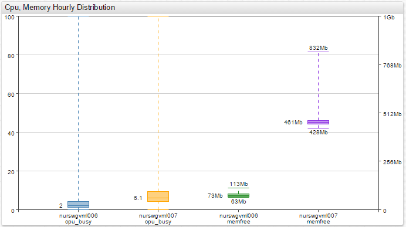
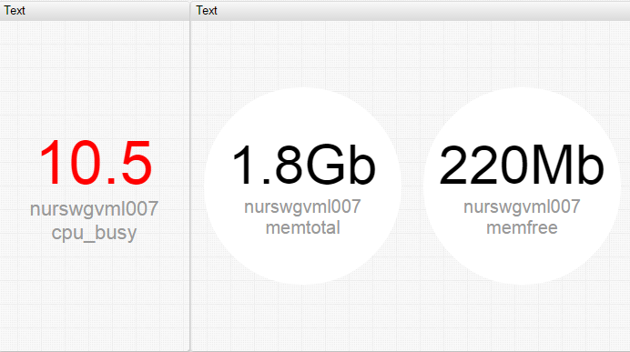
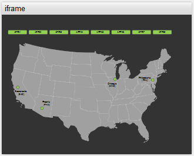
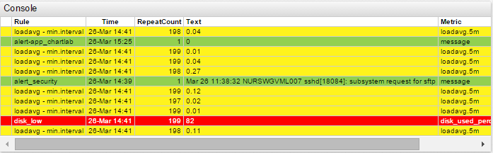
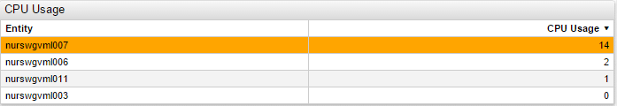

# Axibase Charts

## Status

The new home of Axibase Charts Documentation is under development. See [Legacy Documentation](https://axibase.com/products/axibase-time-series-database/visualization/).

## Overview

Charts is a collection of time-series [widgets](./widgets/README.md) presented in grid layout.

The Charts library implements a simple yet powerful syntax, closely integrated with [ATSD](https://axibase.com/docs/atsd/) schema for building [real-time dashboards](https://apps.axibase.com/chartlab/2ef08f32) in a declarative way.

### Interactive Analytics

* Create [derived series](https://apps.axibase.com/chartlab/62e6c18f/3/).
* Join [multiple metrics](https://apps.axibase.com/chartlab/e0e0be77).
* Re-compute aggregates [on the fly](https://apps.axibase.com/chartlab/57b0a961/3/).

### Historical and Streaming Data

* Streaming parsing of compressed historical data.
* [Incremental](https://apps.axibase.com/chartlab/cc79ed62) real-time data loading.

---

## Tools

* [ChartLab](https://axibase.com/use-cases/tutorials/shared/chartlab.html)
* [Trends](https://axibase.com/use-cases/tutorials/shared/trends.html)

---

## Syntax and Configuration

* [Control Structures](./syntax/control-structures.md)
* [Label Formatting](./syntax/label-formatting.md)
* [Alert Expressions](./syntax/alert-expression.md)
* [Baselines](./syntax/baselines.md)
* [Thresholds and SLA](./syntax/thresholds.md)
* [Extended Aggregators](./syntax/extended-aggregators.md)
* [Linking](./syntax/linking.md)
* [Wildcards](./syntax/wildcards.md)
* [Functions](./syntax/functions.md)  
* [Used-Defined Functions](./syntax/udf.md)
* [Drop-down Lists](./configuration/drop-down-lists.md)
* [Inheritance](./configuration/inheritance.md)
* [Display Filters](./configuration/display-filters.png)
* [Computed Metrics](./configuration/computed-metrics.md)
* [Summary Portals](./configuration/summary-portals.md)
* [Meta Data](./configuration/meta-data.md)

---

## Widgets

Time Chart | Gauge Chart | Bar Chart
:--:|:--:|:--:
 |  | 

Histogram Chart | Box Chart | Calendar Chart
:--:|:--:|:--:
 |  | 

TreeMap Widget | Pie Chart | Graph Widget
:--:|:--:|:--:
 |  | 

Text Widget | Page Widget | Alert Console
:--:|:--:|:--:
 |  | 

Streaming Table | Property Table
:--:|:--:
 | 