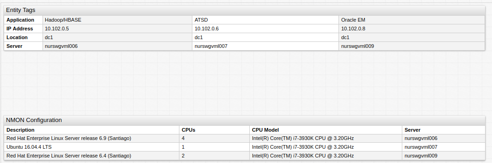
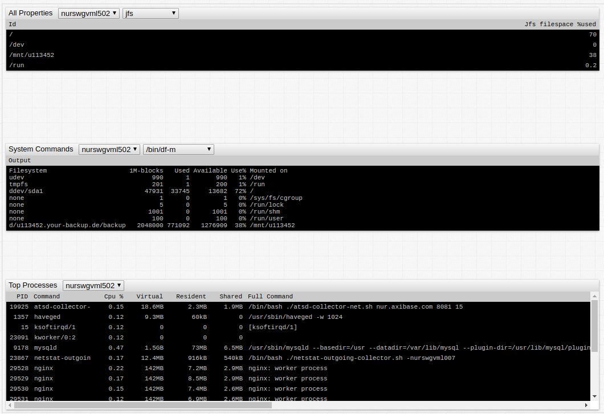
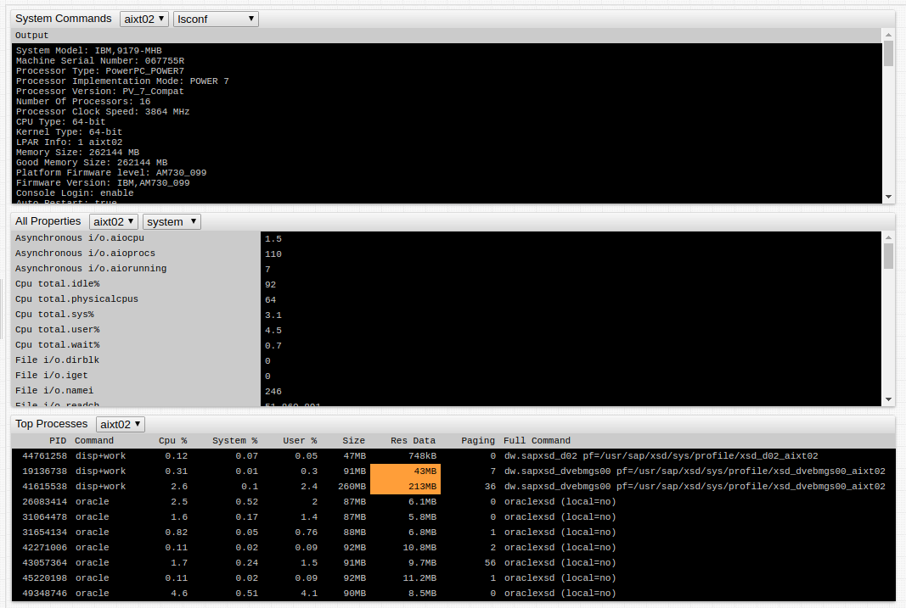

# Configuration

The Property widget displays `entity tags` and `properties` in tabular format.

The list of selected properties is identified with the `type` field, whereas `$entity_tags` is reserved for `entity tags`.

```ls
[widget]
  type = property
  title = Entity Tags
  column-entity = Server
  column-time = null
  [column]
    key = app
    label = Application
  [column]
    key = ip
    label = IP Address
  [column]
    key = loc_area
    label = Location
  [property]
    type = $entity_tags
    entity = nurswgvml007
```



[](https://apps.axibase.com/chartlab/aeec99b1/2)

When the list of columns is not known in advance or there are too many, use `expand-tags` to display all tags returned for the given type.

```ls
[widget]
type = property
title = Entity Tags
column-time = null
expand-tags = true
transpose = true

  [property]
  type = $entity-tags
  entity = nurswgvml007
```



[](https://apps.axibase.com/chartlab/6d918310/1)

Configure the widget to display a drop-down list with `type` or `entity` options.



[](https://apps.axibase.com/chartlab/6d918310/5/)