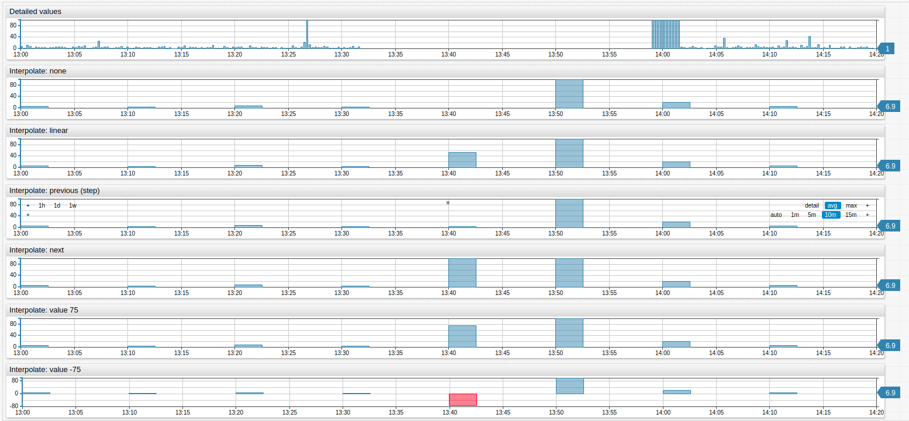
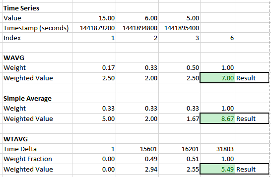
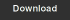
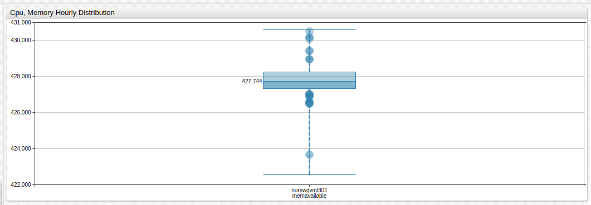
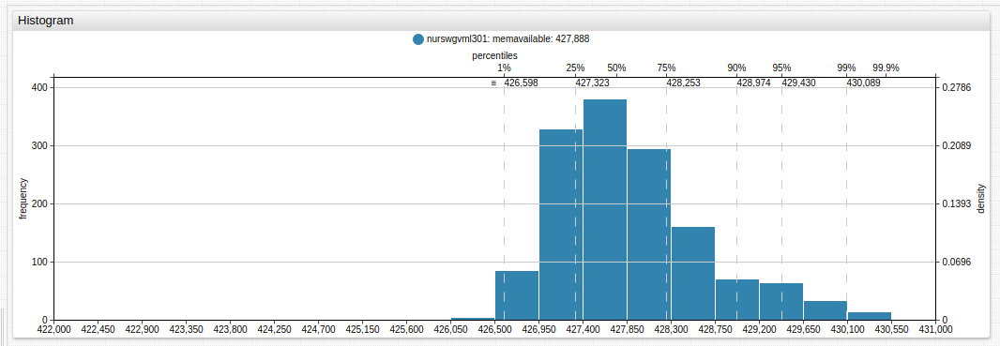
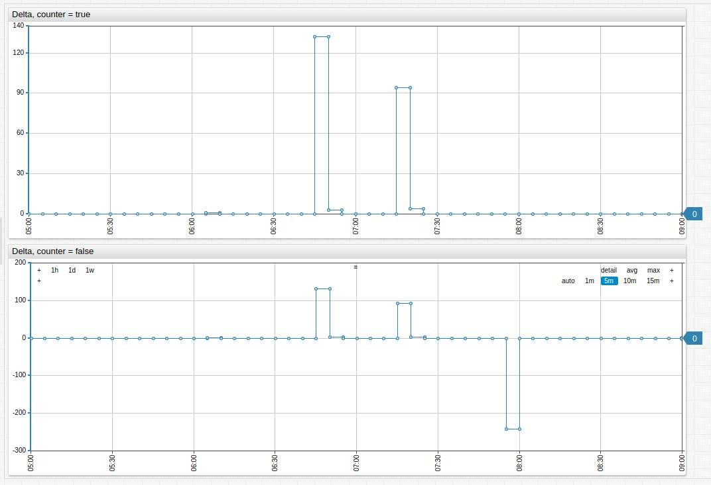
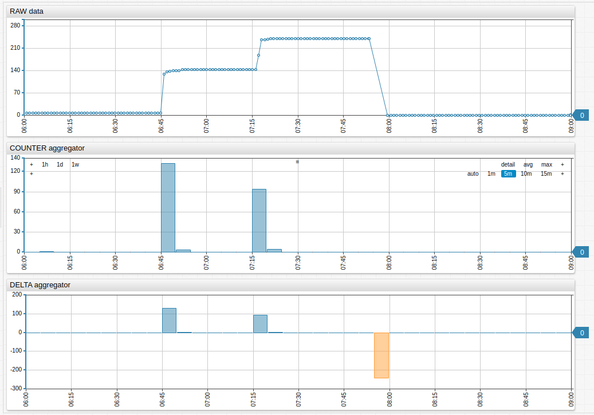

# Aggregators

Charts Syntax supports a number of aggregation functions for inline computation that does not modify the underlying data.

| Syntax | Description
|--- |--- |
| `count` | Number of samples during the period. |
| `min` | Minimum value during the period. |
| `max` | Maximum value during the period. |
| `sum` | Sum of values during the period. |
| `avg` | Average value during the period. |
| `percentile_999`<br> `percentile_995`<br> `percentile_99`<br> `percentile_95`<br> `percentile_90`<br> `percentile_75`<br> `percentile_50`<br> | `percentile_n` is a number which is greater than `n` percentage of samples in the period. For example, `percentile_995` (99.5%) represents a number greater than 99.5% of all observations received during the period. The remaining 0.5% of all observations are greater than `percentile_995`.<br>Argument can be any number between `0` and `100`. <br>Example: `percentile_25`. The NIST (National Institute of Standards and Technology) method is used to calculate percentiles. |
| `median` | Same as `percentile_50`. |
| `standard_deviation` | Standard deviation of values during the period.<br>`Square root` of the variance. |
| `first` | First value received during the period. |
| `last` | Last value received during the period. |
| `delta` | Delta is the difference between the last value in the period and the last value in the previous period. If no last value is present in the previous period, then `delta` is the difference between the last and first values during the current period.<br>See also `counter` aggregator. |
| `counter` | Returns sum of the differences between consecutive values in the period. If the difference between any two values is negative, the difference is replaced with the value itself. If the difference between values is always non-negative, the `counter` aggregator returns the same value as the `delta` aggregator. See this [example](https://apps.axibase.com/chartlab/2f607d1b/17/) to better understand the difference between`COUNTER` and `DELTA`. |
| `wtavg` | An average created via the multiplication of each component by a factor reflecting importance.<br>Weight is assigned based on timestamps rather than index. Data points with older timestamps contribute less to the weighted mean than more recent data.<br>The weight of a sample is proportional to the `current_time – first_time + 1` (in seconds), where `current_time` is the timestamp of the sample, and `first_time` is the timestamp of the first sample received during the period.<br>Weights are normalized, their sum is equal to `1`. See the [calculation example](#avg-wavg-and-wtavg-example) below. |
| `wavg` | A weighted average of samples received during the period.<br>The weight of a sample is proportional to the index of the sample in the time-ordered array of all samples during the period.<br>Weights are normalized, their sum is equal to `1`.<br>A weighted average is sum of sample values multiplied by weight. See the [calculation example](#avg-wavg-and-wtavg-example) below. |
| `min_value_time` | Time when the minimum value (`min`) occurred during the period. |
| `max_value_time` | Time when the maximum value (`max`) occurred during the period. |
| `threshold_count` | Number of threshold violations during the period.<br>A violation is a sequence of one or more successive data points exceeding the specified threshold.<br>Example: The following values are collected every `5` minutes: `1, 2, 5, 7, 1, 1`. <br>If the threshold is set to `4`, then one sequence (`5`,`7`) exceeds the threshold. |
| `threshold_duration` | Total duration of threshold violations during the period in milliseconds.<br>A violation is a sequence of one or more successive data points exceeding the specified threshold.<br>Example: The following values are collected every 5 minutes: `1, 2, 5, 7, 1, 1`.<br>If the threshold is set to 4, then one sequence (`5`,`7`) exceeds the threshold and its total duration based on linear interpolation is `550` seconds.<br>If the threshold is `5`, then duration is `850` seconds.<br>For periods at the beginning of the timespan, at the end of the timespan or after a missing period, the value at the beginning of the period is set to the first value, and the value at the end of the period is set to last value. |
| `threshold_percent` | Percent of time during which the value remained below threshold (no violation).<br>Formula: `threshold_percent = 100 - threshold_duration / period_duration * 100` |

## Interpolation Functions

If the period does not contain any detailed values, they are excluded from the results. Aggregator behavior can be modified by specifying an interpolation function.

|Function |Description |
|--- |--- |
|`NONE` |No interpolation. Periods without any raw values are excluded from results. |
|`LINEAR` |Calculate period value using linear interpolation between previous and next period values. |
|`PREVIOUS` |Set value for the period based on the previous period’s value. |
|`NEXT` |Set value for the period based on the next period’s value. |
|`VALUE` |Set value for the period to a specific number. |

> `NONE` is the default interpolation setting.

### Examples



[](https://apps.axibase.com/chartlab/d8c03f11/3/#fullscreen)

## `AVG`, `WAVG`, and `WTAVG` Example

See the Excel spreadsheet for testing and calculation.



[](./resources/aggregators.xlsx)

`wtavg()`: Weighted time average.

Calculation: `Weight = (sample.time - first.time)/(last.time - first.time + 1)`

## Aggregation Examples

| Timestamp | Value | Aggregators |
| --- | --- | --- |
| `2015-09-10 10:00:00` | `11` | `first = 11` `delta = 0` |
| `2015-09-10 11:00:00` | `9` | `min = 9 | min_value_time = 2015-09-10 11:00:00` `delta = -2` |
| `2015-09-10 12:00:00` | `14` | `delta = 5` |
| `2015-09-10 13:00:00` | `19` | `delta = 5` |
| `2015-09-10 14:00:00` | `21` | `max = 21 | max_value_time = 2015-09-10 14:00:00` `delta = 2` |
| `2015-09-10 15:00:00` | `15` | `delta = -6` |
| `2015-09-10 16:00:00` | `14` | `delta = -1` |
| `2015-09-10 17:00:00` | `11` | `delta = -3` |
| `2015-09-10 18:00:00` | `16` | `delta = 5` |
| `2015-09-10 19:00:00` | `14` | `delta = -2` |
| `2015-09-10 20:00:00` | `13` | `last = 13` `delta = -1` |

## Aggregators

* Threshold is `20`.
* Period is set to `11 hours` to includes the complete data set.

> Period `starttime` is inclusive and `endtime` is exclusive:
> * `startime = 2015-09-14 10:00:00` includes data points occurring exactly at `10:00:00` and later.<br>
> * `Endtime = 2015-09-14 11:00:00` includes data points occurring up to `10:59:59`, excluding points that occurred at `11:00:00` and later.

```txt
count                  = 11
first                  = 11
last                   = 13
min                    = 9
min_value_time         = 2015-09-10 11:00:00
max                    = 21
max_value_time         = 2015-09-10 14:00:00
sum                    = 157
avg                    = 14.27
percentile_999         = 21
percentile_995         = 21
percentile_99          = 21
percentile_95          = 21
percentile_90          = 20.6
percentile_75          = 16
percentile_50 (median) = 14
standard_deviation     = 3.47
wavg                   = 14.47
wtavg                  = 14.51
threshold_count        = 1
threshold_duration     = 3600000
threshold_percent      = 88.9
```

## **ChartLab** Examples

**Box Chart With `percentile`**:



[](https://apps.axibase.com/chartlab/09315b88/7/)

**Histogram With `percentile`**:



[](https://apps.axibase.com/chartlab/09315b88/6/)

**Time Chart With `delta`**:



[](https://apps.axibase.com/chartlab/09315b88/5/)

Time Chart With `count` and `delta` Aggregators:



[](https://apps.axibase.com/chartlab/54e57188)