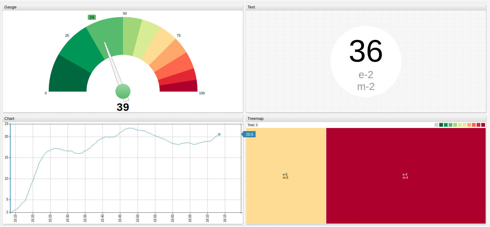

# Audio Alerts

## Overview

When an [`alert-expression`](../syntax/alert-expression.md) evaluates to `true`, play an audio file in your browser. Either set the full URK path to the audio file, or store the  audio file locally on your ATSD installation.

> Store audio files in the `/opt/atsd/atsd/conf/portal` directory of your ATSD installation.

* The following path to audio files stored on the ATSD file system must be set in the `audio-alert` setting: `/portal/resource/alarm.ogg`
  * Note that files located in the specified directory must always be referenced with the addition of `/resource/` before audio file name.

Audio is played only on `alert-expression` status change, such as `false` evaluating to `true` or `true` evaluating to `false`.

Play different audio based on expression, such as one track for `alert-ON` and another track on `alert-OFF`.

* Supported formats: `mp3`, `ogg`, `wav`.

> Internet Explorer 11 does not support `ogg` format.

Use Audio Alerts in any widget that supports `alert-expression` settings.

### **ChartLab** Example

### Example Audio Files

Download the following example audio files and save them in the appropriate directory to use them locally.

* [`alarm.mp3`](https://apps.axibase.com/chartlab/portal/alarm.mp3)
* [`bell.mp3`](https://apps.axibase.com/chartlab/portal/bell.mp3)
* [`bicycle.mp3`](https://apps.axibase.com/chartlab/portal/bicycle.mp3)
* [`dial.mp3`](https://apps.axibase.com/chartlab/portal/dial.mp3)
* [`down.mp3`](https://apps.axibase.com/chartlab/portal/down.mp3)
* [`siren.mp3`](https://apps.axibase.com/chartlab/portal/siren.mp3)
* [`up.mp3`](https://apps.axibase.com/chartlab/portal/up.mp3)

## Browser Compatibility

Browser | `.mp3` | `.wav` | `.ogg`
--|--|--|--
Internet Explorer | :heavy_check_mark: | :heavy_multiplication_x: | :heavy_multiplication_x:
Chrome | :heavy_check_mark: | :heavy_check_mark: | :heavy_check_mark:
Firefox | :heavy_check_mark: | :heavy_check_mark: | :heavy_check_mark:
Safari | :heavy_check_mark: | :heavy_check_mark: | :heavy_multiplication_x:

## `[widget]` Settings

Name | Syntax | Description | Example
--|--|--|--
Audio On Load | `audio-onload` | Play audio alert on initial widget load if `audio-alert` setting contains path to audio file and `audio-onload = true`. Default value, `false`.| 

## `[series]` Settings

Name | Syntax | Description | Example |
--|--|--|--
Audio Alert | `audio-alert = (alert > 0.5) ? '/portal/resource/alarm.ogg' : '/portal/resource/klaxon.ogg'` | Define the audio file to play when `alert-expression` evaluates to `true` Audio is only played on `alert-expression` status change such as `true` to `false` or vise versa. | 