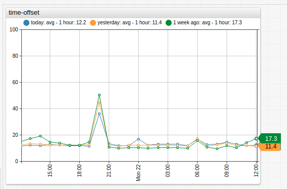
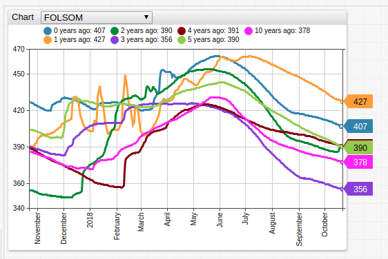
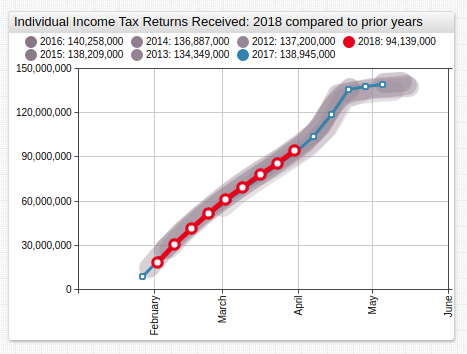

# Baselines

Multiple timespans of the same series can be combined in one widget using the `time-offset` setting to compare for example, current data versus data from some time ago.

```ls
[series]
  label = today
[series]
  label = yesterday
  time-offset = 1 day
[series]
  label = 1 week ago
  time-offset = 1 week
```



[](https://apps.axibase.com/chartlab/e7e3938d)

## Additional Examples

See [ATSD Use Cases](https://axibase.com/use-cases/) for other uses for the `time-offset` setting:

1. [California Water Portals](https://axibase.com/use-cases/chart-of-the-day/water-portal/)

    ```ls
    list ofs = 0, 1, 2, 3, 4, 5, 10
    for offs in ofs
    [series]
      label = @{offs} years ago
      time-offset = @{offs} year
        endfor
    ```

    

    [](https://apps.axibase.com/chartlab/002d531e#)

1. [Tax Day 2018: Americans Reverse the Late-Filing Trend](https://axibase.com/use-cases/research/irs-tax-filings/)

    ```ls
    [widget]
     var offsets = range(2,6)
     for ofs in offsets
     [series]
      label = @{2018-ofs}
      time-offset = @{ofs} year
    ```

    

    [](https://apps.axibase.com/chartlab/fd986f58)
