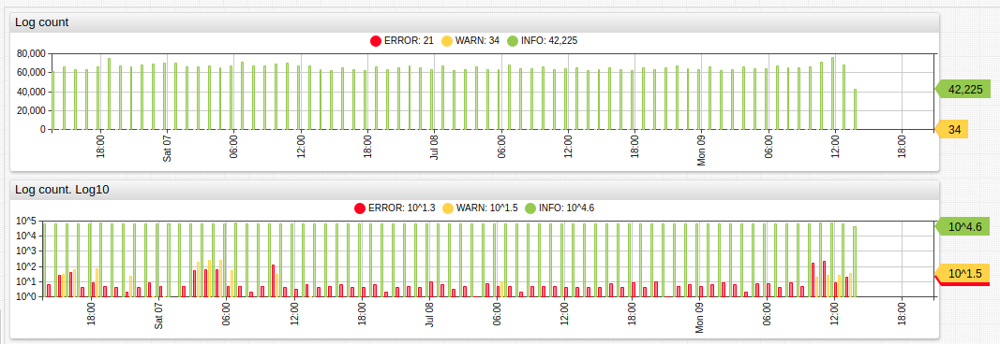
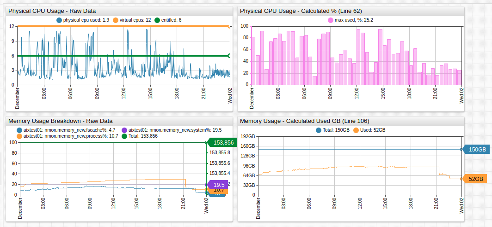
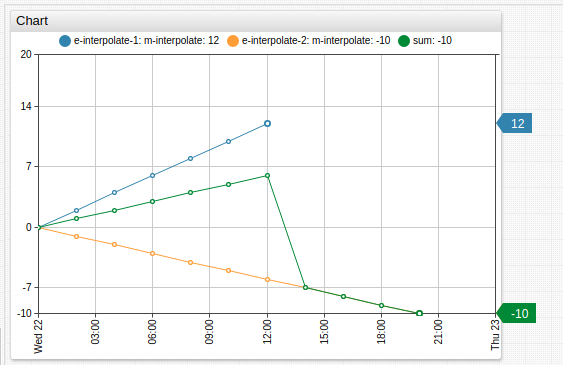
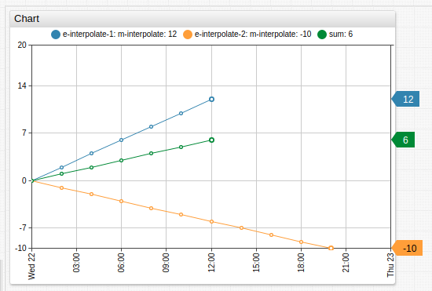

# Computed Metrics

Create computed metrics in any portal using existing metrics. Manipulate underlying series or join multiple series to perform ratio or roll-up  calculations, such as percentage or average values respectively.

Use the `replace-value` setting to replace the input value when no references to other series are required.



[](https://apps.axibase.com/chartlab/2f607d1b/12/#)

In the example above, the second chart uses `log10` values to compare samples of different magnitude.

```css
replace-value = Math.log10(value)
```



[](https://apps.axibase.com/chartlab/e0e0be77)

In this example, the underlying series are hidden and another visible series is created which displays the ratio of two hidden series multiplied to a percentage value. To reference other series, such underlying series must be assigned unique identifiers with the alias setting.

```css
[series]
  metric = nmon.logical_partition.physicalcpu
  alias = pcpu
  display = false
[series]
  metric = nmon.logical_partition.virtualcpus
  alias = vcpu
  display = false
[series]
  label = max used, %
  value = 100*value('pcpu')/value('vcpu')
  color = violet
```

In addition to obtaining the last value at a given time for the referenced series with the `value('alias')` function, it is also possible to obtain period statistics with `avg()`, `max()`, `min()`, and other [aggregation functions](./aggregators.md). If a custom period is required, the syntax is `avg(alias, period)`, for example `avg(s1, 1 hour)` aggregates data from series `s1` hourly.

## Extrapolation

Computed series values are calculated for all unique timestamps of the underlying series.

If one of the series is lagging behind, its value at later points is extrapolated from its last value.



[](https://apps.axibase.com/chartlab/6d3f044c/2/)

Disable extrapolation by setting computed values to `null` for timestamps after the minimum last time of the underlying metrics.



[](https://apps.axibase.com/chartlab/6d3f044c)