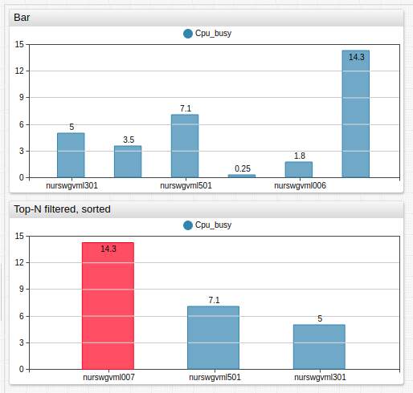
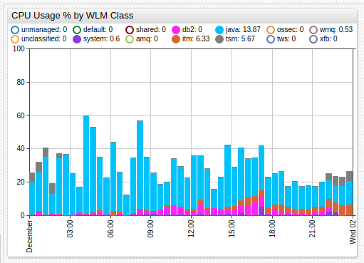
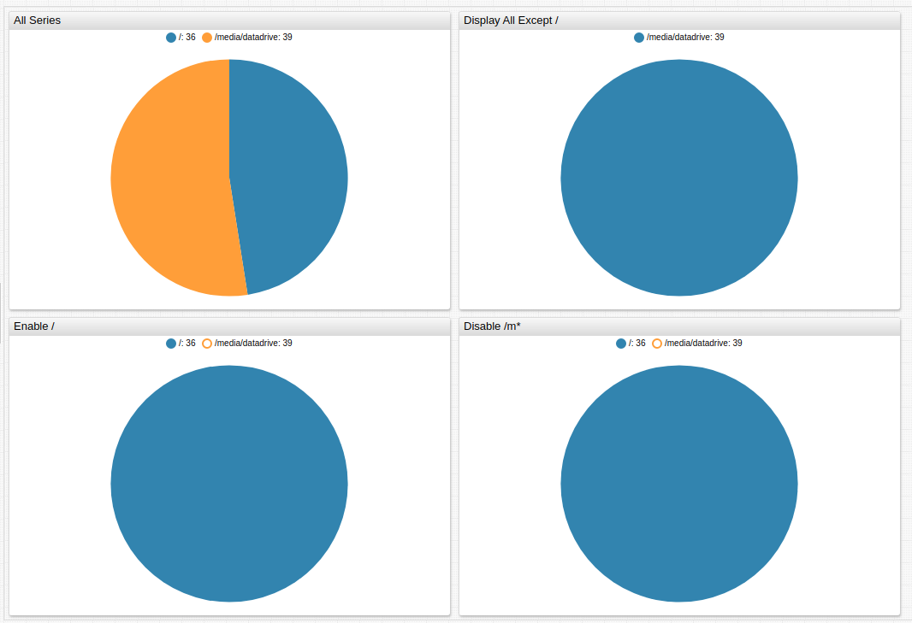
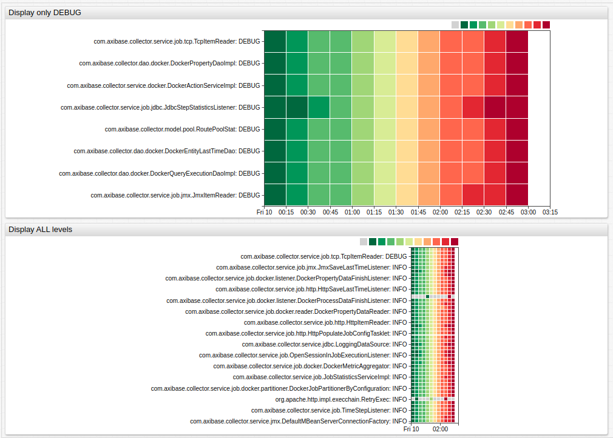

# Display Filters

Both the `display` and `enabled` settings support expressions in addition to boolean values, and as such can be used to show or hide series based on conditions. `display` hides series from view and from the legend, and `enabled` hides series from view but shows them in the legend in disabled state.

These expressions can compare `last value` or statistics with a pre-defined threshold or relative rank based on `last value`.

## Examples

### Display Top Three Results

```ls
[series]
/* show top-3 series by last value */
display = value >= top(3)
```



[](https://apps.axibase.com/chartlab/377091ff)

### Single Day Maximum Exceeds Five

```ls
[widget]
enabled = max('1 day') > 5
```



[](https://apps.axibase.com/chartlab/628bc794/1)

### Negation Syntax

Exclude series with `!=` negation syntax.

```ls
[series]
display = tags.mount_point != '/'

[series]
enabled = tags.mount_point == '/'

[series]
tags.mount_point.indexOf('/m') < 0
```



[](https://apps.axibase.com/chartlab/7518a91f/6/)

### Display by Tag

Calendar display filter.

```ls
[widget]
display = tags.level == 'DEBUG'
```



[](https://apps.axibase.com/chartlab/04f1ed7c/2/#)