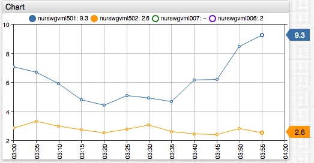

# Display Filters

Both the [`display`](../widgets/shared/README.md#display) and [`enabled`](../widgets/shared/README.md#enabled) settings support boolean expressions to show or hide series based on conditions.

* The `display` setting hides the series from the chart area **and** from the legend.
* The `enabled` setting hides series only from the chart area while retaining it in the legend.



[](https://apps.axibase.com/chartlab/573b3103/3/)

The boolean expressions can compare last values or statistics with a threshold or [rank](../syntax/ranking-functions.md).

## Examples

### Display Top Three Results

```ls
[series]
/* show top-3 series by last value */
display = value >= top(3)
```


[](https://apps.axibase.com/chartlab/377091ff)

### Single Day Maximum Exceeds Five

```ls
[widget]
enabled = max('1 day') > 5
```


[](https://apps.axibase.com/chartlab/628bc794/1)

### Negation Syntax

Exclude series with `!=` negation syntax.

```ls
[series]
display = tags.mount_point != '/'

[series]
enabled = tags.mount_point == '/'

[series]
tags.mount_point.indexOf('/m') < 0
```


[](https://apps.axibase.com/chartlab/7518a91f/6/)

### Display by Tag

Calendar display filter.

```ls
[widget]
display = tags.level == 'DEBUG'
```


[](https://apps.axibase.com/chartlab/04f1ed7c/2/#)

### Derived Series from Hidden Series

The `display` and `enabled` settings have no impact on the calculated series.

```ls
[series]  
    entity = nurswgvml006
    alias = a

[series]  
    entity = nurswgvml007
    alias = b
    display = false

[series]
    # The result is not affected by hiding the 'b' series
    value = value('a') + value('b')
```


[](https://apps.axibase.com/chartlab/9b97ac5e/2/)