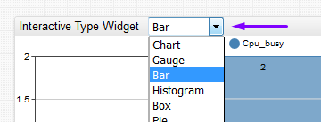
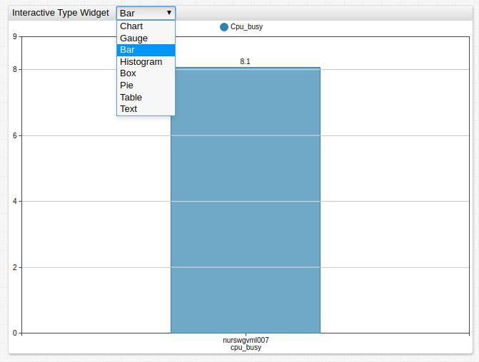
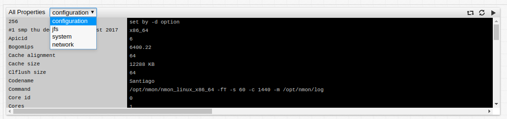
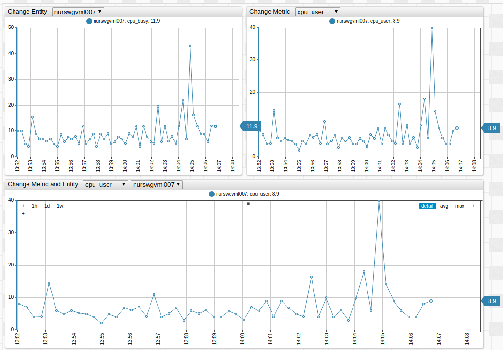
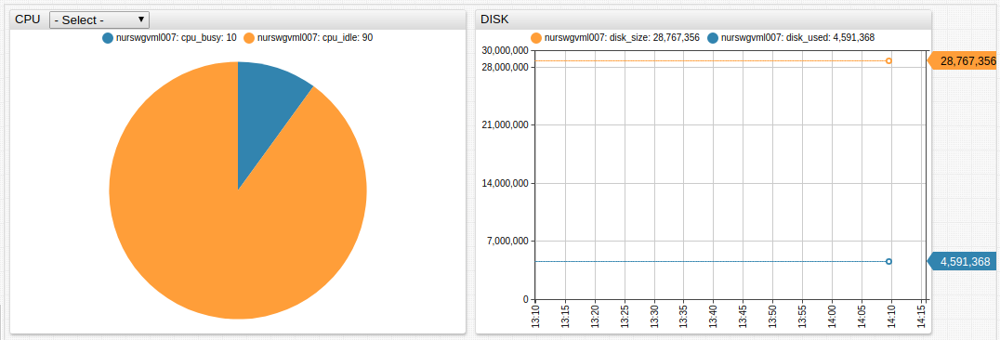

# Drop-down Lists

Drop-down lists provides a way to display interactive selectors inside the widget header.

Configure the selector to update a widget setting for changes made, such as the widget type itself and the metric, entity, or property type.



Add multiple drop-down lists for any widget.

## `[dropdown]` Configuration

* `onchange`: If specified, field is evaluated instead of default `onchange` behavior. Either `onchange`, or `change-field` is required for any drop-down list.
* `change-field`: Widget setting changed upon drop-down list selection. To update the widget subsection setting, use `{section-name}.{setting-name}` syntax. For example, `series.entity` or `keys.mq_manager_name`.
* `format`: Format applied to the option value if no text setting is specified.
* `style`: CSS to apply to the selected element.
* `options`: Comma-separated list of option values.

## `[option]` Configuration

Each option has `value` and `text` attributes. If `text` is specified, the text is displayed, otherwise the formatted value is used.

* If only `text` is specified, `value = text`

* Populate the list of options with the `options =` setting or as a list of `[option]` fields.

Comma-separated list:

```css
options = opt1, opt2, opt3
```

Placeholder to `list` of `var` array:

```css
options = @{taglist}
```

If the list or array contains elements with a comma, use the `escape()` method to backslash commas:

```css
options = @{taglist.escape()}
```

`[option]` fields:

```css
[option]
  text = opt1
[option]
  value = opt2
[option]
  value = opt3
  text = Option 3
```

## Examples

### Change Widget Type

```css
[widget]
  type = bar

/* this drop-down modifies widget type on change
the list of displayed options is specified in options field */
[dropdown]
  options = Chart, Bar, Gauge
  change-field = type

[series]
  metric = cpu_busy
  entity = nurswgvml007
```



[](https://apps.axibase.com/chartlab/566e6428)

### Change Property Type

```css
[dropdown]
  on-change = widget.post.queries[0].type = this.value; widget.reload();
  change-field = property.type
  options = configuration, jfs, system, network  

[property]
  type = configuration
```



[](https://apps.axibase.com/chartlab/6d918310/7/)

### Change `Metric`, `Entity`, or Both

```css
[dropdown]
  change-field = series.metric
  options = cpu_user, cpu_system, cpu_busy
[dropdown]
  change-field = series.entity
  options = nurswgvml007, nurswgvml006
```



[](https://apps.axibase.com/chartlab/e7a978d6)

### Replace Series

```css
[dropdown]
  options = nurswgvml007, nurswgvml006, nurswgvml010
  on-change = replaceEntityInSeriesCollection(cpu_series, this.value); cpu_widget.replaceSeries(cpu_series);  replaceEntityInSeriesCollection(disk_series, this.value); disk_widget.replaceSeries(disk_series);
```



[](https://apps.axibase.com/chartlab/343ec3ea)