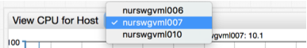

# Drop-down Lists

The `[dropdown]` section adds a drop-down list to the widget header to reload the data or to change the chart appearance.

```ls
[dropdown]
  options = nurswgvml006, nurswgvml007, nurswgvml010
  change-field = series.entity
```



The drop-down list can be configured to update a setting at the `[widget]`, `[series]` or `[property]` levels such as the entity or metric name.

The options can be enumerated manually, passed from a collection or loaded from the server.

## Settings

Name | Description | &nbsp;
--|--|--
<a name="change-field"></a>[`change-field`](#change-field) | Name of the setting changed upon drop-down list selection.<br>To update a setting at the section level, use `<section-name>.<setting-name>` syntax.<br>**Examples**:<br>`change-field = type`<br>`change-field = series.entity` | [↗](https://apps.axibase.com/chartlab/b128e746)
<a name="on-change"></a>[`on-change`](#on-change) | If specified, field is evaluated instead of default `onchange` behavior.<br>Either `onchange`, or `change-field` is **required** for any drop-down list.<br>**Example**: `on-change = widget.reload();` | [↗](https://apps.axibase.com/chartlab/f0b0039d)
<a name="format"></a>[`format`](#format) | Format applied to the option value if no option `text` setting is specified.<br>**Example**: `format = value.toUpperCase()` | [↗](https://apps.axibase.com/chartlab/e50eea0f)
<a name="style"></a>[`style`](#style) | CSS style applied to the HTML element of the drop-down list.<br>**Example**: `style = max-width: 125px` | [↗](https://apps.axibase.com/chartlab/0e84d2a8)

## Options

Populate the list of options with the `options` setting or as an array of `[option]` fields.

### Options Syntax

* Comma-separated list:

  ```ls
  options = opt1, opt2, opt3
  ```

* Placeholder to a `list`:

  ```ls
  list tag_list = /opt, /home, /mnt
  ...
  options = @{tag_list}
  ```

  ```ls
  csv hosts = NAME,LOCATION
  ...
  endcsv
  
  options = @{hosts.values('NAME')}
  ```  

  If the list contains elements with a comma, use the `escape()` method to escape commas:

  ```ls
  options = @{tag_list.escape()}
  ```

* `[option]` array:

  ```ls
  [option]
    value = opt1
  [option]
    value = opt2
  [option]
    value = opt3
    text = Option 3
  ```

## Examples

### Change Widget Type

```ls
[widget]
  type = bar

/* this drop-down modifies widget type on change
the list of displayed options is specified in options field */
[dropdown]
  options = Chart, Bar, Gauge
  change-field = type

[series]
  metric = cpu_busy
  entity = nurswgvml007
```


[](https://apps.axibase.com/chartlab/d84eedd0)

### Change Property Type

```ls
[dropdown]
  on-change = widget.post.queries[0].type = this.value; widget.reload();
  change-field = property.type
  options = configuration, jfs, system, network  

[property]
  type = configuration
```


[](https://apps.axibase.com/chartlab/d84eedd0)

### Change Metric, Entity, or Both

```ls
[dropdown]
  change-field = series.metric
  options = cpu_user, cpu_system, cpu_busy
[dropdown]
  change-field = series.entity
  options = nurswgvml007, nurswgvml006
```


[](https://apps.axibase.com/chartlab/382f4302)

### Replace Series

```ls
[dropdown]
  options = nurswgvml007, nurswgvml006, nurswgvml010
  on-change = replaceEntityInSeriesCollection(cpu_series, this.value); cpu_widget.replaceSeries(cpu_series);  replaceEntityInSeriesCollection(disk_series, this.value); disk_widget.replaceSeries(disk_series);
```


[](https://apps.axibase.com/chartlab/3179db2b)