# Visualizing Data Forecasts


## Overview

ATSD supports algorithm-based [Data Forecasting](https://axibase.com/docs/atsd/forecasting/), the results of which can be used in Charts visualizations.

Data Forecasting uses historical data to predict future sample values. After the creation of a new forecast, use Charts settings to display forecast data alone or alongside historical samples.

## Forecast Series Settings

* The settings apply to the `[series]` section.
* Enter forecast series settings in the **Editor** window of any Charts visualization.

Name | Description | &nbsp;
--|--|--
<a name="data-type"></a>[`data-type`](#data-type)|Data type for the current series.<br>Possible values: `history`, `forecast`, `forecast_deviation`, `lower_confidence`, `upper_confidence`.<br>**Example**: `data-type = forecast`|[↗](https://apps.axibase.com/chartlab/cb49fd2f)|
<a name="forecast-name"></a>[`forecast-name`](#forecast-name)|Unique forecast identifier.<br>Use when creating multiple forecasts for the same series.<br>If no forecast name is set, the default forecast is loaded.<br>**Example**: `forecast-name = hw5`|[↗](https://apps.axibase.com/chartlab/8ec8d153)|
<a name="style"></a>[`style`](#style)|Render forecast as a solid line instead of dashed line.<br>**Example**: `style = stroke-dasharray: none;`|[↗](https://apps.axibase.com/chartlab/73f57d65)|
<a name="value"></a>[`value`](#value)|Returns forecast for the underlying series.<br>**Example**: `value = 100 - forecast('free')`|[↗](https://apps.axibase.com/chartlab/b6a0aa28)|
<a name="load-future-data"></a>[`load-future-data`](#load-future-data)|Load future series values.<br>Import forecasts generated with 3rd party tools, such as [R Language](https://github.com/axibase/atsd-api-r/blob/master/README.md#atsd-r-package).<br>Possible values: `false`, `true`.<br>Default value: `false`. <br>**Example**: `load-future-values = true`|[↗](https://apps.axibase.com/chartlab/268cc442)|
<a name="forecast-style"></a>[`forecast-style`](#forecast-style)|CSS styles applied to forecasts in `column` and `column-stack` modes.<br>**Example**: `forecast-style = stroke: magenta;`|[↗](https://apps.axibase.com/chartlab/35aa293f)|

## Quick Start

1. Download the [Forecast Configuration](./resources/forecast-tutorial.xml) XML file.
1. Import the Forecast Configuration into ATSD. For instructions on performing this operation, see [Importing Forecast Settings](https://axibase.com/use-cases/tutorials/shared/import-forecast.html).
1. Open the newly imported forecast, which is named `Example Forecast` by default.
1. Specify the metric and entity to use as historical data in forecast creation.
1. At the bottom of the page, click **Save** then **Run**
1. Open [**ChartLab**](https://apps.axibase.com/chartlab/b3b920d9), enter the name of the metric and entity at the blank `[series]` configuration level:

    ```ls
    [series]
      entity =
      metric =
    ```
1. Re-enter this information at the second `[series]` configuration level. If you modified the **Forecast Name** parameter on the form, change the `forecast-name` setting in the visualization template provided.
1. Click **Run** to render your data and data forecast visualization.

## Configuration

The following example demonstrates the creation of a data forecast and its visualization in **ChartLab**.

Review [Data Forecasting Documentation](https://axibase.com/docs/atsd/forecasting/#general-settings) for
an explanation of all Forecast Settings or refer to tooltips on the **Forecast Settings** page, visible on mouseover.

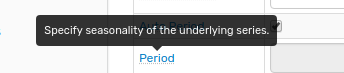

This document uses the `cpu_busy` metric from entity `nurswgvml007` collected every `15` seconds as historical data. This is streaming data from the Axibase servers tracking CPU usage. To enable the `cpu_busy` metric in a local ATSD instance, follow the [`nmon` Integration Tutorial](https://axibase.com/docs/atsd/integration/nmon/).

The `[series]` level configuration for the [Time Chart Widget](../widgets/time-chart/README.md) is shown below.

```ls
[series]
  entity = nurswgvml007
  metric = cpu_busy
```

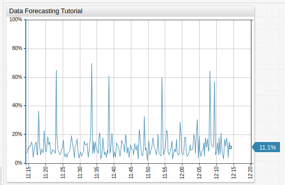

[](https://apps.axibase.com/chartlab/9f17e65a)

Open the ATSD web interface and navigate to **Data > Forecasts**.

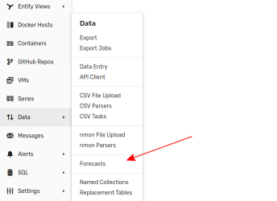

Click **Create** on the split-button at the bottom of the **Forecasts** page.

### Define General Settings

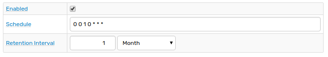

1. By default, the new forecast is enabled. Disable a forecast by clearing the checkbox.
1. Run the forecast on a `cron` schedule.
1. Set the Retention Interval, or amount of time the database stores forecast data.

### Insert Historical Data

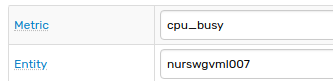

1. Define the `metric` and `entity` from which to read historical. Historical data is used by ATSD to calculate confidence intervals and forecast future sample value.
1. Define **Data Selection Interval**. This parameter determines how much historical data is read to predict future data. A great selection interval increase the accuracy of future sample value predictions.

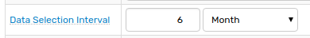

### Define Aggregation

1. Optionally, allow ATSD to automatically aggregate forecast data by selecting the **Auto Aggregate** checkbox.
1. Define the **Aggregation Period** and **Aggregation Statistic** using the drop-down lists.

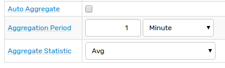

### Configure Algorithm

1. Select the algorithm to use when calculating future sample values. Supported algorithms are Holt-Winters and ARIMA.
1. **Score Interval** is the period which ATSD uses to compute series variance. Samples within the score interval are therefore more important to the calculation of future sample values.
1. Optionally configure algorithm constants for future value calculation. ATSD is able to automatically calculate and assign these values by selecting the **Auto Period** and **Auto Parameters** checkbox.

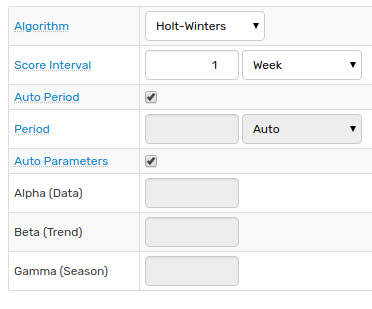

### Define Forecast Settings

1. Assign the forecast a unique name to use as an identifier for series which have multiple forecasts. To use the current forecast as the default forecast, select the **Default Forecast** checkbox.
1. Set a forecast range for data with high variance. Data outside the range is assigned the maximum or minimum range value
1. Define the amount of time into the future which a forecast is calculated by ATSD.

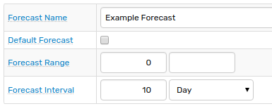

### Save and Run Forecast

Click **Save** to store the forecast in ATSD, then click **Run** to execute calculation and store computed data in the database.

Once a forecast is calculated, the configuration or result data can be exported using the [**Editor Tools**](https://axibase.com/docs/atsd/forecasting/#editor-tools) at the bottom of the page.

ATSD notifies if a forecast is successfully calculated.

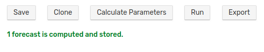

## Visualization

In **ChartLab** use [forecast series settings](#forecast-series-settings) to visualize computed forecasts.

```ls
[series]
  entity = nurswgvml007
  metric = cpu_busy
  data-type = forecast
  forecast-name = Example Forecast
```

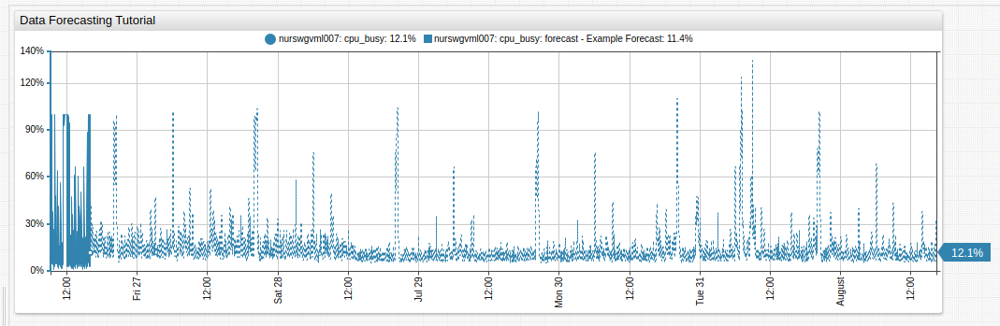
