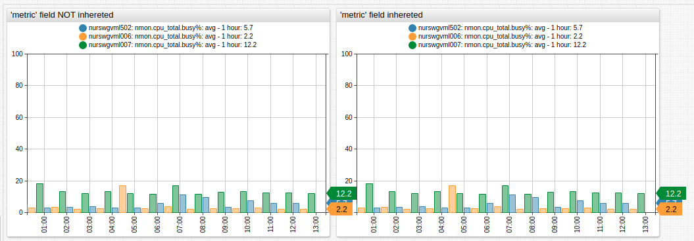
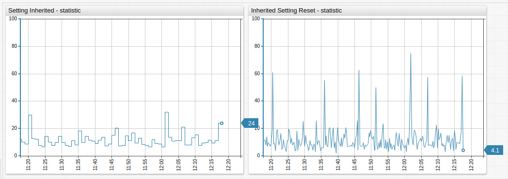

# Inheritance

Inheritance is a mechanism for applying common settings to nested configuration objects. Settings defined at the `[configuration]` level apply to all other sections whereas `[widget]` settings apply to the widget itself as well as nested `[series]` sections.

Inheritance hierarchy:

```ls
[configuration]
  [group]
    [widget]
      [series]
```

Inheritance makes syntax more compact and makes it easy to replace common settings.

## Overriding

To modify the inherited setting, the setting must be set to a new value in the lower-level object.

```ls
[configuration]
  entity = e-1

  [widget]
    # Override 'entity' for this particular widget
    entity = e-2
```

To reset an inherited setting to the default value, specify the name of the setting as an empty string:

```ls
statistic =
```

If a setting needs to be set to an empty string, use double quotes:

```ls
statistic = ""
```

## Example

If all widgets in a portal are created for the same entity, set the `entity` setting at the `[configuration]` level.

```ls
[widget]
  type = chart
  
  # The metric field is inherited by all series in the widget
  metric = nmon.cpu_total.busy%

  [series]
    entity = awsswgvml001
  [series]
    entity = nurswgvml006

  # Metric is overridden for this series
  [series]
    metric = mpstat.cpu_busy%
    entity = nurswgvml007
```



[](https://apps.axibase.com/chartlab/3230deb6/2/)

In this example, the same metric is inherited by all series in the widget because the metric is defined at the `[widget]` level however the second series overrides the inherited value with the `metric = mpstat.cpu_busy%` setting.



[](https://apps.axibase.com/chartlab/061b5af1)

## Portal Example


[](https://apps.axibase.com/chartlab/f137e7d8)