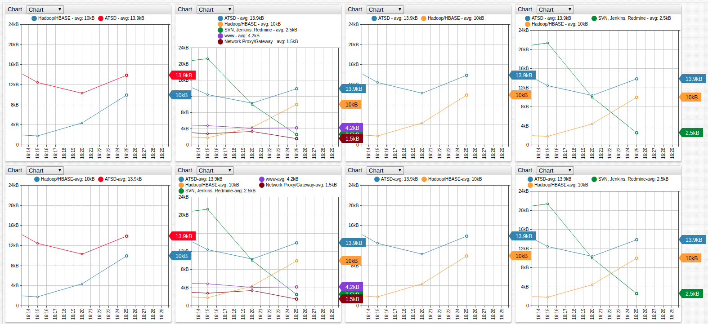
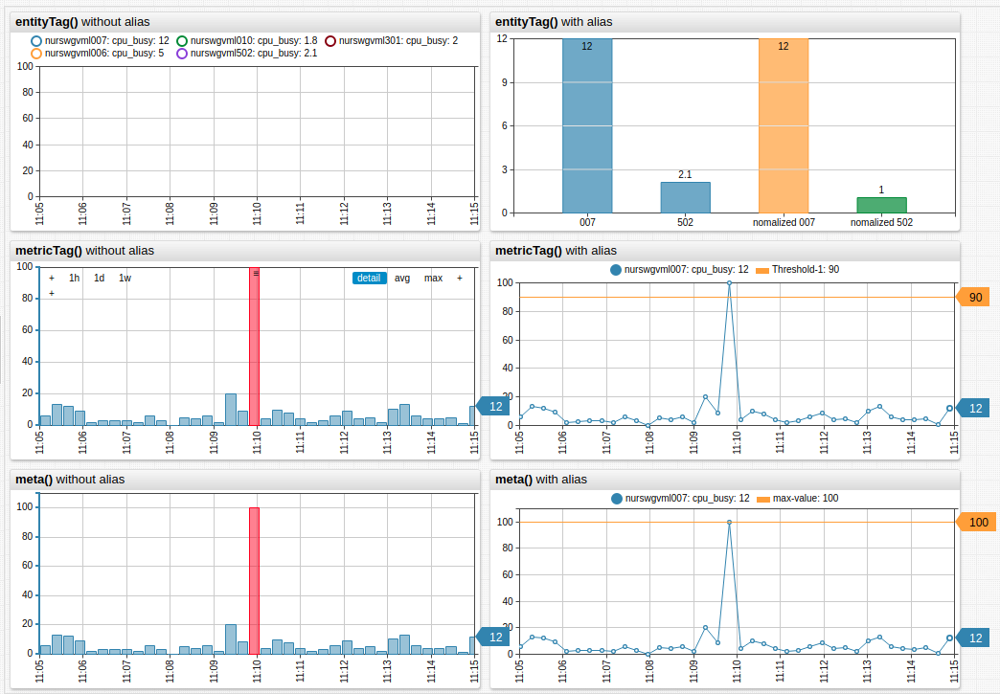

# Meta Data

Request metadata fields from the server by adding `add-meta = true` setting to the widget configuration.

Use these fields in widget settings for several common use cases:

* Add extended `entity` or `metric` information to labels.
* Calculate derived metrics based on `entity tags`.
* Set `[threshold]` value or `TreeMap` sizes based  on `entity tags`, etc.

## Placeholders

`label-format`, `column-label-format`, and `marker-format` settings can reference the following placeholders:

### Entity Placeholders

* `meta.entity.label`: Entity label
* `meta.entity.field_name`: Entity fields such as `timeZone`, `interpolate`, and other fields specified in [Meta API](https://axibase.com/docs/atsd/api/meta/).
* `meta.entity.tags.tag_name`: Entity tag with name `tag_name`.
* `meta.entity.tags[‘tag-name’]`: Entity tag with name `tag-name`.

### Metric Placeholders

* `meta.metric.label`: Metric label
* `meta.metric.field_name`: Metric fields such as `dataType`, `timePrecision`, and other fields specified in [Meta API](https://axibase.com/docs/atsd/api/meta/).
* `meta.metric.tags.tag_name`: Metric tag with name `tag_name`.
* `meta.metric.tags[‘tag-name’]`: Metric tag with name `tag-name`.

## Syntax

```css
[widget]
  type = chart
  label-format = meta.entity.tags.app - statistic
  add-meta = true

  [series]
    entity = nurswgvml006
  [series]
    entity = nurswgvml007
```



[](https://apps.axibase.com/chartlab/100f5b65/2/#)

### Convenience Functions

* `meta('alias')`: Returns `meta` object for series with the specified `alias`.
* `meta()`: Returns `meta` object for the current series.
* `entityTag('alias', 'tag_name')`:  return entity tag value for series with the specified `alias`.
* `entityTag('tag_name')`: Return entity tag value for the current series.
* `metricTag('alias', 'tag_name')`: Return metric tag value for series with the specified `alias`.
* `metricTag('tag_name')`: Return metric tag value for the current series.

Access these functions in the following settings:

* `value`
* `series-value`
* `display`
* `enabled`
* `alert-expression`
* `size` (`TreeMap`)
* `color`
* `node-value` (Chart)
* `link-value` (Chart)
* `link-alert-expression` (Chart)
* `node-alert-expression` (Chart)

```css
[group]

/* columns which are higher than threshold,
 defined by threshold_value, are highlighted as red */

[widget]
  title = <b>metricTag()</b> without alias
  type = chart
  mode = column
[series]
    entity = nurswgvml007
    metric = cpu_busy
    alert-style = fill: red
    alert-expression = value > metricTag('threshold_value')
[series]
    label = nomalized 502
    value = value('502') / entityTag('502', 'cpu_count')
```



[](https://apps.axibase.com/chartlab/199f98ec)