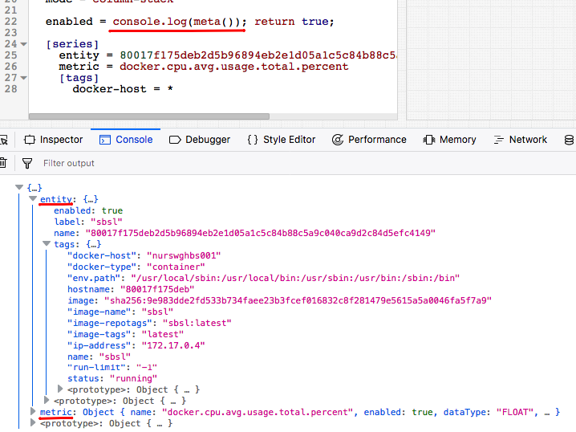

# Meta Data

Request metadata fields from the server by adding `add-meta = true` setting to the widget configuration.

Use these fields for several common use cases:

* Embed extended entity or metric information in series legend labels.
* Calculate derived metrics based on entity tags.
* Set [`[threshold]`](../widgets/time-chart/README.md#threshold-settings) value or [`treemap`](../widgets/treemap/README.md) sizes based on entity tags.

## Metadata Object

If `add-meta` is set to `true`, the response contains metadata for the requested [metric](https://axibase.com/docs/atsd/api/meta/metric/list.html#fields) and [entity](https://axibase.com/docs/atsd/api/meta/entity/list.html#fields).

Sample metadata object:

```json
{
  "metric": {
    "name": "docker.cpu.avg.usage.total.percent",
    "enabled": true,
    "dataType": "FLOAT",
    "label": "Docker Cpu Avg Usage Total %",
    "persistent": true,
    "tags": {
      "table": "Docker Container Summary"
    },
    "retentionDays": 0,
    "seriesRetentionDays": 0,
    "invalidAction": "NONE",
    "versioned": false,
    "interpolate": "LINEAR"
  },
  "entity": {
    "name": "dfab04daa838e9795f6246c5ba9f37412213ca897bfe056baf3b71a11d456370",
    "enabled": true,
    "label": "db-test-mysql-5.7",
    "tags": {
      "env.mysql_version": "5.7.18-1debian8",
      "image-name": "mysql",
    }
  }
}
```

The loaded object can be subsequently accessed in label settings and value expressions.

## Label Settings

The metric and entity metadata object properties can be accessed in the following settings:

* [`label-format`](../widgets/shared/README.md#label-format)
* [`column-label-format`](../widgets/bar-chart/README.md#column-label-format)
* [`marker-format`](../widgets/pie-chart/README.md#marker-format)

```toml
label-format = meta.entity.tags.app
```

Available placeholders:

* `meta.metric.field_name`<br>Metric [fields](https://axibase.com/docs/atsd/api/meta/metric/list.html#fields) such as `label`, `dataType`.
* `meta.entity.field_name`<br>Entity [fields](https://axibase.com/docs/atsd/api/meta/entity/list.html#fields) such as `label`, `timeZone`.
* `meta.metric.tags.tag_name`<br>Metric tag with name `tag_name`.
* `meta.entity.tags.tag_name`<br>Entity tag with name `tag_name`.

> If the tag name contains special characters, use `meta.entity.tags['tag_name']` syntax, for example `meta.entity.tags['image-name']`.


[](https://apps.axibase.com/chartlab/8bbcbaf0)

## Metadata Functions

| Function | Description |
|----------|-------------|
| `meta('alias')` | Returns `meta` object for series with the specified `alias`. |
| `meta()` | Returns `meta` object for the current series. |
| `entityTag('alias', 'tag_name')` | Returns entity tag value for series with the specified `alias`. |
| `entityTag('tag_name')` | Returns entity tag value for the current series. |
| `metricTag('alias', 'tag_name')` | Returns metric tag value for series with the specified `alias`. |
| `metricTag('tag_name')` | Returns metric tag value for the current series. |

The functions can be invoked within the following settings:

* `value`
* `series-value`
* `display`
* `enabled`
* [`alert-expression`](../syntax/alert-expression.md)
* `size`
* `color`
* `node-value` (graph widget)
* `link-value` (graph widget)
* `link-alert-expression` (graph widget)
* `node-alert-expression` (graph widget)

The metadata object can be accessed by specifying the path to the property.

```yml
meta().metric.label        -> Docker Cpu Avg Usage Total %
meta().metric.tags.table   -> Docker Container Summary
meta().entity.label        -> db-test-mysql-5.7
```

If the tag name contains special characters, such as `'image-name'`, enquote the tag name and use brackets to access its value.

```yml
meta().entity.tags['image-name']    -> mysql
```

:::tip Note
In label settings use `meta.`, in functions, use `meta().` syntax.
:::

### Function Examples

[](https://apps.axibase.com/chartlab/b1e81a59/26/)

[](https://apps.axibase.com/chartlab/7c5406f7/12/)

```javascript
alert-expression = value >= meta().metric.maxValue
```

```javascript
series-value= meta().entity.tags.stream
```

```javascript
alert-expression = (1 - (meta().entity.tags.elevation_ft - value)/meta().entity.tags.elevation_ft) > 0.97
```

```javascript
color = ((1 - (meta().entity.tags.elevation_ft - value)/meta().entity.tags.elevation_ft)*100 >= 100) ? 'black': (((1 - (meta().entity.tags.elevation_ft - value)/meta().entity.tags.elevation_ft)*100 >= 95))?'orange':'steelblue'
```

```javascript
series-value = meta().entity.tags.crest_elevation_ft  - value
```

```javascript
display = +meta().entity.tags["storage_capacity_ac-ft"] > 1000000
```

```javascript
alert-expression = value >= meta().metric.maxValue
```

```ls
[series]
    entity = nurswgvml007
    metric = cpu_busy
    alert-style = fill: red
    alert-expression = value > metricTag('threshold_value')
```

```ls
[series]
    label = nomalized 502
    value = value('502') / entityTag('502', 'cpu_count')
```


[](https://apps.axibase.com/chartlab/a337e489)

### Debugging

To print out the metadata object in the developer console, using the `console.log()` function.

```ls
enabled = console.log(meta()); return true;
```


