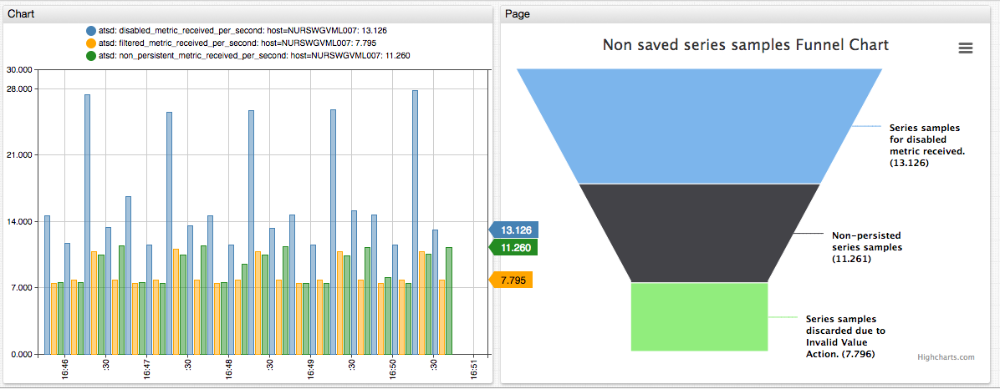

# Create External Widget

## Overview

This document describes how to incorporate charts created with external JavaScript libraries into an ATSD portal.

The task can be accomplished by creating an HTML file with the external chart and including this chart using the `page` widget in ATSD.

## Create Resource Directory

Log in to ATSD server and create a directory in the ATSD installation directory that contains static resources such as JavaScript files, CSS files, and images used by external charting libraries.

```sh
mkdir -p /opt/atsd/atsd/conf/portal/web/JavaScript
```

> Note that access to files in the `conf/portal` directory does not require authentication.

## Download and Copy Dependencies

Download external libraries into the `/opt/atsd/atsd/conf/portal/web/JavaScript` directory. The list of dependencies is specific for each library.

```sh
curl https://code.highcharts.com/highcharts.js > /opt/atsd/atsd/conf/portal/web/JavaScript/highcharts.js
curl https://code.highcharts.com/modules/funnel.js > /opt/atsd/atsd/conf/portal/web/JavaScript/funnel.js
curl https://code.highcharts.com/modules/exporting.js > /opt/atsd/atsd/conf/portal/web/JavaScript/exporting.js
```

Download the ATSD client adapter [`atsdClient`](resources/atsdClient.bundle.js) and its dependencies into the same directory.

```sh
curl https://code.jquery.com/jquery-1.9.1.js > /opt/atsd/atsd/conf/portal/web/JavaScript/jquery-1.9.1.js
curl https://raw.githubusercontent.com/axibase/charts/master/external/resources/atsdClient.bundle.js > /opt/atsd/atsd/conf/portal/web/JavaScript/atsdClient.bundle.js
```

## Verify Dependencies

```sh
ll /opt/atsd/atsd/conf/portal/web/JavaScript
```

The output is as follows:

```sh
-rw-r--r-- 1 axibase axibase   3994 Oct 30 14:12 atsdClient.bundle.js
-rw-r--r-- 1 axibase axibase   9390 Oct 30 14:12 exporting.js
-rw-r--r-- 1 axibase axibase   2200 Oct 30 14:12 funnel.js
-rw-r--r-- 1 axibase axibase 192891 Oct 30 14:12 highcharts.js
-rw-r--r-- 1 axibase axibase 268381 Oct 30 14:12 jquery-1.9.1.js
```

## Create External Chart

The external chart is created using the syntax and settings provided by the external library and is populated with ATSD data using the ATSD client adapter.

```sh
curl https://raw.githubusercontent.com/axibase/charts/master/external/resources/funnel.html > /opt/atsd/atsd/conf/portal/web/funnel.html
```

Check that the file can be accessed at `https://atsd_host:8443/portal/resource/web/funnel.html`.

## Create Portal

Create a portal in ATSD and include a `page` widget with the URL setting referencing the HTML file:

```ls
[widget]
  type = page
  url = /portal/resource/web/funnel.html
```

## Sample Portal

```ls
[configuration]
  width-units = 2
  height-units = 1
  update-interval = 0

[group]
  [widget]
    type = chart
    timespan = 5 minute
    mode = column
    merge-series = false
    format = fixed(3)
    entity = atsd
    [series]
      metric = disabled_metric_received_per_second
    [series]
      metric = filtered_metric_received_per_second
    [series]
      metric = non_persistent_metric_received_per_second

  [widget]
    type = page
    url = /portal/resource/web/funnel.html
```


