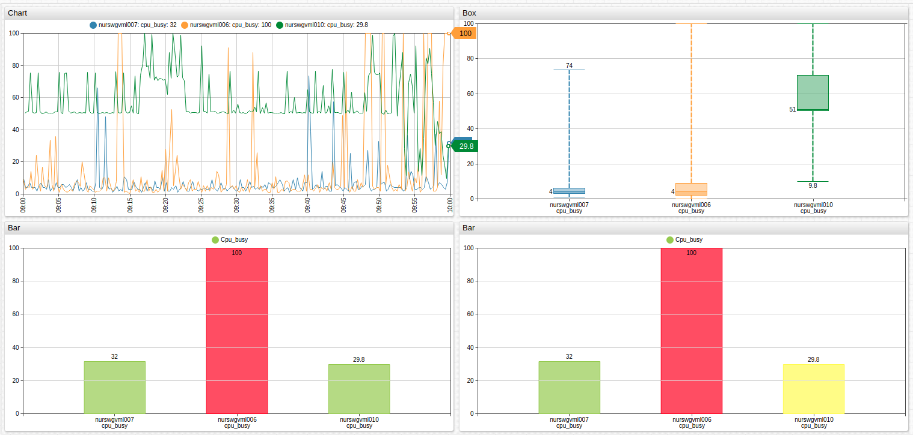

# Alert Expressions

Alert expressions provide a way to modify the graphical properties of a widget such as the color, fill, or visibility based on series values and statistics.

## Example

* Change bar color to `RED` if a threshold is exceeded.
* If the threshold is within the normal range, but is violated at least once during the last hour, change the bar color to `YELLOW`.
* Otherwise, apply `GREEN` as the color.

```ls
[widget]
  type = bar
  color = yellowgreen

  alert-expression = max('1 hour') > 75 ? ((value > 75) ? 2 : 1) : false
  alert-style = (alert == 2) ? 'fill: red; stroke: red' : 'fill: yellow; stroke: yellow'

  [column]
    [series]
      entity = nurswgvml007  
  [column]
    [series]
      entity = nurswgvml006
  [column]
    [series]
      entity = nurswgvml010
```



[](https://apps.axibase.com/chartlab/993a72b2#)