# API Functions

This document enumerates functions that retrieve records, typically metric, entity, and series lists, from the [REST API](https://axibase.com/docs/atsd/api/data/#meta-api-endpoints) endpoints.

The functions can be invoked at the `preprocessor` stage in a `var`, `if`, `if else`, `for .. in`, or `@{}` expression.

| Function | Description |
|------|-------------|
[`getMetrics()`](#getmetrics) | Retrieves the names of metrics for entity.
[`getEntities()`](#getentities) | Retrieves the names of entities for entity group.
[`getTags()`](#gettags) | Retrieves series and returns a sorted array of unique values for the specified series tag.
[`getSeries()`](#getseries) | Retrieves an array of series collected for the specified metric.
[`requestMetricsSeriesValues()`](#requestmetricsseriesvalues) | Creates drop-down list values from values retrieved for the specified series field.
[`requestEntitiesMetricsValues()`](#requestentitiesmetricsvalues) | Creates drop-down list values from values retrieved for the specified metric field.
[`requestPropertiesValues()`](#requestpropertiesvalues) | Creates drop-down list from values retrieved for the specified entity tag or property.
[`requestMetricsSeriesValues()`](#requestmetricsseriesvalues) | Creates drop-down list from values retrieved for the specified series field.

---

## `getMetrics()`

The function retrieves a sorted array of metrics names collected by the specified entity, optionally [filtered](https://axibase.com/docs/atsd/api/meta/expression.html) by name and tags.

```javascript
var result = getMetrics(entity, [expression, [tags, [url, [params]]]])
```

**Description**:

* API endpoint [`/api/v1/entities/{entity}/metrics`](https://axibase.com/docs/atsd/api/meta/entity/metrics.html).
* Request type: : synchronous `GET`.
* The returned array of strings can be assigned to a variable using `var` declaration.
* The returned array is processed by [`list.escape()`](../syntax/control-structures.md#listescape) function.

**Arguments**:

| Name | Type | Description |
|:------|:------|:-------------|
| `entity` | string |**[Required]**  `entity` name. |
| `expression` | string | Filter [`expression`](https://axibase.com/docs/atsd/api/meta/expression.html). |
| `tags` |  string | List of tags included in the response. |
| `url` | string | Protocol, host, and path to which `/api/v1` path is appended. |
| `params` | object | Object with additional request parameter names and values accepted by the API endpoint which are converted to query string. |

**Example**:

Return metrics for entity `nurswgvml006` which contains substrings `cpu` and `user`.

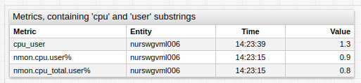

[](https://apps.axibase.com/chartlab/e006c0e8)

```ls
var metrics = getMetrics("nurswgvml007", "name LIKE '*cpu*user*'")
```

```elm
/api/v1/entities/nurswgvml007/metrics?expression=name%20LIKE%20%27*cpu*user*%27
```

Result:

```json
["cpu_user", "nmon.cpu.user%", "nmon.cpu_total.user%"]
```

---

## `getEntities()`

The function retrieves a sorted array of entity names which are members of the specified entity group, optionally [filtered](https://axibase.com/docs/atsd/api/meta/expression.html) by name and tags.

```javascript
var entities = getEntities(group, [expression, [tags, [url, [params]]]])
```

**Description**:

* API endpoint: [`/api/v1/entity-groups/{group}/entities`](https://axibase.com/docs/atsd/api/meta/entity-group/get-entities.html).
* Request type: : synchronous `GET`.
* The returned array of strings can be assigned to a variable using `var` declaration.
* The returned array is processed by [`list.escape()`](../syntax/control-structures.md#listescape) function.

To load multiple groups, retrieve members of each group separately and then concatenate the elements into one array.

```javascript
var agents = [].concat(getEntities("group1"), getEntities("group2"))

var agents = getEntities("group1").concat(getEntities("group2"))  
```

Elements in the concatenated array are sorted first by group, then by element name.

**Arguments**:

| Name | Type | Description |
|:------|:------|:-------------|
| `group` | string |**[Required]**  `group` path parameter. |
| `expression` | string | Filter [`expression`](https://axibase.com/docs/atsd/api/meta/expression.html). |
| `tags` |  string | List of tags included in the response. |
| `url` | string | Protocol, host, and path to which `/api/v1` path is appended. |
| `params` | object | Object with additional request parameter names and values accepted by the API endpoint which are converted to query string. |

**Example**:

 Retrieve entities from entity group `docker-hosts` whose names begin with substring `nur`.

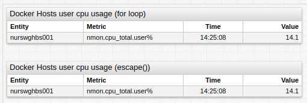

[](https://apps.axibase.com/chartlab/df616dfa/5/)

```ls
var entities = getEntities("docker-hosts", "name LIKE 'nur*'")
```

```elm
/api/v1/entity-groups/docker-hosts/entities?expression=name%20LIKE%20%27nur*%27
```

Result:

```json
["nurswghbs001", "nurswgdkr002"]
```

---

## `getTags()`

**Description**:

* Loads a series for `metric` and `entity` from a defined URL whose last data point has timestamp after `minInsertDate` and before `maxInsertDate`.
* Additional `queryParameters` can be specified.
* Unique tag values defined by `tagName` are retrieved from tags of the loaded series and sorted.
* Returned array is processed by [`list.escape()`](../syntax/control-structures.md#listescape) function.

**Syntax**:

```javascript
getTags(metric, tagName, [entity, [minInsertDate, [maxInsertDate, [url, [queryParameters]]]]])
```

**API Endpoint**:

Sends synchronous `GET` request to
[`/api/v1/metrics/{metric}/series`](https://axibase.com/docs/atsd/api/meta/metric/series.html)

**Returned Value**:

`Array<string>`: unique sorted values of the specified `tagName` series tag.

**Arguments**:

| Name | Type | Description |
|:------|:------|:-------------|
| `metric` | string | **[Required]** `metric` path parameter. |
| `tagName` | string | **[Required]** Tag values retrieved from series descriptors. |
| `entity` | string |`entity` query parameter. |
| `minInsertDate` |  string |[`minInsertDate`](https://axibase.com/docs/atsd/shared/calendar.html) query parameter.|
| `maxInsertDate` |  string |[`maxInsertDate`](https://axibase.com/docs/atsd/shared/calendar.html) query parameter. |
| `url` |  string |Protocol, host, and path to which `/api/v1` path is appended. |
| `queryParameters` | object | Object with parameter names as keys and values as values, transformed to query parameters string. |

### Retrieve values for `mount_point` tag in a series for metric `disk_used` and entity `nurswgvml007` received today

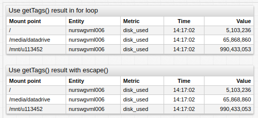

[](https://apps.axibase.com/chartlab/efd22059)

**Syntax**:

```ls
var mount_points = getTags("disk_used", "mount_point", "nurswgvml006", "current_day")
```

**Request Sent**:

```sh
/api/v1/metrics/disk_used/series?tag=mount_point&entity=nurswgvml006&minInsertDate=current_day
```

**Result**:

```json
["/", "/media/datadrive", "/mnt/u113452"]
```

### Retrieve values for `mount_point` tag in a series for metric `disk_used` and entity `nurswgvml007` and send server-specific query parameter `cache` and ignore other parameters

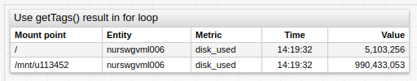

[](https://apps.axibase.com/chartlab/1eb42f5b)

**Syntax**:

```ls
var mount_points = getTags("disk_used", "mount_point", "nurswgvml007", null, null, null, {cache: true})
```

**Request Sent**:

```sh
/api/v1/metrics/disk_used/series?cache=true&tag=mount_point&entity=nurswgvml007
```

**Result**:

```json
["/", "/media/datadrive", "/mnt/u113452"]
```

---

## `getSeries()`

**Description**:

* Loads a series for the `metric` and the `entity` from a defined URL, whose last data point has a timestamp after `minInsertDate` and before `maxInsertDate`.
* Specify additional `queryParameters`.
* Returns a loaded series.

**Syntax**:

```javascript
getSeries(metric, [entity, [minInsertDate, [maxInsertDate, [url, [queryParameters]]]]])
```

**API Endpoint**:

Sends synchronous `GET` requests to the
[`/api/v1/metrics/{metric}/series`](https://axibase.com/docs/atsd/api/meta/metric/series.html)

**Returned Value**:

`Array<object>`: Received series descriptors.

**Arguments**:

| Name | Type | Description |
|:------|:------|:-------------|
| `metric` | string | **[Required]**  `metric` path parameter. |
| `entity` | string | `entity` query parameter. |
| `minInsertDate` | string | [`minInsertDate`](https://axibase.com/docs/atsd/shared/calendar.html) query parameter.|
| `maxInsertDate` | string | [`maxInsertDate`](https://axibase.com/docs/atsd/shared/calendar.html) query parameter. |
| `url` | string | Protocol, host, and path to which `/api/v1` path is appended. |
| `queryParameters` | object | Object with parameter names as keys and values as values, transformed to query parameters string. |

### Return series for metric `disk_used` and entity `nurswgvml006`

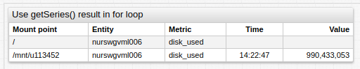

[](https://apps.axibase.com/chartlab/e4441b48)

**Syntax**:

```ls
var seriesDescriptors = getSeries("disk_used", "nurswgvml007")
```

**Request Sent**:

```sh
/api/v1/metrics/disk_used/series?entity=nurswgvml007
```

**Result**:

```json
[
    {
        "metric":"disk_used",
        "entity":"nurswgvml007",
        "tags":{
            "file_system":"/dev/mapper/vg_nurswgvml007-lv_root",
            "mount_point":"/"
        },
        "lastInsertDate":"2017-08-15T15:30:25.000Z"
    },
    {
        "metric":"disk_used",
        "entity":"nurswgvml007",
        "tags":{
            "file_system":"172.17.0.2:/home/store/share",
            "mount_point":"/mnt/share"
        },
        "lastInsertDate":"2015-12-25T14:09:49.000Z"
    },
    {
        "metric":"disk_used",
        "entity":"nurswgvml007",
        "tags":{
            "file_system":"//u113452.your-backup.de/backup",
            "mount_point":"/mnt/u113452"
        },
        "lastInsertDate":"2017-06-21T13:26:00.000Z"
    }
]
```

## Drop-down List Value Function Arguments

### `FieldPath _(optional, type: string)`

* `fieldPath` is the dot-separated path to field in series descriptor object.
  * If not specified, series descriptor objects are returned.
  * If specified, the field found by `fieldPath` is returned.
* `fieldPath "entity"` inherits `entity` from each descriptor.

To populate the drop-down list with the names of entities for which the metric is collected use the following syntax:

```ls
[dropdown]
  options = javascript: requestMetricsSeriesValues("entity")
  change-field = series.entity
```

The content of the resulting drop-down list is shown below:


To populate the drop-down list with values of the `mount_point` tag use the following syntax:

> The `fieldPath` `"tags.mount_point"` reads `tags` in each descriptor then retrieves the `mount_point` field.

```ls
[dropdown]
  options = javascript: requestMetricsSeriesValues("tags.mount_point")
  change-field = series.tags.mount_point
```

The content of the resulting drop-down list is shown below:


---

### `Callback _(optional, type:function)`

* Use `callback` for manual processing of series descriptors or additional processing of retrieved field values.
  * If `fieldPath` is specified, the string values of some field are passed as the argument for the callback, otherwise the series descriptor array is used as the argument.

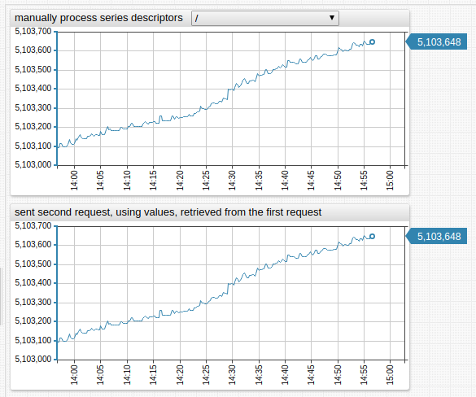

[](https://apps.axibase.com/chartlab/5bcbc24d)

To fill the drop-down list with values of `mount_point` tag of the series, whose entity name begins with the fragment `nur` use the function as shown below.

> Note that the series can be filtered by entity using the expression `queryParameter`.

```ls
[dropdown]
  change-field = series.tags.mount_point

    options = javascript: requestMetricsSeriesValues(null,
    options = function (series) {
    options =   var mountPoints = [];
    options =   series.forEach(function(s){
    options =     if(s.entity.indexOf("nur") === 0 && mountPoints.indexOf(s.tags.mount_point) < 0) {
    options =      mountPoints.push(s.tags.mount_point);
    options =      }
    options =    });
    options =    return mountPoints.sort();
    options = })
```

The content of the resulting drop-down list is shown below:


To populate the drop-down list with entity tag values it is necessary to make two requests:

* Retrieve entity names from series descriptors.
* Request entity tags for those entities.

```ls
[dropdown]
   change-field = series.entity

   options = javascript: requestMetricsSeriesValues("entity",
   options = function (entities) {
   options =   return requestPropertiesOptions("entity", "tags.app", null, entities);
   options = })
```

The content of the resulting drop-down list is shown below:


---

### `requestMetricsSeriesOptions()`

**Description**:

* Request series for the `metric` and add `queryParameters` to the requested URL.
* Creates an option for each loaded series.
* The value of the field found by `valueFieldPath` is assigned to the option value.
* The value of the field found by `textFieldPath` is assigned to the option text.
  * If `textFieldPath` is an array, it sequentially tries to find a field by every path.
* When field is found it is assigned to the option text.
  * If `callback` function is specified `valueFieldPath` and `textFieldPath` are ignored.
* `callback` retrieves the loaded series as an argument and returns an array of options, where at least the value must be specified.

**Syntax**:

```ls
requestMetricsSeriesValues([fieldPath, [callback, [metric, [unique, [queryParameters]]]]])
```

**Scope of Usage**:

Use in `[dropdown]` field `options` setting after `javascript:` prefix.

**API Endpoint**:

Sends asynchronous `GET` request to
[`/api/v1/metrics/{metric}/series`](https://axibase.com/docs/atsd/api/meta/metric/series.html)

**Returned Value**:

`Array<{value: string, text: string}>`: options, generated from series descriptor fields.

**Arguments**:

| Name | Type | Description |
|:------|:------|:-------------|
| `valueFieldPath` | string | Dot-separated path to the field, whose value is used as option value. |
| `textFieldPath` | string or Array | Dot-separated path (or array of such paths) to the field, whose value is used as option text. |
| `callback` | function | Function to process series descriptors, returns array of options. |
| `metric` | string | Metric, for which series are loaded. If not specified, `metric` from the `[widget]` section  is used. |
| `unique` | boolean | Applied to raw series descriptors. |
| `queryParameters` | string/object | String or key-value object representing request parameters. |

**Examples**:

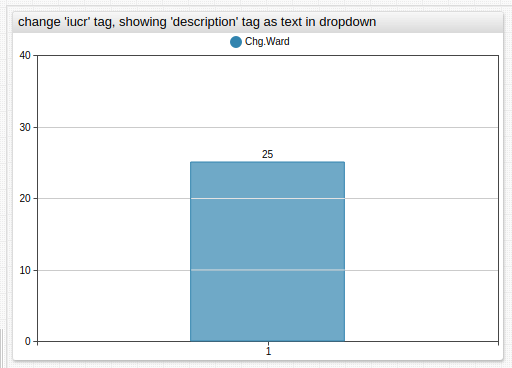

[](https://apps.axibase.com/chartlab/1b6335dc)

To fill the drop-down list with options with the value of the `iucr` tag and the text from the `description` tag, use the following syntax:

```ls
[dropdown]
  options = javascript: requestMetricsSeriesOptions("tags.iucr", "tags.description")
  change-field = series.tags.iucr
```

The content of the resulting drop-down list is shown below:


---

### `requestEntitiesMetricsOptions()`

**Description**:

* Requests metrics for the `entity` adding `queryParameters` to the requested URL.
* Creates an option for each loaded metric.
* The value of the field found by `valueFieldPath` is assigned to the option value.
* The value of the field found by `textFieldPath` is assigned to the option text.
  * If `textFieldPath` is an array, it sequentially tries to find a field by every path.
* When a field is found it is assigned to the option text.
  * If `callback` function is specified `valueFieldPath` and `textFieldPath` are ignored.
* `callback` gets loaded metrics as an argument and returns an array of options, where at least the value must be specified.

**Syntax**:

```ls
requestEntitiesMetricsValues([fieldPath, [callback, [entity, [unique, [queryParameters]]]]])
```

**Scope of Usage**:

Use in `[dropdown]` field `options` setting after `javascript:` prefix.

**API Endpoint**:

Sends asynchronous `GET` request to
[`/api/v1/entities/{entity}/metrics`](https://axibase.com/docs/atsd/api/meta/entity/metrics.html)

**Returned Value**:

`Array<{value: string, text: string}>`: options, generated from metrics descriptors fields.

**Arguments**:

| Name | Type | Description |
|:------|:------|:-------------|
| `valueFieldPath` | string | Dot-separated path to the field, whose value is used as option value. |
| `textFieldPath` | string or Array | Dot-separated path, or array of paths, to the field whose value is used as option text. |
| `callback` | function | Function to process series descriptors.<br>Returns array of options. |
| `entity` | string | Entity, for which metrics descriptors are loaded.<br>If not specified, `entity` from `[widget]` is used. |
| `unique` | boolean | Applied to raw series descriptors. |
| `queryParameters` | string/object | String or key-value object representing request parameters. |

**Examples**:

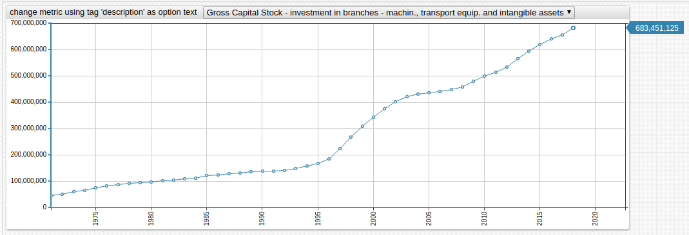

[](https://apps.axibase.com/chartlab/c2fb333f)

To fill the drop-down list with options defined by the value of the `iucr` tag and text from the `description` tag, use the following syntax:

```ls
[dropdown]
  options = javascript: requestEntitiesMetricsOptions("name", "tags.description", null, null, null,{tags:"*",limit:15})
  change-field = metric
```

The content of the resulting drop-down list is shown below:


---

### `requestPropertiesOptions()`

**Description**:

* Requests the entity tags or properties for the entity or the entities specified by the `entity` parameter.
  * If `postBody` is specified, `entity` and `propertyType` parameters are ignored.
* Function requests entity tags if `$entity_tags` is specified as `propertyType`, or otherwise requests properties.
* Creates an option for each loaded tag or property object.
* The value of the field found by `valueFieldPath` is assigned to the option value.
* The value of the field found by `textFieldPath` is assigned to the option text.
  * If `textFieldPath` is an array, the function sequentially tries to find a field at each path.
* When a field is found it is assigned to the option text.
  * If `callback` function is specified, the `valueFieldPath` and `textFieldPath` parameters are ignored.
* `callback` gets loaded tags/properties as an argument and returns an array of options, where at least the value must be specified.

**Syntax**:

```ls
requestPropertiesOptions([valueFieldPath, [textFieldPath, [callback, [entity, [propertyType, [unique, [postBody]]]]]]])
```

**Scope of Usage**:

Use in `[dropdown]` field `options` setting after `javascript:` prefix.

**API Endpoint**:

Sends asynchronous `POST` request to
[`/api/v1/properties/query`](https://axibase.com/docs/atsd/api/data/properties/query.html).

**Returned Value**:

`Array<string>`: options, generated from the property or entity descriptors fields.

**Arguments**:

| Name | Type | Description |
|:------|:------|:-------------|
| `valueFieldPath` | string | Dot-separated path to the field, whose value is used as `option` value. |
| `textFieldPath` | string or Array | Dot-separated path (or array of such paths) to the field, whose value is used as `option` text. |
| `callback` | function | Function to process series descriptors, returns array of options. |
| `entity` | string or Array | entity or entities, for which properties descriptors are loaded. If not specified, `entities` or `entity` from the `[widget]` section  is used. |
| `propertyType` | string | Type of loaded properties, default is `$entity_tags`. |
| `unique` | boolean | Applied to raw series descriptors. |
| `postBody` | object | Body of [Data API properties query](https://axibase.com/docs/atsd/api/data/properties/query.html). |

**Examples**:

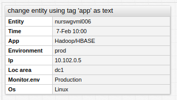

[](https://apps.axibase.com/chartlab/ec413f7c)

To fill drop-down list with values from `entity` and text from tag `app`, use the following syntax:

```ls
[dropdown]
  options = javascript: requestPropertiesOptions("entity", "tags.app", null, ["nurswgvml006","nurswgvml007", "nurswgvml010", "nurswgvml301", "nurswgvml502"], "$entity_tags")
  change-field = entity
```

The content of the resulting drop-down list is shown here:


---

### `TextFieldPath _(optional, type: string/Array<string>)_`

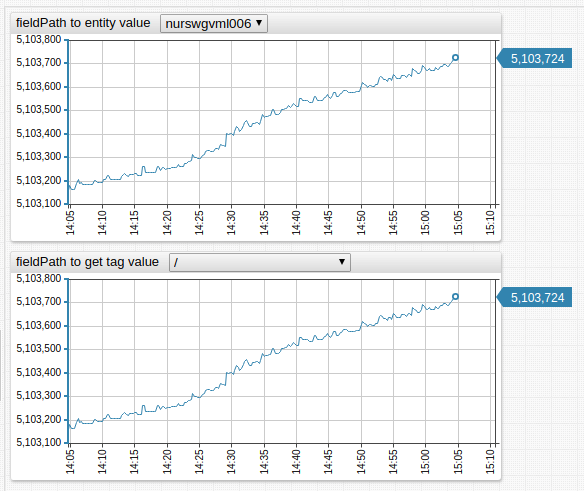

[](https://apps.axibase.com/chartlab/5b41b689)

`textFieldPath` are the period-separated paths to a field in a series descriptor object, or an array of such paths. If it is an array then all elements other than the first are used as text. If `textFieldPath` is not specified or search on all paths failed the value is used as text.

To fill a drop-down list with options in which values are retrieved from the `name` field of the metric descriptor and text from the tag `description`, `textFieldPath` as string can be used.

```ls
[dropdown]
  options = javascript: requestEntitiesMetricsOptions('name', 'tags.description', null, null, null, {tags:'*',limit:15})
  change-field = metric
```

Below is the content of the drop-down list:


Fill the drop-down list with values retrieved from the `name` field of the metric descriptor and the text from the tag `description` or tag `documentation`, if the descriptor has no value for the tag `description`, `textFieldPath` as an array can be used

```ls
[dropdown]
  options = javascript: requestEntitiesMetricsOptions('name', ['tags.description','tags.documentation'], null, null, null, {tags:'*',limit:15})
  change-field = metric
```

Below is the content of the drop-down list:


---

### `Callback _(optional, type:function)_`

* Use `callback` for manual processing of descriptors, which are passed as parameters.
  * If `callback` is specified, `valueFieldPath` and `textFieldPath` are ignored.
* Function returns an array of objects, representing options.

```ls
[
...
{
  value: string,
  text: string
}
...
]
```

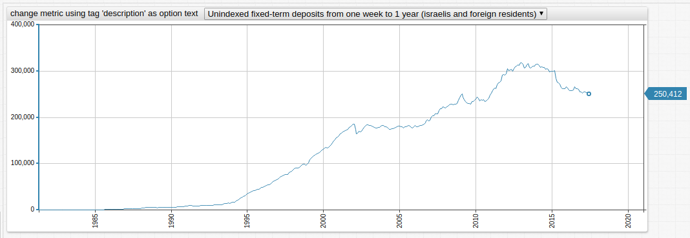

[](https://apps.axibase.com/chartlab/22ac9c17)

To populate the drop-down list with the names of metrics, collected for the entity, and texts which are changed values of the `description` tag, use the following syntax:

```ls
[dropdown]
  change-field = metric

  options = javascript: requestEntitiesMetricsOptions(null, null, function(metrics) {
  options =      return metrics.map(function(m) {
  options =        return {
  options =          value: m.name,
  options =          text: m.tags.description.replace('Gross Capital Stock', 'GCS')
  options =        }
  options =      });
  options =    }, null, null, {tags:'*',limit:15})
```

The contents of the resulting drop-down list are shown here:


---

## `requestMetricsSeriesValues()`

**Description**:

* Requests series for `metric` and adds `queryParameters` to the requested URL.
  * If `fieldPath` is specified retrieves fields found by `fieldPath` in the series.
  * If `unique` is specified retrieved values are unique and sorted.
  * If `callback` function is specified, the array of retrieved fields or the array of loaded series as an argument is returned, whether or not `fieldPath` is specified.
* Returns array of options, objects with `value` property set to the retrieved and processed value.

**Syntax**:

```javascript
requestMetricsSeriesValues([fieldPath, [callback, [metric, [unique, [queryParameters]]]]])
```

**Scope of Usage**:

Use in `[dropdown]` field `options` setting after `javascript:` prefix.

**API Endpoint**:

Sends asynchronous `GET` requests to
[`/api/v1/metrics/{metric}/series`](https://axibase.com/docs/atsd/api/meta/metric/series.html)

**Returned Value**:

`Array<string>`: Values fill the drop-down list, retrieved from series descriptors.

**Arguments**:

| Name | Type | Description |
|:------|:------|:-------------|
| `fieldPath` | string | Dot-separated path to the field, whose value is retrieved. |
| `callback`  | function | Function to process series descriptors or retrieved values. |
| `metric` | string | Metrics, for which series are loaded.<br>If not specified, `metric` from the `[widget]` section  is used. |
| `unique` | boolean | Specify if retrieved values are unique and sorted<br>Default value: `true`. |
| `queryParameters` | string/object | String or key-value object representing request parameters. |

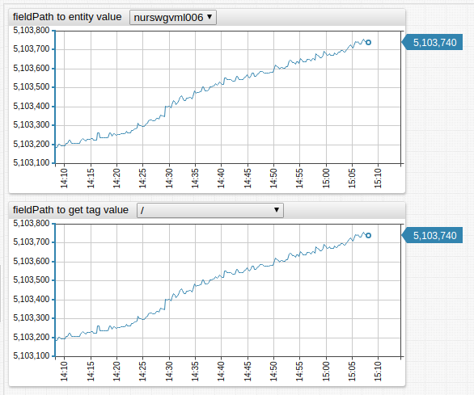

[](https://apps.axibase.com/chartlab/7fab7dd2)

The `fieldPath` `"tags.mount_point"` reads `tags`in each descriptor then retrieves the `mount_point` field.

```ls
[dropdown]
  options = javascript: requestMetricsSeriesValues("tags.mount_point")
  change-field = series.tags.mount_point
```


---

## `requestEntitiesMetricsValues()`

**Description**:

* Requests metrics for the `entity` adding `queryParameters` to the requested URL.
  * If `fieldPath` is specified, retrieves fields found by `fieldPath` in the metric.
  * If `unique` is specified, retrieved values are both unique and sorted.
  * If `callback` function is specified, the function returns the array of retrieved fields or the array of loaded metrics as argument, whether or not `fieldPath` is specified.
* Returns the array of options - objects with `value` property set to the retrieved and processed value.

**Syntax**:

```javascript
requestEntitiesMetricsValues([fieldPath, [callback, [entity, [unique, [queryParameters]]]]])
```

**Scope of Usage**:

Use in `[dropdown]` field `options` setting after `javascript:` prefix.

**API Endpoint**:
Sends asynchronous `GET` requests to
[`/api/v1/entities/{entity}/metrics`](https://axibase.com/docs/atsd/api/meta/entity/metrics.html)

**Returned Value**:

`Array<string>`: values to fill the drop-down list, retrieved from metric descriptors.

**Arguments**:

| Name | Type | Description |
|:------|:------|:-------------|
| `fieldPath` | string | Dot-separated path to the field, whose value is retrieved. |
| `callback` | function | Function to process series descriptors or retrieved values. |
| `entity` | string | Entity, for which metric descriptors are loaded. If not specified, `entity` from the `[widget]` section  is used. |
| unique | boolean | Specify whether retrieved values be unique and sorted, default is `true`. |
| `queryParameters` | string/object | string or key-value object representing request parameters. |

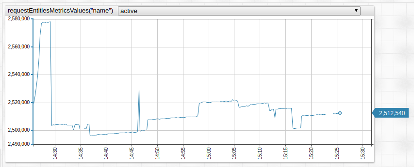

[](https://apps.axibase.com/chartlab/001613f8)

To populate the drop-down list with names of metrics collected for the entity use the following syntax:

```ls
[dropdown]
  options = javascript: requestEntitiesMetricsValues("name")
  change-field = series.metric
```

The content of the resulting drop-down list is shown below:


---

### `requestPropertiesValues()`

**Description**:

* Requests entity tags or properties for the entity or entities specified by the `entity` parameter.
  * If `postBody` is specified, `entity` and `propertyType` parameters are ignored.
* Function requests entity tags if `$entity_tags` is specified as `propertyType`, or if not, requests properties.
  * If `fieldPath` is specified retrieve fields found by `fieldPath` in the entity tags or properties.
  * If `unique` is specified retrieved values are both unique and sorted.
  * If `callback` function is specified, it is applied to the array of retrieved fields or the array of entity tags/properties, whether or not `fieldPath` is specified.
* Returns the array of options, objects with `value` property set to the processed retrieved value.

**Syntax**:

```javascript
requestPropertiesValues([valueFieldPath, [textFieldPath, [callback, [entity, [propertyType, [unique, [postBody]]]]]]])
```

**Scope of Usage**:

Use in `[dropdown]` field `options` setting after `javascript:` prefix.

**API Endpoint**:
Sends asynchronous `POST` requests to
[`/api/v1/properties/query`](https://axibase.com/docs/atsd/api/data/properties/query.html)

**Returned Value**:

`Array<string>`: Values to fill the drop-down list, retrieved from properties descriptors.

**Arguments**:

| Name | Type | Description |
|:------|:------|:-------------|
| `fieldPath` | string | Dot-separated path to the field, whose value is retrieved. |
| `callback` | function | Function to process series descriptors or retrieved values. |
| `entity` | string, array | Entity or entities, for which properties descriptors are loaded.<br>If not specified, `entities` or `entity` from the `[widget]` section  is used. |
| `propertyType` | string | Type of loaded properties.<br>Default setting: `$entity_tags`. |
| `unique` | boolean | Specifies whether retrieved values are unique and sorted.<br>Default value: `true`. |
| `postBody` | object | Body of [Data API Properties Query](https://axibase.com/docs/atsd/api/data/properties/query.html). |

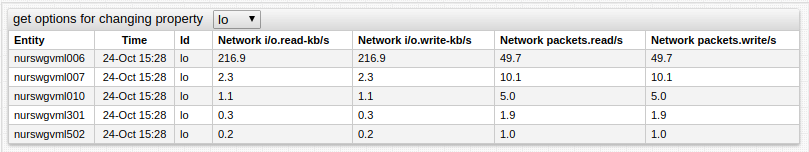

[](https://apps.axibase.com/chartlab/5a8eb13b)

To populate the drop-down list with the `id` of `network` properties use the following syntax:

```ls
[dropdown]
  options = javascript: requestPropertiesValues("key.id", null, null, "network")
  change-field = property.keys.id
```

The content of the resulting drop-down list is shown below:

