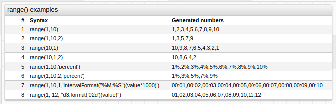
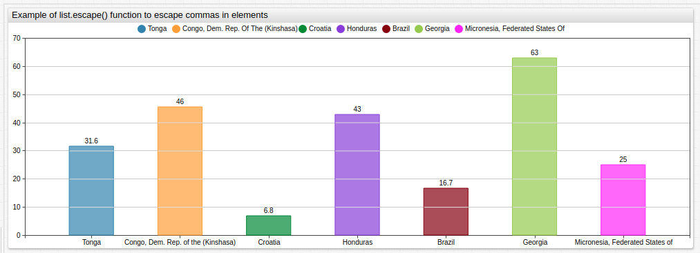
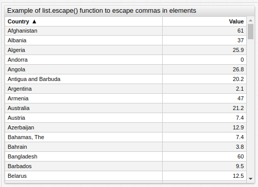
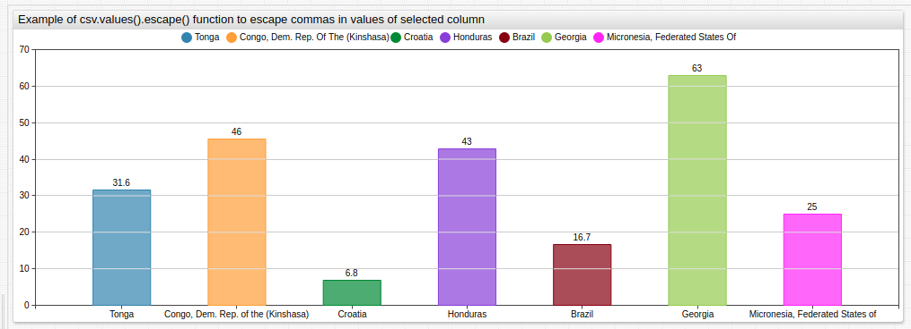

# Control Structures

The control structures extend the static configuration syntax with variable assignment, conditional branches, iterators, and user-defined functions.

* [`var`](#var): assign any object.
* [`list`](#list): parse string to a list of strings.
* [`csv`](./csv.md): parse table to a list of objects.
* [`for`](#for): loop / iterate.
* [`if`](#if): conditional processing.
* [`script`](#script): define functions.

---

## `var`

`var` assigns an array, object, or function to a variable whose value and fields can be accessed with a placeholder.

If the `var` assignment occupies one line, closing it with `endvar` is not required.

The variable must be assigned following the JavaScript syntax, however _without_ the closing semi-colon.

```ls
var disks = [[9,2], [9,3], [8,0], [9,0], [9,1], [8,16]]

for di in disks
    [series]
      [tags]
      major = @{di[0]}
      minor = @{di[1]}
endfor
```

```ls
# use single or double quotes to assign strings.
# do not close the statement with ;
var tp = "busy"

[series]
  entity = nurswgvml006
  metric = cpu_@{tp}
```

Available functions:

* [String functions](./label-formatting.md#string-functions)
* [`getTags()`](./api-functions.md#gettags)
* [`getSeries()`](./api-functions.md#getseries)
* [`getMetrics()`](./api-functions.md#getmetrics)
* [`getEntities()`](./api-functions.md#getentities)
* [`range()`](#range)

The list of entities can be loaded into a `var` array from the server using the [`getEntities`](./api-functions.md#getentities) function.

```ls
# Load entity names into an array
var hosts = getEntities('svl-hosts')

# Loop over the 'hosts' array, referring to each element as '@{host}'
for host in hosts
    [series]
      entity = @{host}
endfor
```

---

## `list`

Create a named list of comma-separated elements to iterate through the list with a `for` loop.

```ls
list servers = awsswgvml001, nurswgvml003,
  nurswgvml006, nurswgvml007, nurswgvml009
endlist
```

The elements can be located on multiple lines in which case the list must be closed with the `endlist` keyword.

If the elements fit on one line, `endlist` is not required.

```ls
list servers = awsswgvml001, nurswgvml003
```

The `list` assignment is similar to [`var`](#var). However the `var` assignment requires the elements to be quoted and enclosed in square brackets.

```ls
list servers = awsswgvml001, nurswgvml003
var servers = ['awsswgvml001', 'nurswgvml003']
```

---

## `for`

Iterates over a list created with the [`list`](#list) command, an array declared with `var` or specified inline, or variable properties. To access the current element use the `@{elementname}` placeholder syntax, or in simple cases, `@elementname`.

> Multiple `for` or `endfor` loops can be nested.

Create the following visualization which tracks metric `cpu_idle` for entities `nurswgvml010` and `nurswgvml007` using either method.


**Iterating Over a List**:

```ls
list servers = nurswgvml010, nurswgvml007
  for server in servers
  [series]
    entity = @{server}
endfor
```

[](https://apps.axibase.com/chartlab/554e7ab3)

**Iterating Over an Inline Array**:

```ls
for server in ['nurswgvml010', 'nurswgvml007']
  [series]
    entity = @{server}
endfor
```

[](https://apps.axibase.com/chartlab/081a08ee)

---

### Iterating Over Object Properties

 Order is arbitrary when iterating with the [`Object.keys()`](https://developer.mozilla.org/en-US/docs/Web/JavaScript/Reference/Global_Objects/Object/keys) function.

```ls
var tags = {
'level': 'ERROR',
'command': 'com.axibase.tsd.Server',
'logger': 'com.axibase.tsd.web.DefaultExceptionHandler'
}
endvar

[widget]
  type = chart
  [series]
    [tags]
      for tag_name in Object.keys(tags):
        @{tag_name} = @{tags[tag_name]}
      endfor
```

---

### Iterating Over Objects with Named Fields

```ls
var servers = [
  {'name': 'nurswgvml001', 'networks': ['en3', 'en4']},
  {'name': 'nurswgvml002', 'networks': ['en5']}
]
endvar

for server in servers
  [widget]
    type = box
    entity = @{server.name}
    metric = network_sent_mb
    for net in server.networks
    [series]
      [tags]
       interface = @{net}
    endfor
endfor
```

---

### Iterating Over Object Properties

```ls
var servers = {
    'nurswgvml001': ['en3', 'en4'],
    'nurswgvml002': ['en5']
}
endvar

for server in servers
[widget]
  type = box
  entity = @{server}
  for net in servers[server]
  [series]
    [tags]
      interface = @{net}
  endfor
endfor
```

---

### Iterating Over a Multi-Dimensional Array

```ls
var servers = [
      ['nurswgvml001', ['en3', 'en4']],
      ['nurswgvml002', ['en5']]
  ]
endvar

for server in servers
  [widget]
    type = box
    entity = @{server[0]}
    metric = network_sent_mb
    for net in server[1]
    [series]
      [tags]
       interface = @{net}
    endfor
endfor
```

#### Insert `[group]` line for each fourth element in the array

```ls
for server in servers
  /* add [group] before every 4th element to display 4 widgets per row */
  if server_index % 4 == 0
  [group]
  endif

  [widget]
    entity = @{server}
endfor
```

Use the `widgets-per-row` setting under `[group]` level to control the number of widgets displayed on each row.

```ls
[group]
  widgets-per-row = 4
for server in servers
  [widget]
    entity = @{server}
endfor
```

Text inside placeholder `@{elementname}` is evaluated as an expression and can be used for concatenation and formatting.

```ls
list servers = 001, 003, 006, 007, 009
for server in servers
  [series]
    entity = @{'nurswgvml' + server}
endfor
```

---

## `if`

Evaluates an expression and prints settings if the expression is `true`. If the expression returns `false`, content located within the branch is excluded from widget configuration.

Array elements are accessed in the `if` or `elseif` expression by name, not as a placeholder.

```ls
for server in servers
  [series]
    entity = @{server}
    if server == 'nurswgvml007'
      color = red
    elseif server == 'nurswgvml006'
      color = green
    endif
endfor
```


[](https://apps.axibase.com/chartlab/2350236d)

---

## `script`

Include inline JavaScript functions using `script` syntax.

If `script` only occupies one line, `endscript` is not required.

```ls
script
window.roundToTen = function (value) {
    return Math.round(value / 10) * 10;
}
endscript
```


[](https://apps.axibase.com/chartlab/f7449e4a#fullscreen)

---

## `range()`

**Description**:

* Generates a regularly spaced array of numbers from `start` to `end` with configurable `step`.
  * If `step` is not specified, numbers are sequential.
  * If `start` is greater than `end`, numbers are generated in descending order.
  * If `format` is specified, each number is formatted and converted to a string.

**Syntax**:

```javascript
range(start, end, [step], [format])
```

**Returned Value**:

`Array<number/string>`: generates optionally formatted numbers.

**Arguments**:

| Name | Type | Description |
|:------|:------|:-------------|
| `start` | number | **[Required]**  First number in list. |
| `end` | number | **[Required]**  Last number in list. |
| `step` | number | Offset between adjacent numbers. |
| `format` | string | [Format setting](./format-settings.md). |

### Return sequential numbers from `1` to `10`



[](https://apps.axibase.com/chartlab/55a5fd09)

**Syntax**:

```javascript
range(1,10)
```

**Result**:

```javascript
1,2,3,4,5,6,7,8,9,10
```

### Return numbers from `1` to `10` with double step

**Syntax**:

```javascript
range(1,10,2)
```

**Result**:

```javascript
1,3,5,7,9
```

### Return numbers from `10` to `1` with a single step

**Syntax**:

```javascript
range(10,1)
```

**Result**:

```javascript
10,9,8,7,6,5,4,3,2,1
```

### Return numbers from `10` to `1` with a double step

**Syntax**:

```javascript
range(10,1,2)
```

**Result**:

```javascript
10,8,6,4,2
```

### Format sequential numbers `1` to `10` as a percent

**Syntax**:

```javascript
range(1,10,'percent')
```

**Result**:

```javascript
1%,2%,3%,4%,5%,6%,7%,8%,9%,10%
```

### Return numbers from `1` to `10` with a double step and format as a percent

**Syntax**:

```javascript
range(1,10,2,'percent')
```

**Result**:

```javascript
1%,3%,5%,7%,9%
```

### Format sequential numbers from `1` to `10` as minutes

**Syntax**:

```javascript
range(1,10,1,'intervalFormat("%M:%S")(value*1000)')
```

**Result**:

```javascript
00:01,00:02,00:03,00:04,00:05,00:06,00:07,00:08,00:09,00:10
```

### Format sequential numbers from `1` to `12` with an additional fill character (`0`) for single digit values

**Syntax**:

```javascript
range(1, 12, "d3.format('02d')(value)")
```

**Result**:

```javascript
01,02,03,04,05,06,07,08,09,10,11,12
```

---

## `list.escape()`

**Description**:

* Escapes commas for each value in an array of strings.
* The `.escape()` method is available in arrays generated from the `list` keyword, `var` expression, and [`csv.values()`](./csv.md#functions) method.

**Syntax**:

```ls
list_name.escape()
```

**Returned Value**:

`Array<string>`: An  array where commas are escaped for each element. If the argument is not a string the argument is returned unmodified.

### Retrieve a list of escaped country names

> Countries names are generated from the `list`, `var` and `csv.values()`

#### Apply `.escape()` to array generated from `list`



[](https://apps.axibase.com/chartlab/c25ce4a7)

**Syntax**:

```txt
list countries =
  Brazil,
  Croatia,
  Micronesia\, Federated States of,
  Georgia,
  Tonga,
  Honduras,
  Congo\, Dem. Rep. of the (Kinshasa)
endlist

country = @{countries.escape()}
```

**Result**:

```json
["Brazil","Croatia","Micronesia\\, Federated States of","Georgia","Tonga","Honduras","Liechtenstein","Congo\\, Dem. Rep. of the (Kinshasa)"]
```

#### Apply `.escape()` to the array created in a [`var`](./control-structures.md#var) expression



[](https://apps.axibase.com/chartlab/04435f95)

**Syntax**:

```ls
var countries = getTags('state.visa-refusal-rate', 'country', 'travel.state.gov')

country = @{countries.escape()}
```

**Result**:

```json
[... "Comoros","Congo\\, Dem. Rep. of the (Kinshasa)","Congo\\, Rep. of the (Brazzaville)","Costa Rica","Cote d'Ivoire" ...]
```

#### Apply `.escape()` to the array retrieved by [`csv.values()`](./csv.md#functions)



[](https://apps.axibase.com/chartlab/c7799073)

**Syntax**:

```txt
csv countries =
  name, value2006
  Brazil, 13.2
  Croatia, 4.9
  "Micronesia, Federated States of", 100
  Georgia, 48.2
  Tonga, 40.8
  Honduras, 38
  Liechtenstein, 5.9
  "Congo, Dem. Rep. of the (Kinshasa)",44.2
endcsv

country = @{countries.values('name').escape()}
```

**Result**:

```txt
["Brazil","Congo\\, Dem. Rep. of the (Kinshasa)","Croatia","Georgia","Honduras","Liechtenstein","Micronesia\\, Federated States of","Tonga"]
```

---

## Troubleshooting

To review the final configuration text after pre-processing, add `script = console.log(widgetConfig)` anywhere in the widget configuration and review the text via **Inspect Element > Console**.

```ls
script = console.log(widgetConfig)
```
