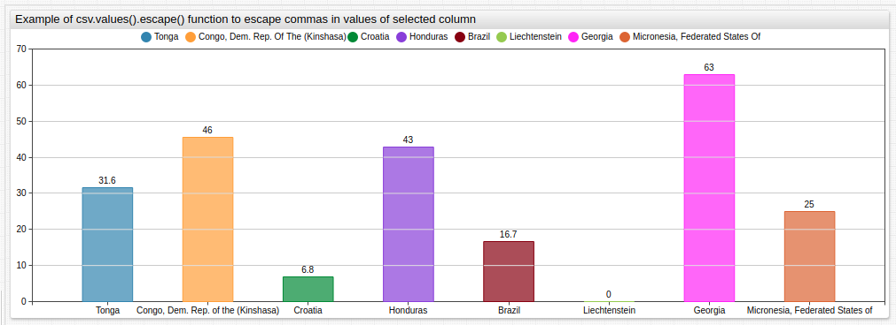

# Control Structures

The control structures extend the static configuration syntax with variable assignment, conditional branches, iterators, and user-defined functions.

* [`var`](#var): assign any object.
* [`list`](#list): parse string to a list of strings.
* [`csv`](#csv): parse table to a list of objects.
* [`for`](#for): loop / iterate.
* [`if`](#if): conditional processing.
* [`script`](#script): define functions.

---

## `var`

`var` assigns an array, object, or function to a variable whose value and fields can be accessed with a placeholder.

If the `var` assignment occupies one line, closing it with `endvar` is not required.

```ls
var disks = [[9,2], [9,3], [8,0], [9,0], [9,1], [8,16]]

for di in disks
    [series]
      [tags]
      major = @{di[0]}
      minor = @{di[1]}
endfor
```

Available functions:

* [String functions](./label-formatting.md#string-functions)
* [`getTags()`](./api-functions.md#gettags)
* [`getSeries()`](./api-functions.md#getseries)
* [`getMetrics()`](./api-functions.md#getmetrics)
* [`getEntities()`](./api-functions.md#getentities)
* [`range()`](#range)

The list of entities can be loaded into a `var` array from the server using the [`getEntities`](./api-functions.md#getentities) function.

```ls
# Load entity names into an array
var hosts = getEntities('svl-hosts')

# Loop over the 'hosts' array, referring to each element as '@{host}'
for host in hosts
    [series]
      entity = @{host}
endfor
```

---

## `list`

Create a named list of comma-separated elements to iterate through the list with a `for` loop.

```ls
list servers = awsswgvml001, nurswgvml003,
  nurswgvml006, nurswgvml007, nurswgvml009
endlist
```

The elements can be located on multiple lines in which case the list must be closed with the `endlist` keyword.

If the elements fit on one line, `endlist` is not required.

```ls
list servers = awsswgvml001, nurswgvml003
```

The `list` assignment is similar to [`var`](#var). However the `var` assignment requires the elements to be quoted and enclosed in square brackets.

```ls
list servers = awsswgvml001, nurswgvml003
var servers = ['awsswgvml001', 'nurswgvml003']
```

---

## `for`

Iterates over a list created with the [`list`](#list) command, an array declared with `var` or specified inline, or variable properties. To access the current element use the `@{elementname}` placeholder syntax, or in simple cases, `@elementname`.

> Multiple `for` or `endfor` loops can be nested.

Create the following visualization which tracks metric `cpu_idle` for entities `nurswgvml010` and `nurswgvml007` using either method.


**Iterating Over a List**:

```ls
list servers = nurswgvml010, nurswgvml007
  for server in servers
  [series]
    entity = @{server}
endfor
```

[](https://apps.axibase.com/chartlab/554e7ab3)

**Iterating Over an Inline Array**:

```ls
for server in ['nurswgvml010', 'nurswgvml007']
  [series]
    entity = @{server}
endfor
```

[](https://apps.axibase.com/chartlab/081a08ee)

---

### Iterating Over Object Properties

 Order is arbitrary when using the [`Object.keys()`](https://developer.mozilla.org/en-US/docs/Web/JavaScript/Reference/Global_Objects/Object/keys) function.

```ls
var tags = {
'level': 'ERROR',
'command': 'com.axibase.tsd.Server',
'logger': 'com.axibase.tsd.web.DefaultExceptionHandler'
}
endvar

[widget]
  type = chart
  [series]
    [tags]
      for tag_name in Object.keys(tags):
        @{tag_name} = @{tags[tag_name]}
      endfor
```

---

### Iterating Over Objects with Named Fields

```ls
var servers = [
  {'name': 'nurswgvml001', 'networks': ['en3', 'en4']},
  {'name': 'nurswgvml002', 'networks': ['en5']}
]
endvar

for server in servers
  [widget]
    type = box
    entity = @{server.name}
    metric = network_sent_mb
    for net in server.networks
    [series]
      [tags]
       interface = @{net}
    endfor
endfor
```

---

### Iterating Over Object Properties

```ls
var servers = {
    'nurswgvml001': ['en3', 'en4'],
    'nurswgvml002': ['en5']
}
endvar

for server in servers
[widget]
  type = box
  entity = @{server}
  for net in servers[server]
  [series]
    [tags]
      interface = @{net}
  endfor
endfor
```

---

### Iterating Over a Multi-Dimensional Array

```ls
var servers = [
      ['nurswgvml001', ['en3', 'en4']],
      ['nurswgvml002', ['en5']]
  ]
endvar

for server in servers
  [widget]
    type = box
    entity = @{server[0]}
    metric = network_sent_mb
    for net in server[1]
    [series]
      [tags]
       interface = @{net}
    endfor
endfor
```

#### Insert `[group]` line for each fourth element in the array

```ls
for server in servers
  /* add [group] before every 4th element to display 4 widgets per row */
  if server_index % 4 == 0
  [group]
  endif

  [widget]
    entity = @{server}
endfor
```

Use the `widgets-per-row` setting under `[group]` level to control the number of widgets displayed on each row.

```ls
[group]
  widgets-per-row = 4
for server in servers
  [widget]
    entity = @{server}
endfor
```

Text inside placeholder `@{elementname}` is evaluated as an expression and can be used for concatenation and formatting.

```ls
list servers = 001, 003, 006, 007, 009
for server in servers
  [series]
    entity = @{'nurswgvml' + server}
endfor
```

---

## `if`

Evaluates an expression and prints settings if the expression is `true`. If the expression returns `false`, content located within the branch is excluded from widget configuration.

Array elements are accessed in the `if` or `elseif` expression by name, not as a placeholder.

```ls
for server in servers
  [series]
    entity = @{server}
    if server == 'nurswgvml007'
      color = red
    elseif server == 'nurswgvml006'
      color = green
    endif
endfor
```


[](https://apps.axibase.com/chartlab/2350236d)

---

## `csv`

Create comma-separated value lists in the **Editor** window.

```ls
csv metrics =
  keyword,identifier
  Consumer Price Index,CPIAUCSL
  Real Gross National Product,A001RO1Q156NBEA
  National income,A032RC1A027NBEA
  Corporate Profits Before Tax,A464RC1A027NBEA
  GDP per Capita,A939RC0A052NBEA
  Average Sale Price of Houses,ASPUS
  Capacity Utilization,CAPUTLB50001SQ
  Cash Surplus or Deficit(% GDP),CASHBLUSA188A
endcsv
```

Access CSV lists to create the parameters for an inline [drop-down list](../configuration/drop-down-lists.md) or [labeling pattern](./label-formatting.md) using [`for`](#for) statements.

```ls
for option in metrics
  [option]
    text = @{option.keyword}
    value = @{option.identifier}
endfor
```


[](https://trends.axibase.com/7fc545d0)

### CSV Inline Text Mode

**Description**:

* Parses CSV-like text placed between `csv name =` and `endcsv` keywords into an array of objects.
* First line contains header and column names.
* Other lines contain data.
* Each data line is parsed into the object, where keys are column names and values are the values of corresponding cells.
* The generated array uses the `.value(column_name)` method to get unique sorted values of the defined column.

Limitations and features that are applied:

* Handling for empty lines and spaces.
* To escape spaces, use double quotes `"`.
* Value cannot contain double quotes `"`.
* Multi-line rows are not supported.
* The delimiter symbol is comma (`,`)

**Syntax**:

```ls
csv name = header1, header2 ...
cell11, cell12 ...
cell21, cell22 ...
...
endcsv
```

**Scope of Usage**:

Use in the `preprocessor` stage.

**Returned Value**:
`Array<object>`: Array of rows represented as objects with headers as keys and cells as corresponding values.

### Create array of objects from tabular structure using CSV


[](https://apps.axibase.com/chartlab/df616dfa/8/)

Using a table written in a CSV-like format: There are two columns, `name` (name of the country) and `value2006` (value in the year 2006). The return value is the difference between the current year value and the 2006 value. The following CSV is used:

```ls
csv countries =
  name, value2006
  Brazil, 13.2
  Croatia, 4.9
  "Micronesia, Federated States of", 100
  Georgia, 48.2
  Tonga, 40.8
  Honduras, 38
  Liechtenstein, 5.9
  "Congo, Dem. Rep. of the (Kinshasa)",44.2
endcsv

country = @{countries.values('name').escape()}
```

This CSV is transformed into the following array:

```json
[
    {
        "name":"Brazil",
        "value2006":"13.2"
    },
    {
        "name":"Croatia",
        "value2006":"4.9"
    },
    {
        "name":"Micronesia, Federated States of",
        "value2006":"100"
    },
    {
        "name":"Georgia",
        "value2006":"48.2"
    },
    {
        "name":"Tonga",
        "value2006":"40.8"
    },
    {
        "name":"Honduras",
        "value2006":"38"
    },
    {
        "name":"Liechtenstein",
        "value2006":"5.9"
    },
    {
        "name":"Congo, Dem. Rep. of the (Kinshasa)",
        "value2006":"44.2"
    }
]
```

### Iterate over the newly created array and set the value and entity based on retrieved country `name` and `value2006`

```ls
for country in countries
    [series]
      replace-value = value - @{country.value2006}
      [tags]
        country = @{country.name.replace(",", "\\,")}
endfor
```

---

### CSV From Mode

**Description**:

* Parse a CSV file located at the defined URL into an array of objects.
* Each data line is parsed into the object, where keys are column names and values are the values of the corresponding cells.
* The generated array uses the `.value(column_name)` method to get unique sorted values of defined column.

Limitation and features applied to text:

* Handling for empty lines and spaces.
* To escape spaces use double-quotes(`"`).
* Values cannot contain double-quotes(`"`).
* Multi-line rows are not supported.
* The delimiter symbol is comma (`,`)

**Syntax**:

```ls
csv csv_name from url
```

**Scope of Usage**:

Use in the `preprocessor` stage.

**Returned Value**:
`Array<object>`: Array of rows represented as objects with headers as keys and cells as corresponding values.

#### Create array of objects from CSV file


[](https://apps.axibase.com/chartlab/b00d77c0)

The returned value in this example is the difference between the current year value and the 2006 value.

The file is loaded from [ATSD Use Cases](https://axibase.com/use-cases/) and stored  in [CSV format](https://raw.githubusercontent.com/axibase/atsd-use-cases/master/research/us-visa-refusal/resources/visa-refusal.csv).

The first several rows from the file are shown below:

```txt
country,2006,2007,2008,2009,2010,2011,2012,2013,2014,2015,2016
Brazil,13.2,9.6,5.5,7,5.2,3.8,3.2,3.5,3.2,5.36,16.7
Croatia,4.9,5.1,5.1,5.3,5.3,6.3,4.4,5.9,6.1,5.29,6.78
"Micronesia, Federated States of",100,0,50,100,0,33.3,50,100,80,85.71,25
Georgia,48.2,55.4,46.6,49.7,43.6,40.2,31.8,38.3,48.2,50.58,62.82
Tonga,40.8,45.4,48.7,47.8,42.8,46.5,41.5,42.1,25.4,28.09,31.58
Honduras,38,37.7,33.6,29.2,29.2,27.6,29.8,37,36.8,39.73,42.76
Liechtenstein,5.9,6.7,0,12.5,5.9,0,0,10,11.1,0,0
```

The setting to load and parse the file is shown below:

```sh
csv rows from https://raw.githubusercontent.com/axibase/atsd-use-cases/master/USVisaRefusal/Resources/visa-refusal.csv
```

```json
[
    {
        "2006":"13.2",
        "2007":"9.6",
        "2008":"5.5",
        "2009":"7",
        "2010":"5.2",
        "2011":"3.8",
        "2012":"3.2",
        "2013":"3.5",
        "2014":"3.2",
        "2015":"5.36",
        "2016":"16.7",
        "country":"Brazil"
    },
    {
        "2006":"4.9",
        "2007":"5.1",
        "2008":"5.1",
        "2009":"5.3",
        "2010":"5.3",
        "2011":"6.3",
        "2012":"4.4",
        "2013":"5.9",
        "2014":"6.1",
        "2015":"5.29",
        "2016":"6.78",
        "country":"Croatia"
        ...
    },
```

#### Iterate over the created array and set the value and entity based on the retrieved country `name` and value or year `2006`

```ls
for row in rows
  [series]
    replace-value = value - @{row[2006]}
  [tags]
    country = @{row.country.replace(",", "\\,")}
  endfor
```

---

### `csv.values()`

**Description**:

* Arrays generated from `csv` use the `.values()` method.
* This function returns a sorted array of unique values in the column defined by the parameter `column_name`.
* The generated array contains the `.escape()` method which escapes commas in each element.
* Escapes commas for values within a CSV file using [`list.escape()`](#listescape) method.

**Syntax**:

```ls
csv_name.values(column_name)
```

**Scope of Usage**:

Use in the `preprocessor` scope in `var`, `if`, `if else`, `for .. in`, `@{}` expressions.

**Returned Value**:

`Array<string>`: Array of unique values in the column defined by `column_name`.

#### Get escaped values of a CSV column



[](https://apps.axibase.com/chartlab/e7ce2234)

The target behavior is to retrieve a list of escaped country names.

Compose the following inline CSV:

```txt
csv countries =
  name, value2006
  Brazil, 13.2
  Croatia, 4.9
  "Micronesia, Federated States of", 100
  Georgia, 48.2
  Tonga, 40.8
  Honduras, 38
  Liechtenstein, 0
  "Congo, Dem. Rep. of the (Kinshasa)",44.2
endcsv

country = @{countries.values('name').escape()}
```

The CSV is transformed into the following array:

```json
[
    {
        "name":"Brazil",
        "value2006":"13.2"
    },
    {
        "name":"Croatia",
        "value2006":"4.9"
    },
    {
        "name":"Micronesia, Federated States of",
        "value2006":"100"
    },
    {
        "name":"Georgia",
        "value2006":"48.2"
    },
    {
        "name":"Tonga",
        "value2006":"40.8"
    },
    {
        "name":"Honduras",
        "value2006":"38"
    },
    {
        "name":"Liechtenstein",
        "value2006":"5.9"
    },
    {
        "name":"Congo, Dem. Rep. of the (Kinshasa)",
        "value2006":"44.2"
    }
]
```

Then retrieve values of the column `name`:

```ls
var names = countries.values('name')
```

Returned values are as follows:

```json
["Brazil","Congo, Dem. Rep. of the (Kinshasa)","Croatia","Georgia","Honduras","Liechtenstein","Micronesia, Federated States of","Tonga"]
```

Iterate over each value and set the country tag.

```ls
for country_name in names
  [series]
  [tags]
    country = @{country_name.replace(',', '\\,')}
endfor
```

---

## `script`

Include inline JavaScript functions using `script` syntax.

If `script` only occupies one line, `endscript` is not required.

```ls
script
window.roundToTen = function (value) {
    return Math.round(value / 10) * 10;
}
endscript
```


[](https://apps.axibase.com/chartlab/f7449e4a#fullscreen)

---

## `range()`

**Description**:

* Generates a regularly spaced array of numbers from `start` to `end` with configurable `step`.
  * If `step` is not specified, numbers are sequential.
  * If `start` is greater than `end`, numbers are generated in descending order.
  * If `format` is specified, each number is formatted and converted to a string.

**Syntax**:

```javascript
range(start, end, [step], [format])
```

**Returned Value**:

`Array<number/string>`: generates optionally formatted numbers.

**Arguments**:

| Name | Type | Description |
|:------|:------|:-------------|
| `start` | number | **[Required]**  First number in list. |
| `end` | number | **[Required]**  Last number in list. |
| `step` | number | Offset between adjacent numbers. |
| `format` | string | [Format setting](./format-settings.md). |

### Return sequential numbers from `1` to `10`


[](https://apps.axibase.com/chartlab/55a5fd09)

**Syntax**:

```javascript
range(1,10)
```

**Result**:

```javascript
1,2,3,4,5,6,7,8,9,10
```

### Return numbers from `1` to `10` with double step

**Syntax**:

```javascript
range(1,10,2)
```

**Result**:

```javascript
1,3,5,7,9
```

### Return numbers from `10` to `1` with a single step

**Syntax**:

```javascript
range(10,1)
```

**Result**:

```javascript
10,9,8,7,6,5,4,3,2,1
```

### Return numbers from `10` to `1` with a double step

**Syntax**:

```javascript
range(10,1,2)
```

**Result**:

```javascript
10,8,6,4,2
```

### Format sequential numbers `1` to `10` as a percent

**Syntax**:

```javascript
range(1,10,'percent')
```

**Result**:

```javascript
1%,2%,3%,4%,5%,6%,7%,8%,9%,10%
```

### Return numbers from `1` to `10` with a double step and format as a percent

**Syntax**:

```javascript
range(1,10,2,'percent')
```

**Result**:

```javascript
1%,3%,5%,7%,9%
```

### Format sequential numbers from `1` to `10` as minutes

**Syntax**:

```javascript
range(1,10,1,'intervalFormat("%M:%S")(value*1000)')
```

**Result**:

```javascript
00:01,00:02,00:03,00:04,00:05,00:06,00:07,00:08,00:09,00:10
```

### Format sequential numbers from `1` to `12` with an additional fill character (`0`) for single digit values

**Syntax**:

```javascript
range(1, 12, "d3.format('02d')(value)")
```

**Result**:

```javascript
01,02,03,04,05,06,07,08,09,10,11,12
```

---

## `list.escape()`

**Description**:

* Escapes commas for each value in an array of strings.
* The `.escape()` method is available in arrays generated from the `list` keyword, `var` expression, and [`csv.values()`](./control-structures.md#csvvalues) method.

**Syntax**:

```ls
list_name.escape()
```

**Returned Value**:

`Array<string>`: An  array where commas are escaped for each element. If the argument is not a string the argument is returned unmodified.

### Retrieve a list of escaped country names

> Countries names are generated from the `list`, `var` and `csv.values()`

#### Apply `.escape()` to array generated from `list`


[](https://apps.axibase.com/chartlab/c25ce4a7)

**Syntax**:

```txt
list countries =
  Brazil,
  Croatia,
  Micronesia\, Federated States of,
  Georgia,
  Tonga,
  Honduras,
  Congo\, Dem. Rep. of the (Kinshasa)
endlist

country = @{countries.escape()}
```

**Result**:

```json
["Brazil","Croatia","Micronesia\\, Federated States of","Georgia","Tonga","Honduras","Liechtenstein","Congo\\, Dem. Rep. of the (Kinshasa)"]
```

#### Apply `.escape()` to the array created in a [`var`](./control-structures.md#var) expression


[](https://apps.axibase.com/chartlab/04435f95)

**Syntax**:

```ls
var countries = getTags('state.visa-refusal-rate', 'country', 'travel.state.gov')

country = @{countries.escape()}
```

**Result**:

```json
[... "Comoros","Congo\\, Dem. Rep. of the (Kinshasa)","Congo\\, Rep. of the (Brazzaville)","Costa Rica","Cote d'Ivoire" ...]
```

#### Apply `.escape()` to the array retrieved by [`csv.values()`](./control-structures.md#csvvalues)


[](https://apps.axibase.com/chartlab/c7799073)

**Syntax**:

```txt
csv countries =
  name, value2006
  Brazil, 13.2
  Croatia, 4.9
  "Micronesia, Federated States of", 100
  Georgia, 48.2
  Tonga, 40.8
  Honduras, 38
  Liechtenstein, 5.9
  "Congo, Dem. Rep. of the (Kinshasa)",44.2
endcsv

country = @{countries.values('name').escape()}
```

**Result**:

```txt
["Brazil","Congo\\, Dem. Rep. of the (Kinshasa)","Croatia","Georgia","Honduras","Liechtenstein","Micronesia\\, Federated States of","Tonga"]
```

---

## Troubleshooting

To review the final configuration text after pre-processing, add `script = console.log(widgetConfig)` anywhere in the widget configuration and review the text via **Inspect Element > Console**.

```ls
script = console.log(widgetConfig)
```
