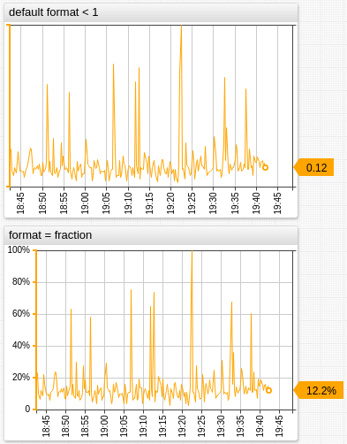

# Format Settings

## Supported Format Settings

```ls
format = bytes
format = kilobytes
format = megawatt
format = kilowatthour
format = hertz
format = kilojoule
format = million watt
format = thousands
```

Name | Description | &nbsp;
:--|:--|:--
<a name="decimal-numeric"></a>[`decimal`/`numeric`](#decimal-numeric)| Number formatting: `numeric` is an `alias` for `decimal`.<br>Specify optional round value parameter in round brackets to define how many spaces the decimal is rounded.<br>`format = numeric(1)` rounds to the first decimal, thus `4.29` becomes `4.3`.<br>**Example**: `format = numeric(1)`| [竊余(https://apps.axibase.com/chartlab/160d5c94)
<a name="fixed"></a>[`fixed`](#fixed)| Format numbers with the specified number of digits.<br>**Example**: `format = fixed(1)`| [竊余(https://apps.axibase.com/chartlab/c0ae0118)
<a name="currency"></a>[`currency`](#currency) | Currency formatting.<br>Any currency symbol is supported.<br>Indicate abbreviated numbers by including the shortened denomination as an argument in the `currency` expression.<br>**Example**: `format = '$' + currency('million')` renders the raw value `6.3` as `$6.3M`.<br>Values beyond the decimal point are rounded to the nearest tenth by default, thus `6.45` is rendered as `$6.5M` when using the same `format` setting described above.<br>Modify rounding behavior with [`round()`](#rounding).<br>**Example**: `format = '$' + currency`| [竊余(https://apps.axibase.com/chartlab/a36fc97a)
<a name="precise"></a>[`precise`](#precise)| Formats a number to a specific precision.<br>Refer to [`Number.prototype.toPrecision()`](https://developer.mozilla.org/en-US/docs/Web/JavaScript/Reference/Global_Objects/Number/toPrecision).<br>**Example**: `format = precise(5)`| [竊余(https://apps.axibase.com/chartlab/1339f722)

### Optional Parameters

All functions have two optional arguments:

* **Dimension**: Set to `kilo|thousand`, `mega|million`, `giga|billion`, etc.
* **Digits**: Maximum number of digits after decimal point.

## Rounding

Perform rounding on displayed values:

`round(value, number_of_digits)`

```ls
format = round(0)
format = round(value/512, 1)
format = round(-3)
```

* If `number_of_digits > 0`, the value is rounded to the specified number of decimal places.
* If `number_of_digits = 0`, the value is rounded to the nearest integer.
* If `number_of_digits < 0`, the value is rounded to the left of the decimal point.

Operation | Syntax
--|--
`12.34` rounded to `12.3` | `format = round(1)`
`12.34` rounded to `12` | `format = round(0)`
`12.34` rounded to `10` | `format = round(-1)`


[](https://apps.axibase.com/chartlab/aebb480d)

## Percent Formatting

Format values as a percentage of `100`.

```ls
format = percent
```


[](https://apps.axibase.com/chartlab/6775b839#fullscreen)

Decimal Values | Fractional Values
--|--
Formatted as a percentage of `100` | Multiplied by `100` and converted into percentage |
`format = percent(1)` formats `10.23243232` as `10.2%`. | `format = fraction(2)` formats `0.23243232` as `23.24%`
[](https://apps.axibase.com/chartlab/64a714fa) | [](https://apps.axibase.com/chartlab/7a677440)

## `fixed`

Control the number of displayed digits. Specify the exact number of digits in the fraction portion of a number.

`fixed(value, number_of_digits)`

### Syntax

```ls
fixed(0, 3); // 0.000
fixed(0); // 0
fixed(1.2); // 1
fixed(1.2, 3); // 1.200
fixed(1.23, 3); // 1.230
fixed(1.234, 3); // 1.234
fixed(1.2345, 3); // 1.234
fixed(1.23456, 4); // 1.2345
fixed(0.2, 3); // 0.200
fixed(1, 3); // 1.000
fixed(1512376152, 3); // 1512376152.000
fixed(NaN, 3); // NaN
fixed(null, 3); // null
```

## Time Format

Control how time is displayed.

Syntax | Description
---|---
`format = iso` | [ISO format](https://axibase.com/docs/atsd/shared/date-format.html).
`format = new Date(value)` | Print time in current locale.
`format = (new Date(value)).toISOString` | Print current locale time in ISO format.


[](https://apps.axibase.com/chartlab/d1bb8335)

## Interval Format

Format series values which represent millisecond duration using the `intervalFormat` function or the `interval-format` setting.

```ls
/* invoke intervalFormat function */
format = intervalFormat('%dd %H:%M:%S')(value*1000)

/* apply the default format */
interval-format = true

/* apply custom format */
interval-format = %H:%M
```

### Supported Placeholders

* `%d`: Day
* `%H` and `%h`: Hour
* `%M` and `%m`: Minute
* `%S` and `%s`: Second
* `%L` and `%l`: Millisecond

## Examples

### [Table](../widgets/property-table/README.md)


[](https://apps.axibase.com/chartlab/f3137fe9)

### [Bar Chart](../widgets/bar-chart/README.md)


[](https://apps.axibase.com/chartlab/293c46cf/2/)

### [Time Chart](../widgets/time-chart/README.md)


[](https://apps.axibase.com/chartlab/293c46cf/)

## Day Format

Modify the date format of the `x` axis for year, month, week, and day.

### Syntax

* `%a`: Three-letter abbreviated day name: `Sun`, `Mon`, `Tue`, `Wed`, `Thu`, `Fri`, `Sat`.
* `%aa`: Two-letter abbreviated day name: `Su`, `Mo`, `Tu`, `We`, `Th`, `Fr`, `Sa`.
* `%A`: Full day name.
* `%b`: Abbreviated month name.
* `%B`: Full month name.
* `%d`: Zero-padded day of the month as a decimal number `[01,31]`.
* `%e`: Space-padded day of the month as a decimal number `[ 1,31]`. Equivalent to `%_d`.
* `%j`: Day of the year as a decimal number `[001,366]`.
* `%m`: Month as a decimal number `[01,12]`.
* `%U`: Week number of the year as a decimal number `[00,53]`. Sunday is the first day of the week.
* `%w`: Weekday as a decimal number `[0(Sunday),6]`.
* `%W`: Week number of the year as a decimal number `[00,53]`. Monday is the first day of the week.
* `%x`: Date, as `%m/%d/%Y`.
* `%y`: Year without century as a decimal number `[00,99]`.
* `%Y`: Year with century as a decimal number.

> Line break syntax `/n` is supported.

#### Examples

```ls
day-format = %m/%d
day-format = %y/%m/%d
day-format = %Y/%m/%d
day-format = %Y %m/%d
```


[](https://apps.axibase.com/chartlab/d0bfcdf8)

```ls
day-format = %m %a
day-format = %m/%aa
day-format = %x
day-format = %W\n%a
```


[](https://apps.axibase.com/chartlab/607961b1)

## Hour Format

Control the time format for the `x` axis for hour and minute.

### Syntax

Use any combination of the following:

* `%H`: 24-hour time hour as a decimal number `[00,23]`.
* `%I`: 12-hour time hour as a decimal number `[01,12]`.
* `%M`: Minute as a decimal number `[00,59]`.
* `%p`: AM or PM.
* `%X`: time, as `%H:%M:%S`.

> Line break syntax `/n` is supported.

#### Example

```ls
hour-format = %I %p
hour-format = %H:%M
```


[](https://apps.axibase.com/chartlab/6bd3c4a6)