# Functions

This document enumerates built-in utility functions which can be included in the **Editor** window of Charts applications.

| Function | Description |
|------|-------------|
| [`getTags()`](#gettags) | Retrieves metric series and returns a sorted array of unique values for defined tags. |
| [`getSeries()`](#getseries) | Returns an array of series collected for the defined metric. |
| [`getMetrics()`](#getmetrics) | Returns the names of metrics collected for the defined entity. |
| [`getEntities()`](#getentities) | Returns the names of entities contained in the defined entity group. |
| [`range()`](#range) | Returns a regularly spaced, customizable array of numbers. |
| [`list.escape()`](#listescape) | Escapes commas in every element of an array. |
| [`previous()`](#previous) | Retrieves the value of the previous point in a sequence. |
| [`movavg()`](#movavg) | Computes the moving average from a specified number of previous points. |
| [`meta()`](#meta) | Retrieves the metadata object for a series. |
| [`entityTag()`](#entitytag) | Returns the value of the entity tag from the metadata object for the series. |
| [`metricTag()`](#metrictag) | Returns the value of the metric tag from the metadata object for the series. |
| [`requestMetricsSeriesValues()`](#requestmetricsseriesvalues) | Creates drop-down list values from values retrieved for the defined series field. |
| [`requestEntitiesMetricsValues()`](#requestentitiesmetricsvalues) | Creates drop-down list values from values retrieved for the defined metric field. |
| [`requestPropertiesValues()`](#requestpropertiesvalues) | Creates drop-down list from values retrieved for the defined entity tag or property. |
| [`requestMetricsSeriesValues()`](#requestmetricsseriesvalues) | Creates drop-down list from values retrieved for the defined series field. |

---

## `getTags()`

**Description**:

* Loads a series for `metric` and `entity` from a defined URL whose last data point has timestamp after `minInsertDate` and before `maxInsertDate`.
* Additional `queryParameters` can be specified.
* Unique tag values defined by `tagName` are retrieved from tags of the loaded series and sorted.
* Returned array is processed by [`list.escape()`](#listescape) function.

**Syntax**:

```ls
getTags(metric, tagName, [entity, [minInsertDate, [maxInsertDate, [url, [queryParameters]]]]])
```

**Scope of Usage**:

Use at the `preprocessor` stage in a `var`, `if`, `if else`, `for .. in`, or `@{}` expression.

**API Request**:

Sends synchronous `GET` request to
[`/api/v1/metrics/{metric}/series`](https://axibase.com/docs/atsd/api/meta/metric/series.html)

**Returned Value**:

`Array<string>`: unique sorted values of the specified `tagName` series tag.

**Arguments**:

| Name | Type | Description |
|------|------|-------------|
| `metric` | string | **[Required]** `metric` path parameter. |
| `tagName` | string | **[Required]** Tag values retrieved from series descriptors. |
| `entity` | string | `entity` query parameter. |
| `minInsertDate` |  string | [`minInsertDate`](https://axibase.com/docs/atsd/shared/calendar.html) query parameter.|
| `maxInsertDate` |  string | [`maxInsertDate`](https://axibase.com/docs/atsd/shared/calendar.html) query parameter. |
| `url` |  string | Protocol, host, and path to which `/api/v1` path is appended. |
| `queryParameters` | object | Object with parameter names as keys and values as values, transformed to query parameters string. |

### Retrieve values for `mount_point` tag in a series for metric `disk_used` and entity `nurswgvml007` received today

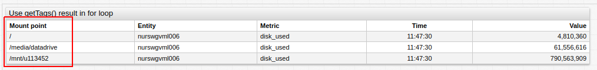

[](https://apps.axibase.com/chartlab/df616dfa)

**Syntax**:

```ls
var mount_points = getTags("disk_used", "mount_point", "nurswgvml006", "current_day")
```

**Request Sent**:

```sh
/api/v1/metrics/disk_used/series?tag=mount_point&entity=nurswgvml006&minInsertDate=current_day
```

**Result**:

```json
["/", "/media/datadrive", "/mnt/u113452"]
```

### Retrieve values for `mount_point` tag in a series for metric `disk_used` and entity `nurswgvml007` and send server-specific query parameter `cache` and ignore other parameters

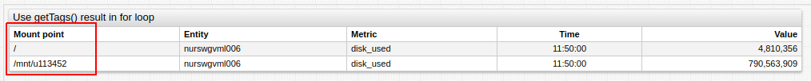

[](https://apps.axibase.com/chartlab/df616dfa/2)

**Syntax**:

```ls
var mount_points = getTags("disk_used", "mount_point", "nurswgvml007", null, null, null, {cache: true})
```

**Request Sent**:

```sh
/api/v1/metrics/disk_used/series?cache=true&tag=mount_point&entity=nurswgvml007
```

**Result**:

```json
["/", "/media/datadrive", "/mnt/u113452"]
```

---

## `getSeries()`

**Description**:

* Loads a series for the `metric` and the `entity` from a defined URL, whose last data point has a timestamp after `minInsertDate` and before `maxInsertDate`.
* Specify additional `queryParameters`.
* Returns a loaded series.

**Syntax**:

```ls
getSeries(metric, [entity, [minInsertDate, [maxInsertDate, [url, [queryParameters]]]]])
```

**Scope of Usage**:

Use at the `preprocessor` stage in a `var`, `if`, `if else`, `for .. in`, or `@{}` expression.

**API Request**:

Sends synchronous `GET` requests to the
[`/api/v1/metrics/{metric}/series`](https://axibase.com/docs/atsd/api/meta/metric/series.html)

**Returned Value**:

`Array<object>`: Received series descriptors.

**Arguments**:

| Name | Type | Description |
|------|------|-------------|
| `metric` | string | **[Required]** `metric` path parameter. |
| `entity` | string | `entity` query parameter. |
| `minInsertDate` | string | [`minInsertDate`](https://axibase.com/docs/atsd/shared/calendar.html) query parameter.|
| `maxInsertDate` | string | [`maxInsertDate`](https://axibase.com/docs/atsd/shared/calendar.html) query parameter. |
| `url` | string | Protocol, host, and path to which `/api/v1` path is appended. |
| `queryParameters` | object | Object with parameter names as keys and values as values, transformed to query parameters string. |

### Return series for metric `disk_used` and entity `nurswgvml006`

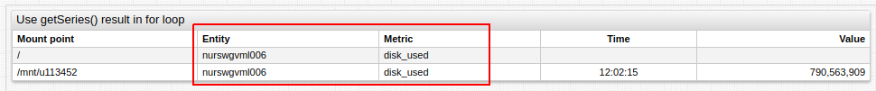

[](https://apps.axibase.com/chartlab/df616dfa/3)

**Syntax**:

```ls
var seriesDescriptors = getSeries("disk_used", "nurswgvml007")
```

**Request Sent**:

```sh
/api/v1/metrics/disk_used/series?entity=nurswgvml007
```

**Result**:

```json
[
    {
        "metric":"disk_used",
        "entity":"nurswgvml007",
        "tags":{
            "file_system":"/dev/mapper/vg_nurswgvml007-lv_root",
            "mount_point":"/"
        },
        "lastInsertDate":"2017-08-15T15:30:25.000Z"
    },
    {
        "metric":"disk_used",
        "entity":"nurswgvml007",
        "tags":{
            "file_system":"172.17.0.2:/home/store/share",
            "mount_point":"/mnt/share"
        },
        "lastInsertDate":"2015-12-25T14:09:49.000Z"
    },
    {
        "metric":"disk_used",
        "entity":"nurswgvml007",
        "tags":{
            "file_system":"//u113452.your-backup.de/backup",
            "mount_point":"/mnt/u113452"
        },
        "lastInsertDate":"2017-06-21T13:26:00.000Z"
    }
]
```

---

## `getMetrics()`

**Description**:

* Loads metrics for `entity` from a defined URL, which satisfies `expression`.
* Specify additional `queryParameters`.
* Returns the sorted names of loaded metrics.
* Returned array is processed by [`list.escape()`](#listescape) function.

**Syntax**:

```ls
getMetrics(entity, [expression, [tags, [url, [queryParameters]]]])
```

**Scope of Usage**:

Use at the `preprocessor` stage in a `var`, `if`, `if else`, `for .. in`, or `@{}` expression.

**API Request**:

Sends synchronous `GET` requests to the
[`/api/v1/entities/{entity}/metrics`](https://axibase.com/docs/atsd/api/meta/entity/metrics.html)

**Returned Value**:
`Array<string>`: retrieved metrics names.

**Arguments**:

| Name | Type | Description |
|------|------|-------------|
| `entity` | string |**[Required]** `entity` path parameter. |
| `expression` | string | [`expression`](https://axibase.com/docs/atsd/api/meta/expression.html) query parameter. |
| `tags` |  string | `tags` request parameter. |
| `url` | string | Protocol, host, and path to which `/api/v1` path is appended. |
| `queryParameters` | object | Object with parameter names as keys and its values as values, which is transformed to query parameters string |

### Return metrics for entity `nurswgvml006` which contains substrings `cpu` and `user`

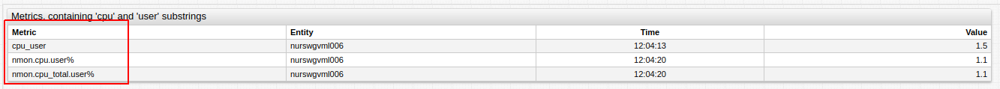

[](https://apps.axibase.com/chartlab/df616dfa/4)

**Syntax**:

```ls
var metrics = getMetrics("nurswgvml007", "name LIKE '*cpu*user*'")
```

**Request Sent**:

```sh
/api/v1/entities/nurswgvml007/metrics?expression=name%20LIKE%20%27*cpu*user*%27
```

**Result**:

```json
["cpu_user","nmon.cpu.user%","nmon.cpu_total.user%"]
```

---

## `getEntities()`

**Description**:

* Load entities contained in the entity group defined by `group` which satisfies `expression`.
* Specify additional `queryParameters`.
* Returns sorted names of loaded entities.
* Returned array is processed by [`list.escape()`](#listescape) function.

**Syntax**:

```ls
getEntities(group, [expression, [tags, [url, [queryParameters]]]])
```

**Scope of Usage**:

Use at the `preprocessor` stage in a `var`, `if`, `if else`, `for .. in`, or `@{}` expression.

To load multiple groups, retrieve members of each group separately and then concatenate the elements into one array.

```javascript
var agents = [].concat(getEntities("group1"), getEntities("group2"))

var agents = getEntities("group1").concat(getEntities("group2"))  
```

Elements in the concatenated array are sorted first by group, then by element name.

**API Request**:

Sends synchronous `GET` requests to the
[`/api/v1/entity-groups/{group}/entities`](https://axibase.com/docs/atsd/api/meta/expression.html)

**Returned Value**:

`Array<string>`: retrieved entities names.

**Arguments**:

| Name | Type | Description |
|------|------|-------------|
| `group` | string |**[Required]** `group` path parameter. |
| `expression` | string | [`expression`](https://axibase.com/docs/atsd/api/meta/expression.html) query parameter. |
| `tags` | string | `tags` request parameter. |
| `url` | string | Protocol, host and path to which `/api/v1` path is appended. |
| `queryParameters` | object | Object with parameter names as keys and its values as values, transformed to query parameters string. |

### Retrieve all entities from entity group `docker-hosts` whose names begin with substring `nur`

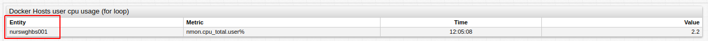

[](https://apps.axibase.com/chartlab/df616dfa/5/)

**Syntax**:

```ls
var entities = getEntities("docker-hosts", "name LIKE 'nur*'")
```

**Request Sent**:

```sh
/api/v1/entity-groups/docker-hosts/entities?expression=name%20LIKE%20%27nur*%27
```

**Result**:

```json
["nurswghbs001"]
```

---

## `range()`

**Description**:

* Generates a regularly spaced array of numbers from `start` to `end` with configurable `step`.
  * If `step` is not specified, numbers are sequential.
  * If `start` is greater than `end`, numbers are generated in descending order.
  * If `format` is specified, each number is formatted and converted to a string.

**Syntax**:

```ls
range(start, end, [step], [format])
```

**Scope of Usage**:

Use at the `preprocessor` stage in a `var`, `if`, `if else`, `for .. in`, or `@{}` expression.

**Returned Value**:

`Array<number/string>`: generates optionally formatted numbers.

**Arguments**:

| Name | Type | Description |
|------|------|-------------|
| `start` | number | **[Required]** First number in list. |
| `end` | number | **[Required]** Last number in list. |
| `step` | number | Offset between adjacent numbers |
| `format` | string | [Format setting](./format-settings.md) |

### Return sequential numbers from `1` to `10`

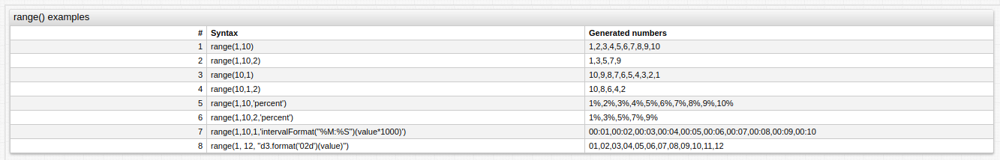

[](https://apps.axibase.com/chartlab/df616dfa/6/)

**Syntax**:

```javascript
range(1,10)
```

**Result**:

```javascript
1,2,3,4,5,6,7,8,9,10
```

### Return numbers from `1` to `10` with double step

**Syntax**:

```javascript
range(1,10,2)
```

**Result**:

```javascript
1,3,5,7,9
```

### Return numbers from `10` to `1` with a single step

**Syntax**:

```javascript
range(10,1)
```

**Result**:

```javascript
10,9,8,7,6,5,4,3,2,1
```

### Return numbers from `10` to `1` with a double step

**Syntax**:

```javascript
range(10,1,2)
```

**Result**:

```javascript
10,8,6,4,2
```

### Format sequential numbers `1` to `10` as a percent

**Syntax**:

```javascript
range(1,10,'percent')
```

**Result**:

```javascript
1%,2%,3%,4%,5%,6%,7%,8%,9%,10%
```

### Return numbers from `1` to `10` with a double step and format as a percent

**Syntax**:

```javascript
range(1,10,2,'percent')
```

**Result**:

```javascript
1%,3%,5%,7%,9%
```

### Format sequential numbers from `1` to `10` as minutes

**Syntax**:

```javascript
range(1,10,1,'intervalFormat("%M:%S")(value*1000)')
```

**Result**:

```javascript
00:01,00:02,00:03,00:04,00:05,00:06,00:07,00:08,00:09,00:10
```

### Format sequential numbers from `1` to `12` with an additional fill character (`0`) for single digit values

**Syntax**:

```javascript
range(1, 12, "d3.format('02d')(value)")
```

**Result**:

```javascript
01,02,03,04,05,06,07,08,09,10,11,12
```

---

## `list.escape()`

**Description**:

* Escapes commas for each value in an array of strings.
* The `.escape()` method is available in arrays generated from the `list` keyword, `var` expression, and [`csv.values()`](./control-structures.md#csvvalues) method.

**Syntax**:

```ls
list_name.escape()
```

**Scope of Usage**:

Use at the `preprocessor` stage in a `var`, `if`, `if else`, `for .. in`, or `@{}` expression.

**Returned Value**:

`Array<string>`: An  array where commas are escaped for each element. If the argument is not a string the argument is returned unmodified.

### Retrieve a list of escaped country names

> Countries names are generated from the `list`, `var` and `csv.values()`

#### Apply `.escape()` to array generated from `list`

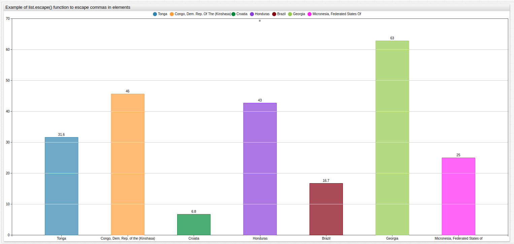

[](https://apps.axibase.com/chartlab/06ec0eaa)

**Syntax**:

```txt
list countries =
  Brazil,
  Croatia,
  Micronesia\, Federated States of,
  Georgia,
  Tonga,
  Honduras,
  Congo\, Dem. Rep. of the (Kinshasa)
    endlist

country = @{countries.escape()}
```

**Result**:

```json
["Brazil","Croatia","Micronesia\\, Federated States of","Georgia","Tonga","Honduras","Liechtenstein","Congo\\, Dem. Rep. of the (Kinshasa)"]
```

#### Apply `.escape()` to the array created in a [`var`](./control-structures.md#var--endvar) expression

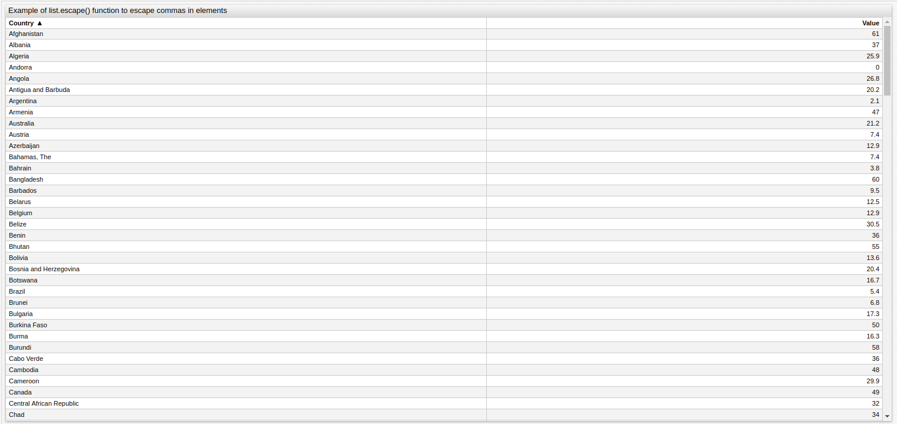

[](https://apps.axibase.com/chartlab/df616dfa/12/)

**Syntax**:

```ls
var countries = getTags('state.visa-refusal-rate', 'country', 'travel.state.gov')

country = @{countries.escape()}
```

**Result**:

```json
[... "Comoros","Congo\\, Dem. Rep. of the (Kinshasa)","Congo\\, Rep. of the (Brazzaville)","Costa Rica","Cote d'Ivoire" ...]
```

#### Apply `.escape()` to the array retrieved by [`csv.values()`](./control-structures.md#csvvalues)

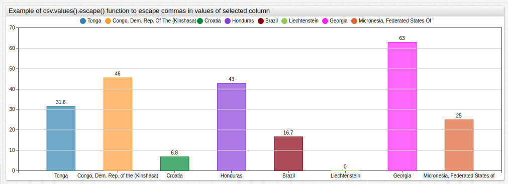

[](https://apps.axibase.com/chartlab/df616dfa/7/)

**Syntax**:

```txt
csv countries =
  name, value2006
  Brazil, 13.2
  Croatia, 4.9
  "Micronesia, Federated States of", 100
  Georgia, 48.2
  Tonga, 40.8
  Honduras, 38
  Liechtenstein, 5.9
  "Congo, Dem. Rep. of the (Kinshasa)",44.2
endcsv

country = @{countries.values('name').escape()}
```

**Result**:

```txt
["Brazil","Congo\\, Dem. Rep. of the (Kinshasa)","Croatia","Georgia","Honduras","Liechtenstein","Micronesia\\, Federated States of","Tonga"]
```

---

## `previous()`

**Description**:

* Retrieve the value of the previous point in the series, defined by the `alias` parameter.
* Control the index position with the `offset` argument, relative to the current point.

**Syntax**:

```ls
previous(alias, [offset])
```

**Scope of Usage**:

Use in [`value`](./value_functions.md) settings.

**Returned Value**:

`number`: value of the previous point.

**Arguments**:

| Name | Type | Description |
|------|------|-------------|
| `alias` | string | **[Required]** Alias of the series, from which the previous value is retrieved |
| `offset` | number | Index of previous point relative to the current point, default is `1` |

### Return a series shifted by one point

**Syntax**:

```ls
value = previous('raw')
```

**Result**:

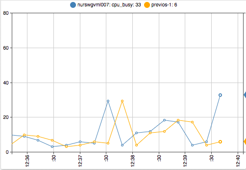

### Return a series shifted two points

**Syntax**:

```ls
value = previous('raw', 2)
```

**Result**:

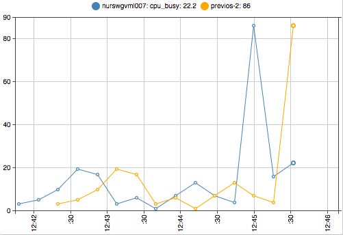

### Calculate the percentile difference of the last `(n)` and last `(n - 1)` points

**Syntax**:

```ls
value = 1 - previous('raw') / value('raw')
```

**Result**:

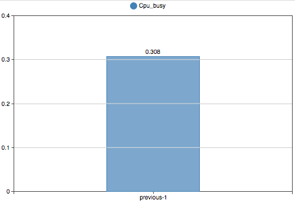

### Calculate the percentage difference of the last `(n)` and last `(n - 1)` points

**Syntax**:

```ls
value = 1 - previous('raw', 2) / value('raw')
```

**Result**:

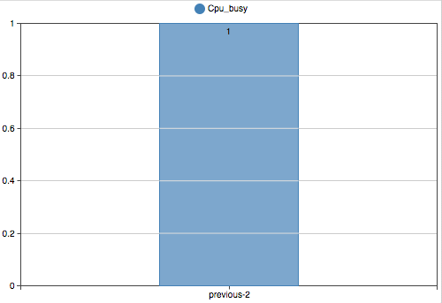

---

## `movavg()`

**Description**:

* Calculate the moving average using `count` previous points in the series defined by `alias`.
* The average is calculated if at least `minCount` previous points are available.

**Syntax**:

```ls
movavg(alias, count, [minCount])
```

**Scope of Usage**:

Use in `value-expression` settings.

**Returned Value**:

`number`: calculated moving average.

**Arguments**:

| Name | Type | Description |
|------|------|-------------|
| `alias` | string | **[Required]** Alias of the series, to which `movavg` is applied |
| `count` | number | **[Required]** Number of points for which `movavg` is calculated |
| `minCount` | number | Minimum number of points, for which `movavg` is calculated, default is `count` |

### Calculate `movavg` when a defined amount of points are available for calculation

**Syntax**:

```ls
value = movavg('raw', 30)
```

**Result**:


[](https://apps.axibase.com/chartlab/df616dfa/22/)

### Calculate `movavg` regardless of the number of points present

**Syntax**:

```ls
value = movavg('raw', 30, 0)
```

**Result**:

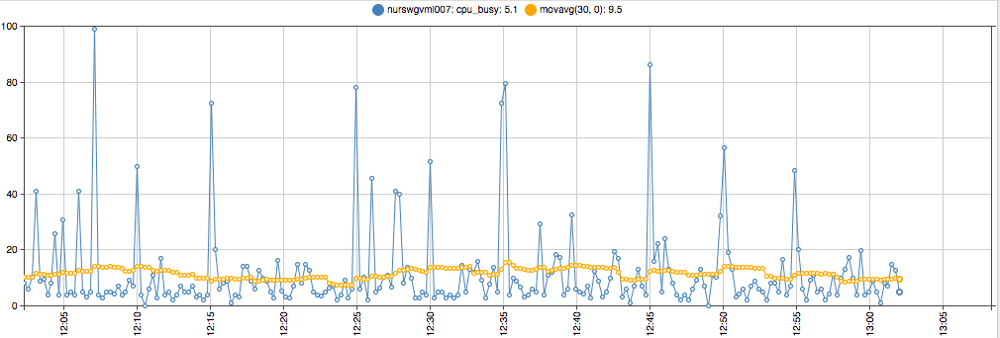

[](https://apps.axibase.com/chartlab/df616dfa/22/)

---

## `meta()`

**Description**:

* Return metadata loaded for a series defined by `alias`.
* `add-meta` setting must be set to `true`.
* Function must be used with `value(alias)` in one expression.

**Syntax**:

```ls
meta(alias)
```

**Scope of Usage**:

Use in `value-expression` settings.

**Returned Value**:

`object`: metadata loaded to series.

**Arguments**:

| Name | Type | Description |
|------|------|-------------|
| `alias` | string | **[Regardless]** Alias of the series, from which metadata is returned |

### Fraction of `maxValue`

[](https://apps.axibase.com/chartlab/df616dfa/23/)

**Syntax**:

```ls
value = value('raw') / meta('raw').metric.maxValue
```

**Result**:

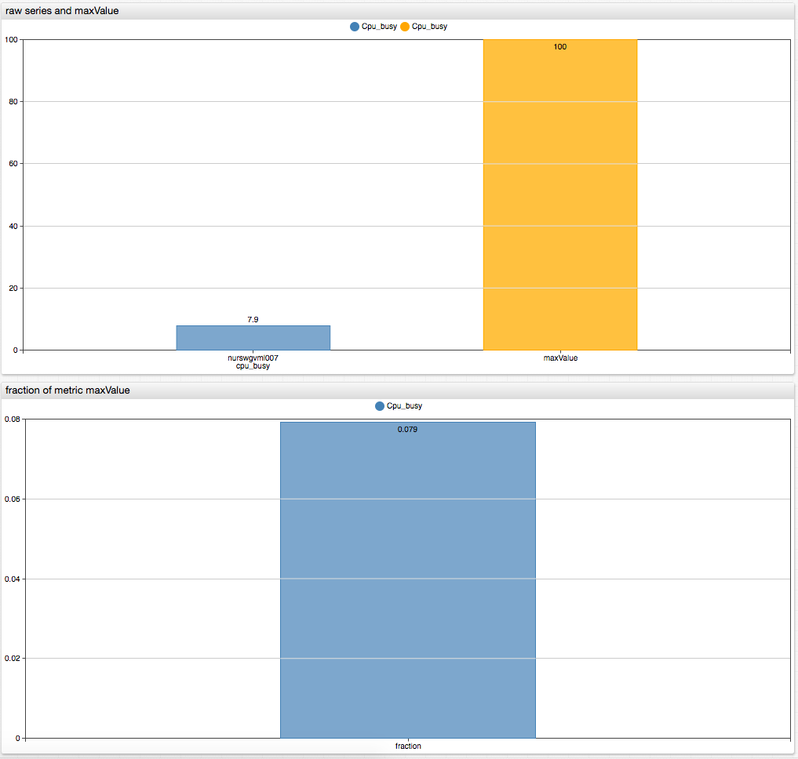

---

## `entityTag()`

**Description**:

* Returns tag with `tagName` from entity metadata loaded for series with `alias`.
* `add-meta` setting must be set to `true`.
* Function must be used with `value(alias)` in one expression.

**Syntax**:

```ls
entityTag(alias, tagName)
```

**Scope of Usage**:

Use in `value-expression` settings.

**Returned Value**:

`number`: Value of specified entity tag.

**Arguments**:

| Name | Type | Description |
|------|------|-------------|
| `alias` | string | **[Required]** Alias of the series, from which metadata is returned |
| `tagName` | string | **[Required]** Name of tag which is retrieved from `meta.entity.tags` |

### Set size to `cpu_count` entity tag

**Syntax**:

```ls
size = entityTag('cpu_count')
```

**Result**:

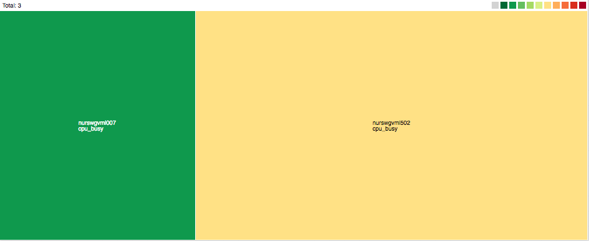

[](https://apps.axibase.com/chartlab/df616dfa/24/)

---

## `metricTag()`

**Description**:

* Returns tag with `tagName` from metric metadata loaded for series with `alias`.
* `add-meta` setting must be `true`.
* Function must be used with `value(alias)` in one expression.

**Syntax**:

```ls
metricTag(alias, tagName)
```

**Scope of Usage**:

Use in `value-expression` settings.

**Returned Value**:

`string`: value of specified metric tag.

**Arguments**:

| Name | Type | Description |
|------|------|-------------|
| `alias`| string | **[Required]** Alias of the series, from which metadata is returned |
| `tagName` | string | **[Required]** Name of tag which is retrieved from `meta.metric.tags` |

### Set threshold to `threshold_value` metric tag

**Syntax**:

```ls
value = metricTag('raw', 'threshold_value')
alert-expression = value() > metricTag('threshold_value')
```

**Result**:

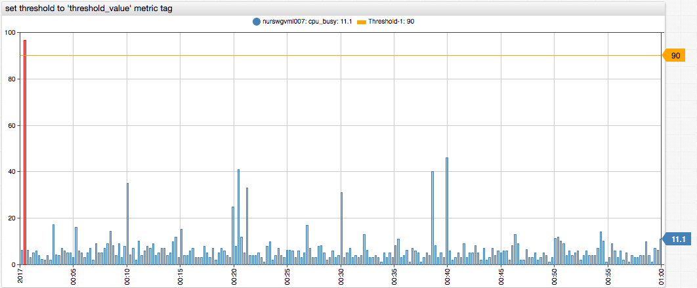

[](https://apps.axibase.com/chartlab/df616dfa/25/)

---

## Drop-down List Value Function Arguments

### `FieldPath _(optional, type: string)`

* `fieldPath` is the dot-separated path to field in series descriptor object.
  * If not specified, series descriptor objects are returned.
  * If specified, the field found by `fieldPath` is returned.
* `fieldPath "entity"` inherits `entity` from each descriptor.

To populate the drop-down list with the names of entities for which the metric is collected use the following syntax:

```ls
[dropdown]
  options = javascript: requestMetricsSeriesValues("entity")
  change-field = series.entity
```

The content of the resulting drop-down list is shown below:

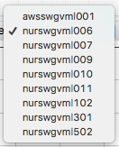

To populate the drop-down list with values of the `mount_point` tag use the following syntax:

> The `fieldPath` `"tags.mount_point"` reads `tags` in each descriptor then retrieves the `mount_point` field.

```ls
[dropdown]
  options = javascript: requestMetricsSeriesValues("tags.mount_point")
  change-field = series.tags.mount_point
```

The content of the resulting drop-down list is shown below:

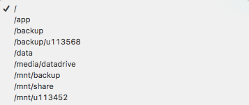

---

### `Callback _(optional, type:function)`

* Use `callback` for manual processing of series descriptors or additional processing of retrieved field values.
  * If `fieldPath` is specified, the string values of some field are passed as the argument for the callback, otherwise the series descriptor array is used as the argument.

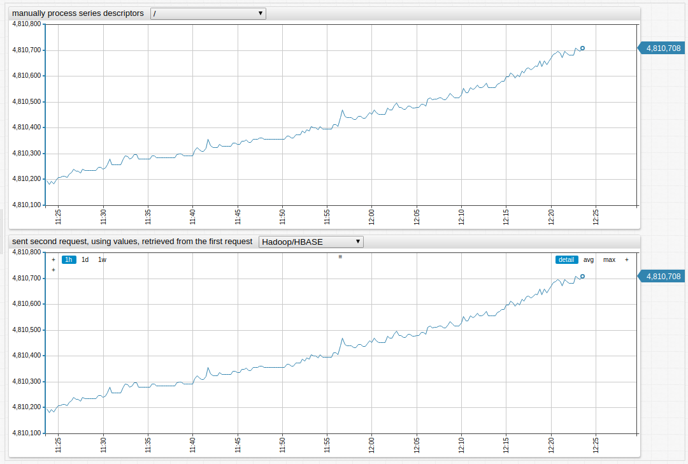

[](https://apps.axibase.com/chartlab/df616dfa/15/)

To fill the drop-down list with values of `mount_point` tag of the series, whose entity name begins with the fragment `nur` use the function as shown below.

> Note that the series can be filtered by entity using the expression `queryParameter`.

```ls
[dropdown]
  change-field = series.tags.mount_point

    options = javascript: requestMetricsSeriesValues(null,
    options = function (series) {
    options =   var mountPoints = [];
    options =   series.forEach(function(s){
    options =     if(s.entity.indexOf("nur") === 0 && mountPoints.indexOf(s.tags.mount_point) < 0) {
    options =      mountPoints.push(s.tags.mount_point);
    options =      }
    options =    });
    options =    return mountPoints.sort();
    options = })
```

The content of the resulting drop-down list is shown below:


To populate the drop-down list with entity tag values it is necessary to make two requests:

* Retrieve entity names from series descriptors.
* Request entity tags for those entities.

```ls
[dropdown]
   change-field = series.entity

   options = javascript: requestMetricsSeriesValues("entity",
   options = function (entities) {
   options =   return requestPropertiesOptions("entity", "tags.app", null, entities);
   options = })
```

The content of the resulting drop-down list is shown below:

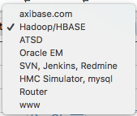

---

### `requestMetricsSeriesOptions()`

**Description**:

* Request series for the `metric` and add `queryParameters` to the requested URL.
* Creates an option for each loaded series.
* The value of the field found by `valueFieldPath` is assigned to the option value.
* The value of the field found by `textFieldPath` is assigned to the option text.
  * If `textFieldPath` is an array, it sequentially tries to find a field by every path.
* When field is found it is assigned to the option text.
  * If `callback` function is specified `valueFieldPath` and `textFieldPath` are ignored.
* `callback` retrieves the loaded series as an argument and returns an array of options, where at least the value must be specified.

**Syntax**:

```ls
requestMetricsSeriesValues([fieldPath, [callback, [metric, [unique, [queryParameters]]]]])
```

**Scope of Usage**:

Use in `[dropdown]` field `options` setting after `javascript:` prefix.

**API Request**:

Sends asynchronous `GET` request to
[`/api/v1/metrics/{metric}/series`](https://axibase.com/docs/atsd/api/meta/metric/series.html)

**Returned Value**:

`Array<{value: string, text: string}>`: options, generated from series descriptor fields.

**Arguments**:

| Name | Type | Description |
|------|------|-------------|
| `valueFieldPath` | string | Dot-separated path to the field, whose value is used as option value. |
| `textFieldPath` | string or Array | Dot-separated path (or array of such paths) to the field, whose value is used as option text. |
| `callback` | function | Function to process series descriptors, returns array of options. |
| `metric` | string | Metric, for which series are loaded. If not specified, `metric` from the `[widget]` is used |
| `unique` | boolean | Applied to raw series descriptors. |
| `queryParameters` | string/object | String or key-value object representing request parameters |

**Examples**:

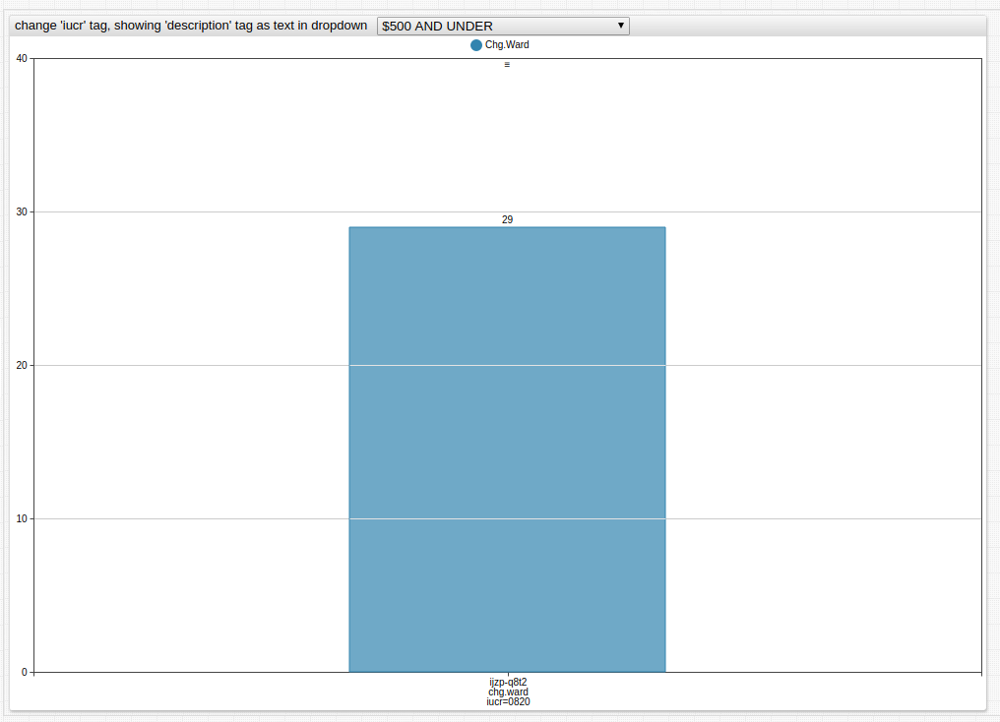

[](https://apps.axibase.com/chartlab/4f937185)

To fill the drop-down list with options with the value of the `iucr` tag and the text from the `description` tag, use the following syntax:

```ls
[dropdown]
  options = javascript: requestMetricsSeriesOptions("tags.iucr", "tags.description")
  change-field = series.tags.iucr
```

The content of the resulting drop-down list is shown below:

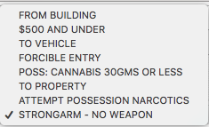

---

### `requestEntitiesMetricsOptions()`

**Description**:

* Requests metrics for the `entity` adding `queryParameters` to the requested URL.
* Creates an option for each loaded metric.
* The value of the field found by `valueFieldPath` is assigned to the option value.
* The value of the field found by `textFieldPath` is assigned to the option text.
  * If `textFieldPath` is an array, it sequentially tries to find a field by every path.
* When a field is found it is assigned to the option text.
  * If `callback` function is specified `valueFieldPath` and `textFieldPath` are ignored.
* `callback` gets loaded metrics as an argument and returns an array of options, where at least the value must be specified.

**Syntax**:

```ls
requestEntitiesMetricsValues([fieldPath, [callback, [entity, [unique, [queryParameters]]]]])
```

**Scope of Usage**:

Use in `[dropdown]` field `options` setting after `javascript:` prefix.

**API Request**:

Sends asynchronous `GET` request to
[`/api/v1/entities/{entity}/metrics`](https://axibase.com/docs/atsd/api/meta/entity/metrics.html)

**Returned Value**:

`Array<{value: string, text: string}>`: options, generated from metrics descriptors fields.

**Arguments**:

| Name | Type | Description |
|------|------|-------------|
| `valueFieldPath` | string | Dot-separated path to the field, whose value is used as option value. |
| `textFieldPath` | string or Array | Dot-separated path, or array of paths, to the field whose value is used as option text. |
| `callback` | function | Function to process series descriptors.<br>Returns array of options. |
| `entity` | string | Entity, for which metrics descriptors are loaded.<br>If not specified, `entity` from `[widget]` is used. |
| `unique` | boolean | Applied to raw series descriptors. |
| `queryParameters` | string/object | String or key-value object representing request parameters. |

**Examples**:

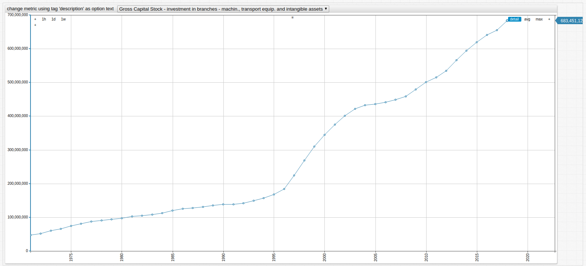

[](https://apps.axibase.com/chartlab/df616dfa/19/)

To fill the drop-down list with options defined by the value of the `iucr` tag and text from the `description` tag, use the following syntax:

```ls
[dropdown]
  options = javascript: requestEntitiesMetricsOptions("name", "tags.description", null, null, null,{tags:"*",limit:15})
  change-field = metric
```

The content of the resulting drop-down list is shown below:


---

### `requestPropertiesOptions()`

**Description**:

* Requests the entity tags or properties for the entity or the entities specified by the `entity` parameter.
  * If `postBody` is specified, `entity` and `propertyType` parameters are ignored.
* Function requests entity tags if `$entity_tags` is specified as `propertyType`, or otherwise requests properties.
* Creates an option for each loaded tag or property object.
* The value of the field found by `valueFieldPath` is assigned to the option value.
* The value of the field found by `textFieldPath` is assigned to the option text.
  * If `textFieldPath` is an array, the function sequentially tries to find a field at each path.
* When a field is found it is assigned to the option text.
  * If `callback` function is specified, the `valueFieldPath` and `textFieldPath` parameters are ignored.
* `callback` gets loaded tags/properties as an argument and returns an array of options, where at least the value must be specified.

**Syntax**:

```ls
requestPropertiesOptions([valueFieldPath, [textFieldPath, [callback, [entity, [propertyType, [unique, [postBody]]]]]]])
```

**Scope of Usage**:

Use in `[dropdown]` field `options` setting after `javascript:` prefix.

**API Request**:

Sends asynchronous `POST` request to
[`/api/v1/properties/query`](https://axibase.com/docs/atsd/api/data/properties/query.html).

**Returned Value**:

`Array<string>`: options, generated from the property or entity descriptors fields.

**Arguments**:

| Name | Necessity | Type | Description |
|------|-----------|------|-------------|
| `valueFieldPath` | string | Dot-separated path to the field, whose value is used as `option` value. |
| `textFieldPath` | string or Array | Dot-separated path (or array of such paths) to the field, whose value is used as `option` text. |
| `callback` | function | Function to process series descriptors, returns array of options. |
| `entity` | string or Array | entity or entities, for which properties descriptors are loaded. If not specified, `entities` or `entity` from the `[widget]` is used. |
| `propertyType` | string | string | Type of loaded properties, default is `$entity_tags` |
| `unique` | boolean | Applied to raw series descriptors. |
| `postBody` | object | Body of [Data API properties query](https://axibase.com/docs/atsd/api/data/properties/query.html). |

**Examples**:

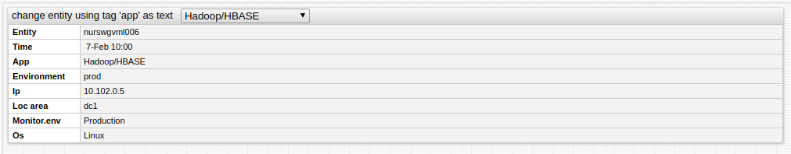

[](https://apps.axibase.com/chartlab/df616dfa/20/)

To fill drop-down list with values from `entity` and text from tag `app`, use the following syntax:

```ls
[dropdown]
  options = javascript: requestPropertiesOptions("entity", "tags.app", null, ["nurswgvml006","nurswgvml007", "nurswgvml010", "nurswgvml301", "nurswgvml502"], "$entity_tags")
  change-field = entity
```

The content of the resulting drop-down list is shown here:

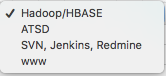

---

### `TextFieldPath _(optional, type: string/Array<string>)_`

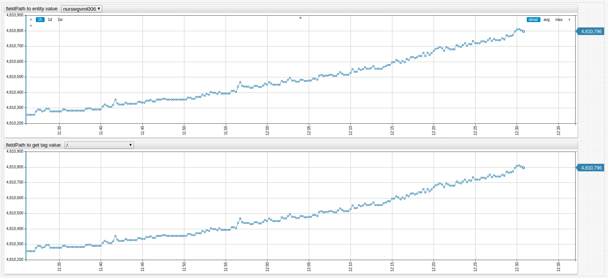

[](https://apps.axibase.com/chartlab/df616dfa/14/)

`textFieldPath` are the period-separated paths to a field in a series descriptor object, or an array of such paths. If it is an array then all elements other than the first are used as text. If `textFieldPath` is not specified or search on all paths failed the value is used as text.

To fill a drop-down list with options in which values are retrieved from the `name` field of the metric descriptor and text from the tag `description`, `textFieldPath` as string can be used.

```ls
[dropdown]
  options = javascript: requestEntitiesMetricsOptions('name', 'tags.description', null, null, null, {tags:'*',limit:15})
  change-field = metric
```

Below is the content of the drop-down list:


Fill the drop-down list with values retrieved from the `name` field of the metric descriptor and the text from the tag `description` or tag `documentation`, if the descriptor has no value for the tag `description`, `textFieldPath` as an array can be used

```ls
[dropdown]
  options = javascript: requestEntitiesMetricsOptions('name', ['tags.description','tags.documentation'], null, null, null, {tags:'*',limit:15})
  change-field = metric
```

Below is the content of the drop-down list:


---

### `Callback _(optional, type:function)_`

* Use `callback` for manual processing of descriptors, which are passed as parameters.
  * If `callback` is specified, `valueFieldPath` and `textFieldPath` are ignored.
* Function returns an array of objects, representing options.

```ls
[
...
{
  value: string,
  text: string
}
...
]
```

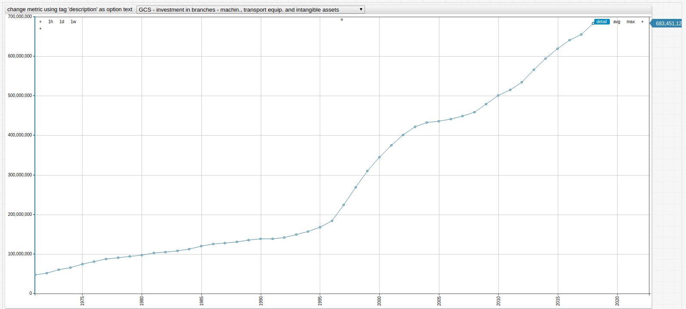

[](https://apps.axibase.com/chartlab/df616dfa/26/)

To populate the drop-down list with the names of metrics, collected for the entity, and texts which are changed values of the `description` tag, use the following syntax:

```ls
[dropdown]
  change-field = metric

  options = javascript: requestEntitiesMetricsOptions(null, null, function(metrics) {
  options =      return metrics.map(function(m) {
  options =        return {
  options =          value: m.name,
  options =          text: m.tags.description.replace('Gross Capital Stock', 'GCS')
  options =        }
  options =      });
  options =    }, null, null, {tags:'*',limit:15})
```

The contents of the resulting drop-down list are shown here:

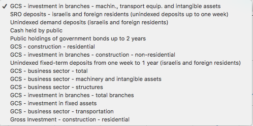

---

## `requestMetricsSeriesValues()`

**Description**:

* Requests series for `metric` and adds `queryParameters` to the requested URL.
  * If `fieldPath` is specified retrieves fields found by `fieldPath` in the series.
  * If `unique` is specified retrieved values are unique and sorted.
  * If `callback` function is specified, the array of retrieved fields or the array of loaded series as an argument is returned, whether or not `fieldPath` is specified.
* Returns array of options, objects with `value` property set to the retrieved and processed value.

**Syntax**:

```ls
requestMetricsSeriesValues([fieldPath, [callback, [metric, [unique, [queryParameters]]]]])
```

**Scope of Usage**:

Use in a `[dropdown]` field `options` setting after the `javascript:` prefix.

**API Request**:

Sends asynchronous `GET` requests to
[`/api/v1/metrics/{metric}/series`](https://axibase.com/docs/atsd/api/meta/metric/series.html)

**Returned Value**:

`Array<string>`: Values fill the drop-down list, retrieved from series descriptors.

**Arguments**:

| Name  | Type | Description |
|------|------|-------------|
| `fieldPath` | string | Dot-separated path to the field, whose value is retrieved. |
| `callback`  | function | Function to process series descriptors or retrieved values. |
| `metric` | string | Metrics, for which series are loaded.<br>If not specified, `metric` from the `[widget]` is used |
| `unique` | boolean | Specify if retrieved values are unique and sorted<br>Default setting: `true` |
| `queryParameters` | string/object | String or key-value object representing request parameters |

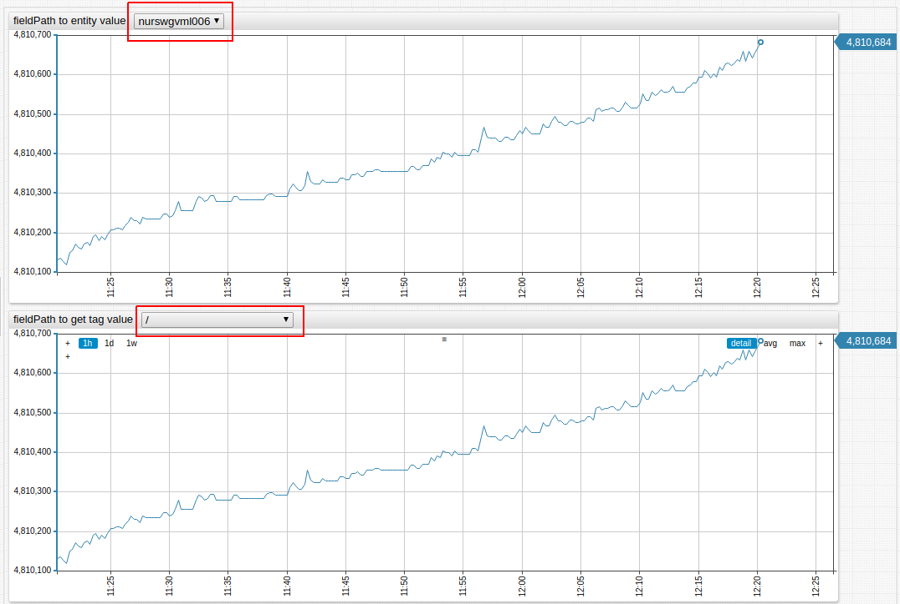

[](https://apps.axibase.com/chartlab/df616dfa/14/)

The `fieldPath` `"tags.mount_point"` reads `tags`in each descriptor then retrieves the `mount_point` field.

```ls
[dropdown]
  options = javascript: requestMetricsSeriesValues("tags.mount_point")
  change-field = series.tags.mount_point
```


---

## `requestEntitiesMetricsValues()`

**Description**:

* Requests metrics for the `entity` adding `queryParameters` to the requested URL.
  * If `fieldPath` is specified, retrieves fields found by `fieldPath` in the metric.
  * If `unique` is specified, retrieved values are both unique and sorted.
  * If `callback` function is specified, the function returns the array of retrieved fields or the array of loaded metrics as argument, whether or not `fieldPath` is specified.
* Returns the array of options - objects with `value` property set to the retrieved and processed value.

**Syntax**:

```ls
requestEntitiesMetricsValues([fieldPath, [callback, [entity, [unique, [queryParameters]]]]])
```

**Scope of Usage**:

Use in `[dropdown]` field `options` setting after `javascript:` prefix.

**API Request**:
Sends asynchronous `GET` requests to
[`/api/v1/entities/{entity}/metrics`](https://axibase.com/docs/atsd/api/meta/entity/metrics.html)

**Returned Value**:

`Array<string>`: values to fill the drop-down list, retrieved from metric descriptors.

**Arguments**:

| Name | Necessity | Type | Description |
|------|-----------|------|-------------|
| `fieldPath` | string | Dot-separated path to the field, whose value is retrieved. |
| `callback` | function | Function to process series descriptors or retrieved values. |
| `entity` | string | Entity, for which metric descriptors are loaded. If not specified, `entity` from the `[widget]` is used. |
| unique | boolean | Specify whether retrieved values be unique and sorted, default is `true`. |
| `queryParameters` | string/object | string or key-value object representing request parameters. |

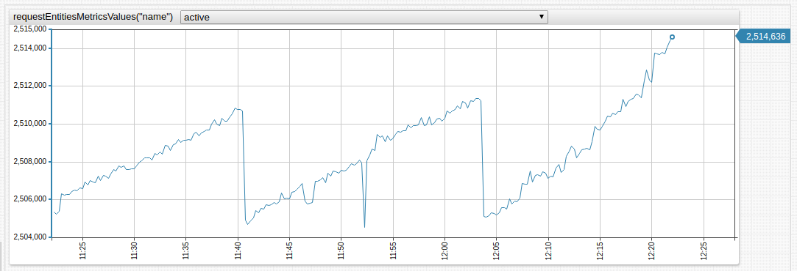

[](https://apps.axibase.com/chartlab/df616dfa/16/)

To populate the drop-down list with names of metrics collected for the entity use the following syntax:

```ls
[dropdown]
  options = javascript: requestEntitiesMetricsValues("name")
  change-field = series.metric
```

The content of the resulting drop-down list is shown below:

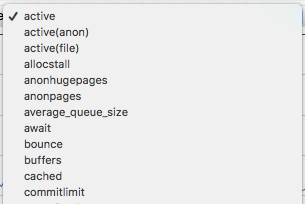

---

### `requestPropertiesValues()`

**Description**:

* Requests entity tags or properties for the entity or entities specified by the `entity` parameter.
  * If `postBody` is specified, `entity` and `propertyType` parameters are ignored.
* Function requests entity tags if `$entity_tags` is specified as `propertyType`, or if not, requests properties.
  * If `fieldPath` is specified retrieve fields found by `fieldPath` in the entity tags or properties.
  * If `unique` is specified retrieved values are both unique and sorted.
  * If `callback` function is specified, it is applied to the array of retrieved fields or the array of entity tags/properties, whether or not `fieldPath` is specified.
* Returns the array of options, objects with `value` property set to the processed retrieved value.

**Syntax**:

```ls
requestPropertiesValues([valueFieldPath, [textFieldPath, [callback, [entity, [propertyType, [unique, [postBody]]]]]]])
```

**Scope of Usage**:

Can be used in `[dropdown]` field `options` setting after `javascript:` prefix.

**API Request**:
Sends asynchronous `POST` requests to
[`/api/v1/properties/query`](https://axibase.com/docs/atsd/api/data/properties/query.html)

**Returned Value**:

`Array<string>`: Values to fill the drop-down list, retrieved from properties descriptors.

**Arguments**:

| Name | Type | Description |
|------|------|-------------|
| `fieldPath` | string | Dot-separated path to the field, whose value is retrieved. |
| `callback` | function | Function to process series descriptors or retrieved values. |
| `entity` | string, array | Entity or entities, for which properties descriptors are loaded.<br>If not specified, `entities` or `entity` from the `[widget]` is used. |
| `propertyType` | string | Type of loaded properties.<br>Default setting: `$entity_tags`. |
| `unique` | boolean | Specifies whether retrieved values are unique and sorted.<br>Default value: `true`. |
| `postBody` | object | Body of [Data API Properties Query](https://axibase.com/docs/atsd/api/data/properties/query.html). |

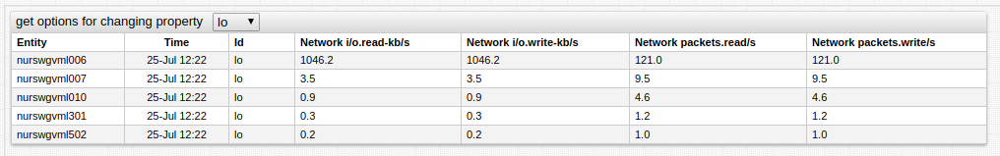

[](https://apps.axibase.com/chartlab/df616dfa/17/)

To populate the drop-down list with the `id` of `network` properties use the following syntax:

```ls
[dropdown]
  options = javascript: requestPropertiesValues("key.id", null, null, "network")
  change-field = property.keys.id
```

The content of the resulting drop-down list is shown below:

