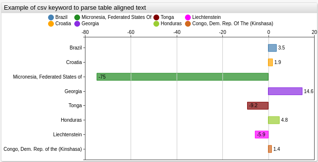
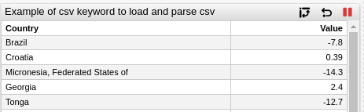

# Functions

The list contains built-in utility functions that can be included in Axibase Charts.

## Reference

| Name | Description |
|------|-------------|
| [`getTags()`](#gettags) | Retrieves metric series and returns a sorted array of unique values for defined tags |
| [`getSeries()`](#getseries) | Returns an array of series collected for the defined metric |
| [`getMetrics()`](#getmetrics) | Returns the names of metrics collected for the defined entity |
| [`getEntities()`](#getentities) | Returns the names of entities contained in the defined entity-group |
| [`range()`](#range) | Returns a regularly spaced, customizable array of numbers |
| [`CSV Inline Text Mode`](#csv-inline-text-mode) | Parses CSV-like text into an array of objects |
| [`CSV From Mode`](#csv-from-mode)| Loads a CSV file located at the defined URL and parses it into an array of objects |
| [`csv.values()`](#csvvalues) | Returns the sorted, unique values of a defined column |
| [`list.escape()`](#listescape) | Escapes commas in every element of an array |
| [`previous()`](#previous) | Retrieves the value of the previous point in a sequence |
| [`movavg()`](#movavg) | Computes the moving average from a desired number of previous points |
| [`meta()`](#meta) | Retrieves the metadata object for a series |
| [`entityTag()`](#entitytag) | Returns the value of the entity tag from the metadata object for the series |
| [`metricTag()`](#metrictag) | Returns the value of the metric tag from the metadata object for the series |
| [`requestMetricsSeriesValues()`](#requestmetricsseriesvalues) | Creates drop-down list values from values retrieved for the defined series field |
| [`requestEntitiesMetricsValues()`](#requestentitiesmetricsvalues) | Creates drop-down list values from values retrieved for the defined metric field |
| [`requestPropertiesValues()`](#requestpropertiesvalues) | Creates drop-down list from value values retrieved for the defined entity tag or property |
| [`requestMetricsSeriesValues()`](#requestmetricsseriesvalues) | Creates drop-down list from values retrieved for the defined series field |
| [`requestEntitiesMetricsValues()`](#requestentitiesmetricsvalues) | Creates drop-down list from values retrieved for the defined metric field |
| [`requestPropertiesValues()`](#requestpropertiesvalues) | Creates drop-down list from values retrieved for the defined entity tag or property |

---

## `getTags()`

**Description**:

* Loads a series for the `metric` and the `entity` from a defined URL, whose last data point has been added after the `minInsertDate` and before the `maxInsertDate`.
* Additional `queryParameters` can be specified.
* Unique values of the tag defined by `tagName` are retrieved from tags of the loaded series and sorted.
* The returned array includes the `list.escape()` function, which escapes any commas present in each element.

**Syntax**:

```ls
getTags(metric, tagName, [entity, [minInsertDate, [maxInsertDate, [url, [queryParameters]]]]])
```

**Scope of Usage**:

Use at the `preprocessor` stage in a `var`, `if`, `if else`, `for .. in`, or `@{}` expression.

**API Request**:

Sends synchronous `GET` request to
[/api/v1/metrics/{metric}/series](https://axibase.com/docs/atsd/api/meta/metric/series.html)

**Returned Value**:

`Array<string>`: unique sorted values of the specified `tagName` series tag.

**Arguments**:

| Name | Necessity | Type | Description |
|------|-----------|------|-------------|
| `metric` | required | string | `metric` path parameter |
| `tagName` | required | string | Tag whose values are retrieved from series descriptors |
| `entity` | optional | string | `entity` query parameter |
| `minInsertDate` | optional | string | `minInsertDate` query parameter ([syntax](https://axibase.com/docs/atsd/shared/calendar.html)) |
| `maxInsertDate` | optional | string | `maxInsertDate` query parameter ([syntax](https://axibase.com/docs/atsd/shared/calendar.html)) |
| `url` | optional | string | Protocol, host and path to which `/api/v1` path is added |
| `queryParameters` | optional | object | Object with parameter names as keys and values as values, to be transformed to query parameters string |

**Examples**:

**Get values of `mount_point` tag in a series for the metric `disk_used` and the entity `nurswgvml007` received today:**


[](https://apps.axibase.com/chartlab/df616dfa)

**Usage**:

```ls
var mount_points = getTags("disk_used", "mount_point", "nurswgvml006", "current_day")
```

**Request Sent**:

```sh
/api/v1/metrics/disk_used/series?tag=mount_point&entity=nurswgvml006&minInsertDate=current_day
```

**Result**:

 ```json
 ["/", "/media/datadrive", "/mnt/u113452"]
 ```

**Get values of `mount_point` tag in a series for the metric `disk_used` and the entity `nurswgvml007` and send server-specific query parameter `cache` while ignoring other parameters**:


[](https://apps.axibase.com/chartlab/df616dfa/2)

**Usage**:

```ls
var mount_points = getTags("disk_used", "mount_point", "nurswgvml007", null, null, null, {cache: true})
```

**Request Sent**:

```sh
/api/v1/metrics/disk_used/series?cache=true&tag=mount_point&entity=nurswgvml007
```

**Result**:

```json
["/", "/media/datadrive", "/mnt/u113452"]
```

---

## `getSeries()`

**Description**:

* Loads a series for the `metric` and the `entity` from a defined URL, whose last data point has been added after the `minInsertDate` and before the `maxInsertDate`.
* Specify additional `queryParameters`.
* Returns a loaded series.

**Syntax**:

```ls
getSeries(metric, [entity, [minInsertDate, [maxInsertDate, [url, [queryParameters]]]]])
```

**Scope of Usage**:

Use at the `preprocessor` stage in a `var`, `if`, `if else`, `for .. in`, or `@{}` expression.

**API Request**:

Sends synchronous `GET` requests to the
[/api/v1/metrics/{metric}/series](https://axibase.com/docs/atsd/api/meta/metric/series.html)

**Returned Value**:

`Array<object>`: Received series descriptors.

**Arguments**:

| Name | Necessity | Type | Description |
|------|-----------|------|-------------|
| `metric` | required | string | `metric` path parameter |
| `entity` | optional | string | `entity` query parameter |
| `minInsertDate` | optional | string | `minInsertDate` query parameter ([syntax](https://axibase.com/docs/atsd/shared/calendar.html)) |
| `maxInsertDate` | optional | string | `maxInsertDate` query parameter ([syntax](https://axibase.com/docs/atsd/shared/calendar.html)) |
| `url` | optional | string | protocol, host and path to which `/api/v1` path is added |
| `queryParameters` | optional | object | object with parameter names as keys and its values as values, which is transformed to query parameters string |

**Examples**:

**Returns a series for the metric `disk_used` and the entity `nurswgvml006`**:


[](https://apps.axibase.com/chartlab/df616dfa/3)

**Usage**:

```ls
var seriesDescriptors = getSeries("disk_used", "nurswgvml007")
```

**Request Sent**:

```sh
/api/v1/metrics/disk_used/series?entity=nurswgvml007
```

**Result**:

 ``` json
[
    {
        "metric":"disk_used",
        "entity":"nurswgvml007",
        "tags":{
            "file_system":"/dev/mapper/vg_nurswgvml007-lv_root",
            "mount_point":"/"
        },
        "lastInsertDate":"2017-08-15T15:30:25.000Z"
    },
    {
        "metric":"disk_used",
        "entity":"nurswgvml007",
        "tags":{
            "file_system":"172.17.0.2:/home/store/share",
            "mount_point":"/mnt/share"
        },
        "lastInsertDate":"2015-12-25T14:09:49.000Z"
    },
    {
        "metric":"disk_used",
        "entity":"nurswgvml007",
        "tags":{
            "file_system":"//u113452.your-backup.de/backup",
            "mount_point":"/mnt/u113452"
        },
        "lastInsertDate":"2017-06-21T13:26:00.000Z"
    }
]
 ```

---

## `getMetrics()`

**Description**:

* Loads metrics for `entity` from a defined URL, which satisfies `expression`.
* Specify additional `queryParameters`.
* Returns the sorted names of loaded metrics.
* The returned array includes the `list.escape()` function, which escapes any commas in each element.

**Syntax**:

```ls
getMetrics(entity, [expression, [tags, [url, [queryParameters]]]])
```

**Scope of Usage**:

Use at the `preprocessor` stage in a `var`, `if`, `if else`, `for .. in`, or `@{}` expression.

**API Request**:

Sends synchronous `GET` requests to the
[`/api/v1/entities/{entity}/metrics`](https://axibase.com/docs/atsd/api/meta/entity/metrics.html)

**Returned Value**:
`Array<string>`: retrieved metrics names.

**Arguments**:

| Name | Necessity | Type | Description |
|------|-----------|------|-------------|
| `entity` | required | string | `entity` path parameter |
| `expression` | optional | string | `expression` query parameter ([syntax](https://axibase.com/docs/atsd/api/meta/expression.html)) |
| `tags` | optional | string | `tags` request parameter |
| `url` | optional | string | protocol, host and path to which `/api/v1` path is added |
| `queryParameters` | optional | object | object with parameter names as keys and its values as values, which is transformed to query parameters string |

**Examples**:

**Returns metrics for the entity `nurswgvml006` which contains the `cpu` and `user` substrings**:


[](https://apps.axibase.com/chartlab/df616dfa/4)

**Usage**:

```ls
var metrics = getMetrics("nurswgvml007", "name LIKE '*cpu*user*'")
```

**Request Sent**:

```sh
/api/v1/entities/nurswgvml007/metrics?expression=name%20LIKE%20%27*cpu*user*%27
```

**Result**:

 ```json
["cpu_user","nmon.cpu.user%","nmon.cpu_total.user%"]
 ```

---

## `getEntities()`

**Description**:

* Loads entities contained in the entity-group defined by `group`, which satisfies `expression`.
* Specify additional `queryParameters`.
* Returns sorted names of loaded entities.
* Returned array includes the `list.escape()` function, which escapes any commas in each element.

**Syntax**:

```ls
getEntities(group, [expression, [tags, [url, [queryParameters]]]])
```

**Scope of Usage**:

Use at the `preprocessor` stage in a `var`, `if`, `if else`, `for .. in`, or `@{}` expression.

To load multiple groups, retrieve members of each group separately and then concatenate the elements into one array.

```javascript
var agents = [].concat(getEntities("group1"), getEntities("group2"))

var agents = getEntities("group1").concat(getEntities("group2"))  
```

The elements in the concatenated array are sorted first by group, then by element name.

**API Request**:

Sends synchronous `GET` requests to the
[`/api/v1/entity-groups/{group}/entities`](https://axibase.com/docs/atsd/api/meta/expression.html)

**Returned Value**:

`Array<string>`: retrieved entities names.

**Arguments**:

| Name | Necessity | Type | Description |
|------|-----------|------|-------------|
| `group` | required | string | `group` path parameter |
| `expression` | optional | string | `expression` query parameter ([syntax](https://axibase.com/docs/atsd/api/meta/expression.html)) |
| `tags` | optional | string | `tags` request parameter |
| `url` | optional | string | protocol, host and path to which `/api/v1` path is added |
| `queryParameters` | optional | object | object with parameter names as keys and its values as values, which is transformed to query parameters string |

**Examples**:

**Get entities contained in entity-group `docker-hosts` whose names begin with substring `nur`**:


[](https://apps.axibase.com/chartlab/df616dfa/5/)

**Usage**:

```ls
var entities = getEntities("docker-hosts", "name LIKE 'nur*'")
```

**Request Sent**:

```sh
/api/v1/entity-groups/docker-hosts/entities?expression=name%20LIKE%20%27nur*%27
```

**Result**:

 ```json
["nurswghbs001"]
 ```

## `range()`

**Description**:

* Generates an array of numbers from `start` to `end`, regularly spaced with a configurable `step`.
  * If `step` is not specified, numbers are sequential.
  * If `start` is greater than `end`, numbers are generated in descending order.
  * If `format` is specified, each number is formatted and converted to a string.

**Syntax**:

```ls
range(start, end, [step], [format])
```

**Scope of Usage**:

Use at the `preprocessor` stage in a `var`, `if`, `if else`, `for .. in`, or `@{}` expression.

**Returned Value**:

`Array<number/string>`: generates optionally formatted numbers.

**Arguments**:

| Name | Necessity | Type | Description |
|------|-----------|------|-------------|
| `start` | required | number | First number in list |
| `end` | required | number | Last number is list |
| `step` | optional | number | Offset between adjacent numbers |
| `format` | optional | string | Formatter name ([available formats](./format-settings.md)) |

**Examples**:


[](https://apps.axibase.com/chartlab/df616dfa/6/)

**Get sequential numbers from `1` to `10`**:

**Usage**:

```javascript
range(1,10)
```

**Result**:

```javascript
1,2,3,4,5,6,7,8,9,10
```

**Get numbers from `1` to `10` with double step**:

**Usage**:

```javascript
range(1,10,2)
```

**Result**:

```javascript
1,3,5,7,9
```

**Get numbers from `10` to `1` with a single step**:

**Usage**:

```javascript
range(10,1)
```

**Result**:

```javascript
10,9,8,7,6,5,4,3,2,1
```

**Get numbers from `10` to `1` with a double step**;

**Usage**:

```javascript
range(10,1,2)
```

**Result**:

```javascript
10,8,6,4,2
```

**Format sequential numbers `1` to `10` as a percent**:

**Usage**:

```javascript
range(1,10,'percent')
```

**Result**:

```javascript
1%,2%,3%,4%,5%,6%,7%,8%,9%,10%
```

**Get numbers from `1` to `10` with a double step and format as a percent**:

**Usage**:

```javascript
range(1,10,2,'percent')
```

**Result**:

```javascript
1%,3%,5%,7%,9%
```

**Format sequential numbers from `1` to `10` as minutes**:

**Usage**:

```javascript
range(1,10,1,'intervalFormat("%M:%S")(value*1000)')
```

**Result**:

```javascript
00:01,00:02,00:03,00:04,00:05,00:06,00:07,00:08,00:09,00:10
```

**Format sequential numbers from `1` to `12` with an additional fill character (`0`) for single digit values**:

**Usage**:

```javascript
range(1, 12, "d3.format('02d')(value)")
```

**Result**:

```javascript
01,02,03,04,05,06,07,08,09,10,11,12
```

---

## CSV Inline Text Mode

**Description**:

* Parses CSV-like text placed between `csv name =` and `endcsv` keywords into an array of objects.
* First line contains header and column names.
* Other lines contain data.
* Each data line is parsed into the object, where keys are column names and values are the values of corresponding cells.
* The generated array uses the `.value(column_name)` method to get unique sorted values of the defined column.

Limitations and features that are applied:

* Handling for empty lines and spaces.
* To escape spaces, use double quotes `"`.
* Value cannot contain double quotes `"`.
* Multi-line rows are not supported.
* The delimiter symbol is comma (`,`)

**Syntax**:

```ls
csv name = header1, header2 ...
cell11, cell12 ...
cell21, cell22 ...
...
endcsv
```

**Scope of Usage**:

Use in the `preprocessor` stage.

**Returned Value**:
`Array<object>`: Array of rows represented as objects with headers as keys and cells as corresponding values.

**Examples**:

**Create array of objects from tabular structure using CSV**:



[](https://apps.axibase.com/chartlab/df616dfa/8/)

Using a table written in a CSV-like format: There are two columns, `name` (name of the country) and `value2006` (value in the year 2006). The return value is the difference between the current year value and the 2006 value. The following CSV is used:

```ls
csv countries =
  name, value2006
  Brazil, 13.2
  Croatia, 4.9
  "Micronesia, Federated States of", 100
  Georgia, 48.2
  Tonga, 40.8
  Honduras, 38
  Liechtenstein, 5.9
  "Congo, Dem. Rep. of the (Kinshasa)",44.2
endcsv

country = @{countries.values('name').escape()}
```

This CSV is transformed into the following array:

 ```json
[
    {
        "name":"Brazil",
        "value2006":"13.2"
    },
    {
        "name":"Croatia",
        "value2006":"4.9"
    },
    {
        "name":"Micronesia, Federated States of",
        "value2006":"100"
    },
    {
        "name":"Georgia",
        "value2006":"48.2"
    },
    {
        "name":"Tonga",
        "value2006":"40.8"
    },
    {
        "name":"Honduras",
        "value2006":"38"
    },
    {
        "name":"Liechtenstein",
        "value2006":"5.9"
    },
    {
        "name":"Congo, Dem. Rep. of the (Kinshasa)",
        "value2006":"44.2"
    }
]
 ```

Iterate over the newly created array and set the value and entity based on thr retrieved country `name` and `value2006`.

```ls
for country in countries
    [series]
      replace-value = value - @{country.value2006}
      [tags]
        country = @{country.name.replace(",", "\\,")}
endfor
```

---

## CSV From Mode

**Description**:

* Parse a CSV file located at the defined URL into an array of objects.
* Each data line is parsed into the object, where keys are column names and values are the values of the corresponding cells.
* The generated array uses the `.value(column_name)` method to get unique sorted values of defined column.

Limitation and features that are applied to the text:

* Handling for empty lines and spaces.
* To escape spaces use double-quotes(`"`).
* Values cannot contain double-quotes(`"`).
* Multi-line rows are not supported.
* The delimiter symbol is comma (`,`)

**Syntax**:

```ls
csv csv_name from url
```

**Scope of Usage**:

Use in the `preprocessor` stage.

**Returned Value**:
`Array<object>`: Array of rows represented as objects with headers as keys and cells as corresponding values.

**Examples**:

**Create array of objects from CSV file**:



[](https://apps.axibase.com/chartlab/b00d77c0)

The desired return value in this example is the difference between the current year value and the 2006 value.

The file is loaded from [ATSD Use Cases](https://axibase.com/use-cases/) and stored  in [CSV format](https://raw.githubusercontent.com/axibase/atsd-use-cases/master/research/us-visa-refusal/resources/visa-refusal.csv).

The first several rows from the file are shown below:

```txt
country,2006,2007,2008,2009,2010,2011,2012,2013,2014,2015,2016
Brazil,13.2,9.6,5.5,7,5.2,3.8,3.2,3.5,3.2,5.36,16.7
Croatia,4.9,5.1,5.1,5.3,5.3,6.3,4.4,5.9,6.1,5.29,6.78
"Micronesia, Federated States of",100,0,50,100,0,33.3,50,100,80,85.71,25
Georgia,48.2,55.4,46.6,49.7,43.6,40.2,31.8,38.3,48.2,50.58,62.82
Tonga,40.8,45.4,48.7,47.8,42.8,46.5,41.5,42.1,25.4,28.09,31.58
Honduras,38,37.7,33.6,29.2,29.2,27.6,29.8,37,36.8,39.73,42.76
Liechtenstein,5.9,6.7,0,12.5,5.9,0,0,10,11.1,0,0
```

The setting to load and parse the file is shown below:

```sh
csv rows from https://raw.githubusercontent.com/axibase/atsd-use-cases/master/USVisaRefusal/Resources/visa-refusal.csv
```

 ```json
[
    {
        "2006":"13.2",
        "2007":"9.6",
        "2008":"5.5",
        "2009":"7",
        "2010":"5.2",
        "2011":"3.8",
        "2012":"3.2",
        "2013":"3.5",
        "2014":"3.2",
        "2015":"5.36",
        "2016":"16.7",
        "country":"Brazil"
    },
    {
        "2006":"4.9",
        "2007":"5.1",
        "2008":"5.1",
        "2009":"5.3",
        "2010":"5.3",
        "2011":"6.3",
        "2012":"4.4",
        "2013":"5.9",
        "2014":"6.1",
        "2015":"5.29",
        "2016":"6.78",
        "country":"Croatia"
        ...
    },
 ```

Iterate over the created array and set the value and entity based on the retrieved country `name` and value or year `2006`.

```ls
for row in rows
  [series]
    replace-value = value - @{row[2006]}
  [tags]
    country = @{row.country.replace(",", "\\,")}
  endfor
```

## `csv.values()`

**Description**:

* Arrays generated from `csv` use the `.values()` method.
* This function returns a sorted array of unique values in the column defined by the parameter `column_name`.
* The generated array contains the `.escape()` method which escapes commas in each element.

**Syntax**:

```ls
csv_name.values(column_name)
```

**Scope of Usage**:

Use in the `preprocessor` scope in `var`, `if`, `if else`, `for .. in`, `@{}` expressions.

**Returned Value**:

`Array<string>`: Array of unique values in the column defined by `column_name`.

**Examples**:

**Get escaped values of a CSV column**:


[](https://apps.axibase.com/chartlab/e7ce2234)

The goal in this example is to retrieve a list of escaped country names.

Write the following CSV:

```txt
csv countries =
  name, value2006
  Brazil, 13.2
  Croatia, 4.9
  "Micronesia, Federated States of", 100
  Georgia, 48.2
  Tonga, 40.8
  Honduras, 38
  Liechtenstein, 0
  "Congo, Dem. Rep. of the (Kinshasa)",44.2
endcsv

country = @{countries.values('name').escape()}
```

The CSV is transformed into the following array:

 ```json
[
    {
        "name":"Brazil",
        "value2006":"13.2"
    },
    {
        "name":"Croatia",
        "value2006":"4.9"
    },
    {
        "name":"Micronesia, Federated States of",
        "value2006":"100"
    },
    {
        "name":"Georgia",
        "value2006":"48.2"
    },
    {
        "name":"Tonga",
        "value2006":"40.8"
    },
    {
        "name":"Honduras",
        "value2006":"38"
    },
    {
        "name":"Liechtenstein",
        "value2006":"5.9"
    },
    {
        "name":"Congo, Dem. Rep. of the (Kinshasa)",
        "value2006":"44.2"
    }
]
```

Then retrieve values of the column `name`:

```ls
var names = countries.values('name')
```

Returned values are as follows:

```json
["Brazil","Congo, Dem. Rep. of the (Kinshasa)","Croatia","Georgia","Honduras","Liechtenstein","Micronesia, Federated States of","Tonga"]
```

Iterate over each value and set the country tag.

```ls
for country_name in names
  [series]
  [tags]
    country = @{country_name.replace(',', '\\,')}
endfor
```

---

## `list.escape()`

**Description**:

* Escapes commas for each value in an array of strings.
* The `.escape()` method is available in arrays generated from the `list` keyword, `var` expression, and `csv.values()` method.

**Syntax**:

```ls
list_name.escape()
```

**Scope of Usage**:

Use at the `preprocessor` stage in a `var`, `if`, `if else`, `for .. in`, or `@{}` expression.

**Returned Value**:

`Array<string>`: An  array where commas are escaped for each element. If the argument is not a string the argument is returned unmodified.

**Examples**:

The goal in the following example is to retrieve a list of escaped country names. Countries names are generated from the `list`, `var` and `csv.values()`

**Apply `.escape()` to array generated from `list`**:


[](https://apps.axibase.com/chartlab/06ec0eaa)

**Usage**:

```txt
list countries =
  Brazil,
  Croatia,
  Micronesia\, Federated States of,
  Georgia,
  Tonga,
  Honduras,
  Congo\, Dem. Rep. of the (Kinshasa)
    endlist

country = @{countries.escape()}
```

**Result**:

```json
["Brazil","Croatia","Micronesia\\, Federated States of","Georgia","Tonga","Honduras","Liechtenstein","Congo\\, Dem. Rep. of the (Kinshasa)"]
```

**Apply `.escape()` to the array created in the `var` expression**:


[](https://apps.axibase.com/chartlab/df616dfa/12/)

**Usage**:

```ls
var countries = getTags('state.visa-refusal-rate', 'country', 'travel.state.gov')

country = @{countries.escape()}
```

**Result**:

```json
[... "Comoros","Congo\\, Dem. Rep. of the (Kinshasa)","Congo\\, Rep. of the (Brazzaville)","Costa Rica","Cote d'Ivoire" ...]
```

**Apply `.escape()` to the array retrieved by `csv.values()`**:

[](https://apps.axibase.com/chartlab/df616dfa/7/)

**Usage**:

```txt
csv countries =
  name, value2006
  Brazil, 13.2
  Croatia, 4.9
  "Micronesia, Federated States of", 100
  Georgia, 48.2
  Tonga, 40.8
  Honduras, 38
  Liechtenstein, 5.9
  "Congo, Dem. Rep. of the (Kinshasa)",44.2
endcsv

country = @{countries.values('name').escape()}
```

**Result**:

```txt
["Brazil","Congo\\, Dem. Rep. of the (Kinshasa)","Croatia","Georgia","Honduras","Liechtenstein","Micronesia\\, Federated States of","Tonga"]
```

---

## `previous()`

**Description**:

* Get the value of the previous point in the series, defined by the `alias` parameter.
* Control the index position with the `offset` argument, relative to the current point.

**Syntax**:

```ls
previous(alias, [offset])
```

**Scope of Usage**:

Use in `value-expression` settings.

**Returned Value**:

`number`: value of the previous point.

**Arguments**:

| Name | Necessity | Type | Description |
|------|-----------|------|-------------|
| `alias` | required | string | Alias of the series, from which the previous value is retrieved |
| `offset` | optional | number | The index of the previous point relative to the current point, default is `1` |

**Examples**:

[](https://apps.axibase.com/chartlab/df616dfa/21)

**Show a copy of the series shifted one point**:

**Usage**:

```ls
value = previous('raw')
```

**Result**:


**Show a copy of the seres shifted two points**:

**Usage**:

```ls
value = previous('raw', 2)
```

**Result**:


**Calculate the percentile difference of the last `(n)` and last `(n - 1)` points**

**Usage**:

```ls
value = 1 - previous('raw') / value('raw')
```

**Result**:


**Calculate the percentage difference of the last `(n)` and last `(n - 1)` points**:

**Usage**:

```ls
value = 1 - previous('raw', 2) / value('raw')
```

**Result**:


---

## `movavg()`

**Description**:

* Calculates the moving average using `count` previous points in the series defined by `alias`.
* The average is calculated if at least `minCount` previous points are available.

**Syntax**:

```ls
movavg(alias, count, [minCount])
```

**Scope of Usage**:

Use in `value-expression` settings.

**Returned Value**:
`number`: calculated moving average.

**Arguments**:

| Name | Necessity | Type | Description |
|------|-----------|------|-------------|
| `alias` | required | string | alias of the series, to which `movavg` is applied |
| `count` | required | number | number of points for which `movavg` is calculated |
| `minCount` | optional | number | minimal number of points, for which `movavg` is calculated, default is `count` |

**Examples**:

[](https://apps.axibase.com/chartlab/df616dfa/22/)

**Calculate `movavg` when there are a defined amount of points for calculation**:

**Usage**:

```ls
value = movavg('raw', 30)
```

**Result**:


**Calculate `movavg` regardless of the number of points present**:

**Usage**:

```ls
value = movavg('raw', 30, 0)
```

**Result**:


---

## `meta()`

**Description**:

* Return metadata loaded for a series defined by `alias`.
* `add-meta` setting must be set to `true`.
* Function must be used with `value(alias)` in one expression.

**Syntax**:

```ls
meta(alias)
```

**Scope of Usage**:

Use in `value-expression` settings.

**Returned Value**:

`object`: metadata loaded to series.

**Arguments**:

| Name | Necessity | Type | Description |
|------|-----------|------|-------------|
| `alias` | required | string | alias of the series, from which metadata is returned |

**Examples**:

**Fraction of `maxValue`**:

[](https://apps.axibase.com/chartlab/df616dfa/23/)

**Usage**:

```ls
value = value('raw') / meta('raw').metric.maxValue
```

**Result**:


---

## `entityTag()`

**Description**:

* Returns tag with `tagName` from entity metadata loaded for series with `alias`.
* `add-meta` setting must be set to `true`.
* Function must be used with `value(alias)` in one expression.

**Syntax**:

```ls
entityTag(alias, tagName)
```

**Scope of Usage**:

Use in `value-expression` settings.

**Returned Value**:
`number`: Value of specified entity tag.

**Arguments**:

| Name | Necessity | Type | Description |
|------|-----------|------|-------------|
| `alias` | required | string | alias of the series, from which metadata is returned |
| `tagName` | required | string | name of tag which is retrieved from `meta.entity.tags` |

**Examples**:

**Set size to `cpu_count` entity tag**:

[](https://apps.axibase.com/chartlab/df616dfa/24/)

**Usage**:

```ls
size = entityTag('cpu_count')
```

**Result**:


---

## `metricTag()`

**Description**:

* Returns tag with `tagName` from metric metadata loaded for series with `alias`.
* `add-meta` setting must be set to `true`.
* Function must be used with `value(alias)` in one expression.

**Syntax**:

```ls
metricTag(alias, tagName)
```

**Scope of Usage**:

Use in `value-expression` settings.

**Returned Value**:

`string`: value of specified metric tag.

**Arguments**:

| Name | Necessity | Type | Description |
|------|-----------|------|-------------|
| `alias` | required | string | Alias of the series, from which metadata is returned |
| `tagName` | required | string | Name of tag which is retrieved from `meta.metric.tags` |

**Examples**:

**Set threshold to `threshold_value` metric tag**:

[](https://apps.axibase.com/chartlab/df616dfa/25/)

**Usage**:

```ls
value = metricTag('raw', 'threshold_value')
alert-expression = value() > metricTag('threshold_value')
```

**Result**:


---

## `requestMetricsSeriesValues()`

**Description**:

* Requests series for the `metric` adding `queryParameters` to the requested URL.
  * If `fieldPath` is specified retrieves fields found by `fieldPath` in the series.
  * If `unique` is specified retrieved values are unique and sorted.
  * If `callback` function is specified, the array of retrieved fields or the array of loaded series as an argument is returned, whether or not `fieldPath` is specified.
* Returns the array of options, objects with `value` property are set to the retrieved and processed value.

**Syntax**:

```ls
requestMetricsSeriesValues([fieldPath, [callback, [metric, [unique, [queryParameters]]]]])
```

**Scope of Usage**:

Use in a `[dropdown]` field `options` setting after the `javascript:` prefix.

**API Request**:

Sends asynchronous `GET` requests to
[`/api/v1/metrics/{metric}/series`](https://axibase.com/docs/atsd/api/meta/metric/series.html)

**Returned Value**:

`Array<string>`: Values fill the drop-down list, retrieved from series descriptors.

**Arguments**:

| Name | Necessity | Type | Description |
|------|-----------|------|-------------|
| `fieldPath` | optional | string | Dot-separated path to the field, whose value is retrieved |
| `callback` | optional | function | Function to process series descriptors or retrieved values |
| `metric` | optional | string | Metrics, for which series are loaded. If not specified, `metric` from the `[widget]` is used |
| `unique` | optional | boolean | Specify whether retrieved values be unique and sorted, default is `true` |
| `queryParameters` | optional | string/object | String or key-value object representing request parameters |

**Examples**:


[](https://apps.axibase.com/chartlab/df616dfa/14/)

The `fieldPath` `"tags.mount_point"` reads `tags`in each descriptor then retrieves the `mount_point` field.

```ls
[dropdown]
  options = javascript: requestMetricsSeriesValues("tags.mount_point")
  change-field = series.tags.mount_point
```


---

## `requestEntitiesMetricsValues()`

**Description**:

* Requests metrics for the `entity` adding `queryParameters` to the requested URL.
  * If `fieldPath` is specified, retrieves fields found by `fieldPath` in the metric.
  * If `unique` is specified, retrieved values are both unique and sorted.
  * If `callback` function is specified, the function returns the array of retrieved fields or the array of loaded metrics as argument, whether or not `fieldPath` is specified.
* Returns the array of options - objects with `value` property set to the retrieved and processed value.

**Syntax**:

```ls
requestEntitiesMetricsValues([fieldPath, [callback, [entity, [unique, [queryParameters]]]]])
```

**Scope of Usage**:

Use in `[dropdown]` field `options` setting after `javascript:` prefix.

**API Request**:
Sends asynchronous `GET` requests to
[`/api/v1/entities/{entity}/metrics`](https://axibase.com/docs/atsd/api/meta/entity/metrics.html)

**Returned Value**:

`Array<string>`: values to fill the drop-down list, retrieved from metric descriptors.

**Arguments**:

| Name | Necessity | Type | Description |
|------|-----------|------|-------------|
| `fieldPath` | optional | string | Dot-separated path to the field, whose value is retrieved. |
| `callback` | optional | function | Function to process series descriptors or retrieved values. |
| `entity` | optional | string | Entity, for which metric descriptors are loaded. If not specified, `entity` from the `[widget]` is used. |
| unique | optional | boolean | Specify whether retrieved values be unique and sorted, default is `true`. |
| `queryParameters` | optional | string/object | string or key-value object representing request parameters. |

**Examples**:


[](https://apps.axibase.com/chartlab/df616dfa/16/)

To populate the drop-down list with names of metrics collected for the entity use the following syntax:

```ls
[dropdown]
  options = javascript: requestEntitiesMetricsValues("name")
  change-field = series.metric
```

The content of the drop-down list is shown below:


## `requestPropertiesValues()`

**Description**:

* Requests entity tags or properties for the entity or entities specified by the `entity` parameter.
  * If `postBody` is specified, `entity` and `propertyType` parameters are ignored.
* Function requests entity tags if `$entity_tags` is specified as `propertyType`, or if not, requests properties.
  * If `fieldPath` is specified retrieve fields found by `fieldPath` in the entity tags or properties.
  * If `unique` is specified retrieved values are both unique and sorted.
  * If `callback` function is specified, it is applied to the array of retrieved fields or the array of entity tags/properties, whether or not `fieldPath` is specified.
* Returns the array of options, objects with `value` property set to the processed retrieved value.

**Syntax**:

```ls
requestPropertiesValues([valueFieldPath, [textFieldPath, [callback, [entity, [propertyType, [unique, [postBody]]]]]]])
```

**Scope of Usage**:

Can be used in `[dropdown]` field `options` setting after `javascript:` prefix.

**API Request**:
Sends asynchronous `POST` requests to
[`/api/v1/properties/query`](https://axibase.com/docs/atsd/api/data/properties/query.html)

**Returned Value**:

`Array<string>`: Values to fill the drop-down list, retrieved from properties descriptors.

**Arguments**:

| Name | Necessity | Type | Description |
|------|-----------|------|-------------|
| `fieldPath` | optional | string | Dot-separated path to the field, whose value is retrieved. |
| `callback` | optional | function | Function to process series descriptors or retrieved values. |
| `entity` | optional | string | Array | Entity or entities, for which properties descriptors are loaded. If not specified, `entities` or `entity` from the `[widget]` is used. |
| `propertyType` | optional | string | string | Type of loaded properties, default is `$entity_tags`. |
| `unique` | optional | boolean | Specifies whether retrieved values are unique and sorted, default is `true`. |
| `postBody` | optional/object | Body of [Data API properties query](https://axibase.com/docs/atsd/api/data/properties/query.html) |

**Examples**:


[](https://apps.axibase.com/chartlab/df616dfa/17/)

To populate the drop-down list with the IDs of `network` properties use the following syntax:

```ls
[dropdown]
  options = javascript: requestPropertiesValues("key.id", null, null, "network")
  change-field = property.keys.id
```

Below is the content of the drop-down list:


---

## Drop-down List Values Function Arguments Description

**`FieldPath _(optional, type: string)`**

* `fieldPath` is the dot-separated path to field in series descriptor object. If not specified, series descriptor objects are returned. If specified, the field found by `fieldPath` is returned.
* The `fieldPath` `"entity"` gets the entity field from each descriptor.

To populate the drop-down list with the names of entities for which the metric is collected use the following syntax.

```ls
[dropdown]
  options = javascript: requestMetricsSeriesValues("entity")
  change-field = series.entity
```

Below is the content of the drop-down list:


To populate the drop-down list with values of the `mount_point` tag use the following syntax. The `fieldPath` `"tags.mount_point"` reads `tags`in each descriptor then retrieves the `mount_point` field.

```ls
[dropdown]
  options = javascript: requestMetricsSeriesValues("tags.mount_point")
  change-field = series.tags.mount_point
```

Below is content of the drop-down list


---

**`Callback _(optional, type:function)`**

* Use `callback` for manual processing of series descriptors or additional processing of retrieved field values.
  * If `fieldPath` is specified, the string values of some field are passed as the argument for the callback, otherwise the series descriptor array is used as the argument.


[](https://apps.axibase.com/chartlab/df616dfa/15/)

To fill the drop-down list with values of `mount_point` tag of the series, whose entity name begins with the fragment `nur` use the function as shown below.

> Note that the series can be filtered by entity using the expression `queryParameter`.

```ls
[dropdown]
  change-field = series.tags.mount_point

    options = javascript: requestMetricsSeriesValues(null,
    options = function (series) {
    options =   var mountPoints = [];
    options =   series.forEach(function(s){
    options =     if(s.entity.indexOf("nur") === 0 && mountPoints.indexOf(s.tags.mount_point) < 0) {
    options =      mountPoints.push(s.tags.mount_point);
    options =      }
    options =    });
    options =    return mountPoints.sort();
    options = })
```

Below is the content of the drop-down list:


To fill the drop-down list with entity tag values it is necessary to make two requests:

* Get entity names from series descriptors.
* Request entity tags for that entities.

```ls
[dropdown]
   change-field = series.entity

   options = javascript: requestMetricsSeriesValues("entity",
   options = function (entities) {
   options =   return requestPropertiesOptions("entity", "tags.app", null, entities);
   options = })
```

Below is the content of the drop-down list:


---

**`requestMetricsSeriesOptions()`**

**Description**:

* Request series for the `metric` adding `queryParameters` to the requested URL.
* Creates an option for each loaded series.
* The value of the field found by `valueFieldPath` is assigned to the option value.
* The value of the field found by `textFieldPath` is assigned to the option text.
  * If `textFieldPath` is an array, it sequentially tries to find a field by every path.
* When field is found it is assigned to the option text.
  * If `callback` function is specified `valueFieldPath` and `textFieldPath` are ignored.
* `callback` retrieves the loaded series as an argument and returns an array of options, where at least the value must be specified.

**Syntax**:

```ls
requestMetricsSeriesValues([fieldPath, [callback, [metric, [unique, [queryParameters]]]]])
```

**Scope of Usage**:

Use in `[dropdown]` field `options` setting after `javascript:` prefix.

**API Request**:

Sends asynchronous `GET` request to
[`/api/v1/metrics/{metric}/series`](https://axibase.com/docs/atsd/api/meta/metric/series.html)

**Returned Value**:

`Array<{value: string, text: string}>`: options, generated from series descriptor fields.

**Arguments**:

| Name | Necessity | Type | Description |
|------|-----------|------|-------------|
| `valueFieldPath` | optional | string | Dot-separated path to the field, whose value is used as option value. |
| `textFieldPath` | optional | string or Array | Dot-separated path (or array of such paths) to the field, whose value is used as option text. |
| `callback` | optional | function | Function to process series descriptors, returns array of options. |
| `metric` | optional | string | Metric, for which series are loaded. If not specified, `metric` from the `[widget]` is used |
| `unique` | optional | boolean | Applied to raw series descriptors. |
| `queryParameters` | optional | string/object | String or key-value object representing request parameters |

**Examples**:


[](https://apps.axibase.com/chartlab/4f937185)

To fill the drop-down list with options with the value of the `iucr` tag and the text from the `description` tag, use the following syntax:

```ls
[dropdown]
  options = javascript: requestMetricsSeriesOptions("tags.iucr", "tags.description")
  change-field = series.tags.iucr
```

Below is the content of the drop-down list:


**`requestEntitiesMetricsOptions()`**:

**Description**:

* Requests metrics for the `entity` adding `queryParameters` to the requested URL.
* Creates an option for each loaded metric.
* The value of the field found by `valueFieldPath` is assigned to the option value.
* The value of the field found by `textFieldPath` is assigned to the option text.
  * If `textFieldPath` is an array, it sequentially tries to find a field by every path.
* When a field is found it is assigned to the option text.
  * If `callback` function is specified `valueFieldPath` and `textFieldPath` are ignored.
* `callback` gets loaded metrics as an argument and returns an array of options, where at least the value must be specified.

**Syntax**:

```ls
requestEntitiesMetricsValues([fieldPath, [callback, [entity, [unique, [queryParameters]]]]])
```

**Scope of Usage**:

Use in `[dropdown]` field `options` setting after `javascript:` prefix.

**API Request**:

Sends asynchronous `GET` request to
[`/api/v1/entities/{entity}/metrics`](https://axibase.com/docs/atsd/api/meta/entity/metrics.html)

**Returned Value**:

`Array<{value: string, text: string}>`: options, generated from metrics descriptors fields.

**Arguments**:

| Name | Necessity | Type | Description |
|------|-----------|------|-------------|
| `valueFieldPath` | optional | string | Dot-separated path to the field, whose value is used as option value. |
| `textFieldPath` | optional | string or Array | Dot-separated path (or array of such paths) to the field, whose value is used as option text. |
| `callback` | optional | function | Function to process series descriptors, returns array of options. |
| `entity` | optional | string | Entity, for which metrics descriptors are loaded. If not specified, `entity` from the `[widget]` is used. |
| `unique` | optional | boolean | Applied to raw series descriptors. |
| `queryParameters` | optional | string/object | String or key-value object representing request parameters. |

**Examples**:


[](https://apps.axibase.com/chartlab/df616dfa/19/)

To fill the drop-down list with options defined by the value of `iucr` tag and text from the `description` tag, use the following syntax:

```ls
[dropdown]
  options = javascript: requestEntitiesMetricsOptions("name", "tags.description", null, null, null,{tags:"*",limit:15})
  change-field = metric
```

Below is the content of the drop-down list:


## requestPropertiesOptions()

**Description**:

* Requests the entity tags or properties for the entity or the entities specified by the `entity` parameter.
  * If `postBody` is specified, `entity` and `propertyType` parameters are ignored.
* Function requests entity tags if `$entity_tags` is specified as `propertyType`, or otherwise requests properties.
* Creates an option for each loaded tag or property object.
* The value of the field found by `valueFieldPath` is assigned to the option value.
* The value of the field found by `textFieldPath` is assigned to the option text.
  * If `textFieldPath` is an array, the function sequentially tries to find a field at each path.
* When a field is found it is assigned to the option text.
  * If `callback` function is specified, the `valueFieldPath` and `textFieldPath` parameters are ignored.
* `callback` gets loaded tags/properties as an argument and returns an array of options, where at least the value must be specified.

**Syntax**:

```ls
requestPropertiesOptions([valueFieldPath, [textFieldPath, [callback, [entity, [propertyType, [unique, [postBody]]]]]]])
```

**Scope of Usage**:

Use in `[dropdown]` field `options` setting after `javascript:` prefix.

**API Request**:

Sends asynchronous `POST` request to
[`/api/v1/properties/query`](https://axibase.com/docs/atsd/api/data/properties/query.html).

**Returned Value**:

`Array<string>`: options, generated from the property or entity descriptors fields.

**Arguments**:

| Name | Necessity | Type | Description |
|------|-----------|------|-------------|
| `valueFieldPath` | optional | string | Dot-separated path to the field, whose value is used as `option` value. |
| `textFieldPath` | optional | string or Array | Dot-separated path (or array of such paths) to the field, whose value is used as `option` text. |
| `callback` | optional | function | Function to process series descriptors, returns array of options. |
| `entity` | optional | string or Array | entity or entities, for which properties descriptors are loaded. If not specified, `entities` or `entity` from the `[widget]` is used. |
| `propertyType` | optional | string | string | Type of loaded properties, default is `$entity_tags` |
| `unique` | optional | boolean | Applied to raw series descriptors. |
| `postBody` | optional | object | Body of [Data API properties query](https://axibase.com/docs/atsd/api/data/properties/query.html). |

**Examples**:


[](https://apps.axibase.com/chartlab/df616dfa/20/)

To fill drop-down list with values from `entity` and text from tag `app`, use the following syntax:

```ls
[dropdown]
  options = javascript: requestPropertiesOptions("entity", "tags.app", null, ["nurswgvml006","nurswgvml007", "nurswgvml010", "nurswgvml301", "nurswgvml502"], "$entity_tags")
  change-field = entity
```

The content of the drop-down list is shown here:


---

## Drop-down List Values Function Arguments Description

**`TextFieldPath _(optional, type: string/Array<string>)_`**:


[](https://apps.axibase.com/chartlab/df616dfa/14/)

`textFieldPath` are the period-separated paths to a field in a series descriptor object, or an array of such paths. If it is an array then all elements other than the first are used as text. If `textFieldPath` is not specified or search on all paths failed the value is used as text.

To fill a drop-down list with options in which values are retrieved from the `name` field of the metric descriptor and text from the tag `description`, `textFieldPath` as string can be used.

```ls
[dropdown]
  options = javascript: requestEntitiesMetricsOptions('name', 'tags.description', null, null, null, {tags:'*',limit:15})
  change-field = metric
```

Below is the content of the drop-down list:


Fill the drop-down list with values retrieved from the `name` field of the metric descriptor and the text from the tag `description` or tag `documentation`, if the descriptor has no value for the tag `description`, `textFieldPath` as an array can be used

```ls
[dropdown]
  options = javascript: requestEntitiesMetricsOptions('name', ['tags.description','tags.documentation'], null, null, null, {tags:'*',limit:15})
  change-field = metric
```

Below is the content of the drop-down list:


---

**`Callback _(optional, type:function)_`**

* Use `callback` for manual processing of descriptors, which are passed as parameters.
  * If `callback` is specified, `valueFieldPath` and `textFieldPath` are ignored.
* Function returns an array of objects, representing options.

```ls
[
...
{
  value: string,
  text: string
}
...
]
```


[](https://apps.axibase.com/chartlab/df616dfa/26/)

To populate the drop-down list with the names of metrics, collected for the entity, and texts which are changed values of the `description` tag, use the following syntax:

```ls
[dropdown]
  change-field = metric

  options = javascript: requestEntitiesMetricsOptions(null, null, function(metrics) {
  options =      return metrics.map(function(m) {
  options =        return {
  options =          value: m.name,
  options =          text: m.tags.description.replace('Gross Capital Stock', 'GCS')
  options =        }
  options =      });
  options =    }, null, null, {tags:'*',limit:15})
```

The contents of the drop-down list are shown here:

