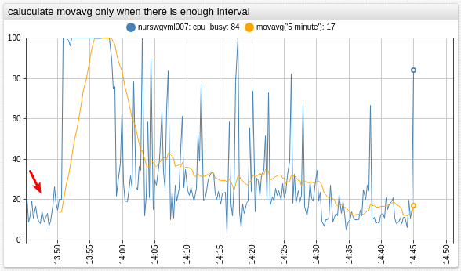
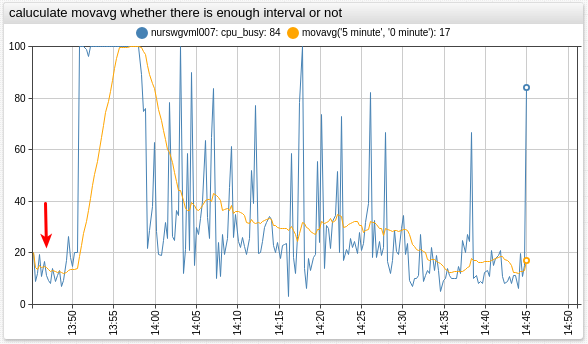

# JavaScript Settings Scope

To provide flexibility for custom calculations there is a set of settings in Charts, whose value is processed as JavaScript expression:

* [`alert-expression`](../widgets/shared/README.md#alert-expression)
* [`display`](../widgets/shared/README.md#display)
* [`enabled`](../widgets/shared/README.md#enabled)
* [`format`](../widgets/shared/README.md#format)
* [`size`](../widgets/treemap/README.md#size)
* [`value`](../widgets/shared/README.md#value)

This document contains exhausting reference of **local** variables available in every JavaScript setting.

## Scope 1

Parameters below are available in:

* [`alert-expression`](../widgets/shared/README.md#alert-expression)
* [`display`](../widgets/shared/README.md#display)
* [`enabled`](../widgets/shared/README.md#enabled)
* [`size`](../widgets/treemap/README.md#size)
* [`value`](../widgets/shared/README.md#value)

Name&nbsp; &nbsp; &nbsp; &nbsp; &nbsp; &nbsp; &nbsp; &nbsp; &nbsp; &nbsp; &nbsp; &nbsp; &nbsp;&nbsp;|Type / Description / Example
---|---
`metric`|**string**<br>Metric name of corresponding series. `null` for `[series]` with [`value`](../widgets/shared/README.md#value). [↗](https://apps.axibase.com/chartlab/93e6adae/2/ "View in Chart Lab")
`entity`|**string**<br>Entity name of corresponding series. `null` for `[series]` with [`value`](../widgets/shared/README.md#value). [↗](https://apps.axibase.com/chartlab/93e6adae/ "View in Chart Lab")
`tags`|**object**<br>Tags of corresponding series. `null` for `[series]` with [`value`](../widgets/shared/README.md#value). [↗](https://apps.axibase.com/chartlab/93e6adae/3/ "View in Chart Lab")
`value(string alias)`|**function**<br>Returns value of the referenced series at the same timestamp. [↗](https://apps.axibase.com/chartlab/17fba87d/2/ "View in Chart Lab")
`previous(string alias)`|**function**<br>Returns value of the referenced series at the previous timestamp. [↗](https://apps.axibase.com/chartlab/17fba87d/8/ "View in Chart Lab")
`movavg(string alias, number count[, number minCount])`|**function**<br>Returns average value of `count` last samples of the referenced series. Calculated for each point.<br>Refer to [Implementation Notes](#movavg-alias-count-mincount-function). [↗](https://apps.axibase.com/chartlab/a1ad388a "View in Chart Lab")
`movavg(string alias, string interval[, string minInterval])`|**function**<br>Returns average value of last samples of the referenced series within the `interval`. Calculated for each point.<br>Refer to [Implementation Notes](#movavg-alias-interval-mininterval-function). [↗](https://apps.axibase.com/chartlab/a1ad388a/2/ "View in Chart Lab")
`detail`|**function**<br>Alias for `value()`.
`percentile(number n, string alias[, string interval])`|**function**<br>Returns `n`-th [percentile](https://axibase.com/docs/atsd/api/data/aggregation.html#percentile), calculated for each `interval`<sup>[*](#*-interval-format)</sup> in timespan of referenced seriess.<br>`n` is a decimal number between `[0, 100]`. [↗](https://apps.axibase.com/chartlab/17fba87d/9/ "View in Chart Lab")
`max(string alias[, string interval])`|**function**<br>Returns maximum, calculated for each `interval`<sup>[*](#*-interval-format)</sup> in timespan of referenced series. [↗](https://apps.axibase.com/chartlab/17fba87d/10/ "View in Chart Lab")
`min(string alias[, string interval])`|**function**<br>Returns minimum, calculated for each `interval`<sup>[*](#*-interval-format)</sup> in timespan of referenced series. [↗](https://apps.axibase.com/chartlab/17fba87d/10/ "View in Chart Lab")
`avg(string alias[, string interval])`|**function**<br>Returns average, calculated for each `interval`<sup>[*](#*-interval-format)</sup> in timespan of referenced series[↗](https://apps.axibase.com/chartlab/17fba87d/10/ "View in Chart Lab")
`sum(string alias[, string interval])`|**function**<br>Returns sum of values, calculated for each `interval`<sup>[*](#*-interval-format)</sup> in timespan of referenced series. [↗](https://apps.axibase.com/chartlab/17fba87d/10/ "View in Chart Lab")
`delta(string alias[, string interval])`|**function**<br>Returns difference between last value in the specified `interval`<sup>[*](#*-interval-format)</sup> and last value before the `interval` for referenced series. [↗](https://apps.axibase.com/chartlab/17fba87d/10/ "View in Chart Lab")
`count(string alias[, string interval])`|**function**<br>Returns number of samples in referenced series in the `interval`<sup>[*](#*-interval-format)</sup>. [↗](https://apps.axibase.com/chartlab/17fba87d/11/ "View in Chart Lab")
`counter(string alias[, string interval])`|**function**<br>Returns sum of positive differences between subsequent values of referenced series within the `interval`<sup>[*](#*-interval-format)</sup>. [↗](https://apps.axibase.com/chartlab/17fba87d/11/ "View in Chart Lab")
`last(string alias[, string interval])`|**function**<br>Returns value of the last sample of referenced series in the `interval`<sup>[*](#*-interval-format)</sup>. [↗](https://apps.axibase.com/chartlab/17fba87d/10/ "View in Chart Lab")
`first(string alias[, string interval])`|**function**<br>Returns value of the first sample of referenced series in the `interval`<sup>[*](#*-interval-format)</sup>. [↗](https://apps.axibase.com/chartlab/17fba87d/10/ "View in Chart Lab")
`min_value_time(string alias[, string interval])`|**function**<br>Returns timestamp of the maximum value of referenced series in the `interval`<sup>[*](#*-interval-format)</sup>. [↗](https://apps.axibase.com/chartlab/17fba87d/10/ "View in Chart Lab")
`max_value_time(string alias[, string interval])`|**function**<br>Returns timestamp of the minimum value of referenced series in the `interval`<sup>[*](#*-interval-format)</sup>. [↗](https://apps.axibase.com/chartlab/17fba87d/10/ "View in Chart Lab")
`time()`|**function**<br>Returns timestamp in Unix milliseconds, corresponding to current calculation point. [↗](https://apps.axibase.com/chartlab/abab8160 "View in Chart Lab")
`data(string alias)`|**function**<br>Returns [`DataSeries`](./js-objects.md#dataseries) object, corresponding to referenced series.
`config(string alias)`|**function**<br>Returns parsed configuration for referenced series. More info in [Config Objects](./config-objects.md).
`meta(string alias)`|**function**<br>Returns [metadata object](https://axibase.com/docs/charts/configuration/meta-data.html)<sup>[**](#**-metadata-functions)</sup> loaded for a series defined by `alias`. [↗](https://apps.axibase.com/chartlab/e9b05112 "View in Chart Lab")
`entityTag(string alias, string tagName)`|**function**<br>Returns value of the tag by name from entity metadata<sup>[**](#**-metadata-functions)</sup> loaded for a series defined by `alias`. [↗](https://apps.axibase.com/chartlab/e9b05112/2/ "View in Chart Lab")
`metricTag(string alias, string tagName)`|**function**<br>Returns value of the tag by name from metric metadata<sup>[**](#**-metadata-functions)</sup> loaded for a series defined by `alias`. [↗](https://apps.axibase.com/chartlab/4d044933 "View in Chart Lab")
`median(string alias[, string interval])`|**function**<br>Alias for `percentile(50)`.
`average(string alias[, string interval])`|**function**<br>Alias for `avg()`.
`minimum(string alias[, string interval])`|**function**<br>Alias for `min()`.
`maximum(string alias[, string interval])`|**function**<br>Alias for `max()`.
`series`|**object**<br>[`SeriesGroup`](./js-objects.md#seriesgroup) object.
`getValueWithOffset(string alias, string interval)`|**function**<br>Returns value of the series identified by `alias`, for the timestamp calculated as `current_time - interval`<sup>[*](#*-interval-format)</sup>. Interval is required.<br>Refer to [Utility Functions](./udf.md#utility-functions). [↗](https://apps.axibase.com/chartlab/d188ee70/7/ "View in Chart Lab")
<code>getValueForDate(string alias, string&#x7c;number date)</code>|**function**<br>Returns value of the series, identified by `alias`, for the `date`, specified as [date template](./date-format.md), [calendar expression](./calendar.md) or Unix milliseconds.<br>Refer to [Utility Functions](./udf.md#utility-functions). [↗](https://apps.axibase.com/chartlab/d188ee70/5/ "View in Chart Lab")
`getMaximumValue(string alias)`|**function**<br>Returns the maximum value of the series, identified by `alias`, for the loaded timespan.<br>Refer to [Utility Functions](./udf.md#utility-functions). [↗](https://apps.axibase.com/chartlab/d188ee70/4/ "View in Chart Lab")
<code>getDateWithOffset(string interval[, string&#x7c;number date])</code>|**function**<br>Returns `date`, shifted back within `interval`<sup>[*](#*-interval-format)</sup>. Interval is required. Current calculation timestamp is used, if `date` is not specified. [↗](https://apps.axibase.com/chartlab/d188ee70/11/ "View in Chart Lab")

### * Interval Format

Interval must be specified as the number of [time units](./calendar.md#interval-units). Default `interval` is `1 minute`.

### ** Metadata Functions

Metadata functions work only if [`add-meta`](../widgets/shared/README.md#add-meta) setting is set to `true`. `alias` is required for [calculated](../widgets/shared/README.md#derived-value-settings) series.

## Implementation Notes

### `movavg(alias, count[, minCount])`

Calculates the moving average using `count` previous points in the series defined by `alias`.

The average is calculated if at least `minCount` previous points are available.

```javascript
movavg(string alias, number count[, number minCount])
```

| Name | Description |
|:------|:-------------|
| `alias` |**[Required]**  Alias of the series, to which `movavg` is applied. |
| `count` |**[Required]**  Number of points for which `movavg` is calculated. |
| `minCount` | Minimum number of points, for which `movavg` is calculated, default is `count`. |

Calculate `movavg` when a defined amount of points are available for calculation:

```ls
value = movavg('raw', 30)
```

Calculate `movavg` regardless of the number of points present:

```ls
value = movavg('raw', 30, 0)
```

[](https://apps.axibase.com/chartlab/b5457f1c "View in Chart Lab")

### `movavg(alias, interval[, minInterval])`

Calculates the moving average using previous points within `interval` in the series defined by `alias`.

The average is calculated if at least `minInterval` of previous points is available.

```javascript
movavg(string alias, string interval[, string minInterval])
```

| Name | Description |
|:------|:-------------|
| `alias` | **[Required]**  Alias of the series, to which `movavg` is applied. |
| `interval` | **[Required]**  Interval for which `movavg` is calculated, specified as the number of [time units](../syntax/calendar.md#interval-units).<br>Format: `count time_unit`. |
| `minInterval` |  Minimum interval, for which `movavg` is calculated, default is `interval`. |

Calculate `movavg` when a defined interval is available for calculation:

```ls
value = movavg('raw', '5 minute')
```

[](https://apps.axibase.com/chartlab/a1ad388a/2/ "View in Chart Lab")

Calculate `movavg` regardless of the defined interval present:

```ls
value = movavg('raw', '5 minute', '0 minute')
```

[](https://apps.axibase.com/chartlab/a1ad388a/2/ "View in Chart Lab")
