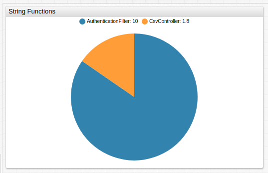
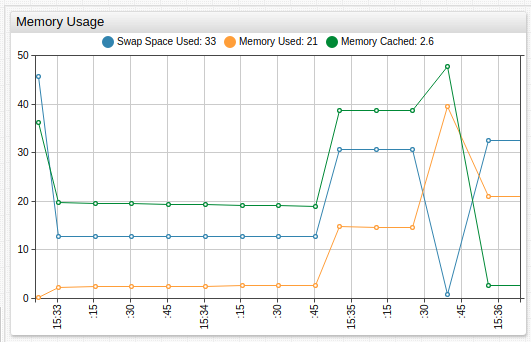
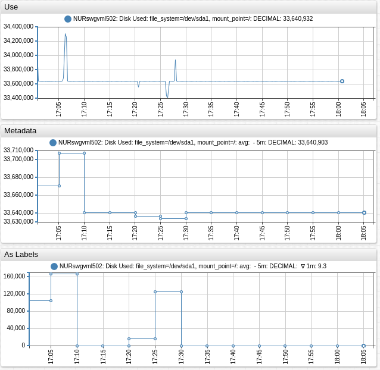
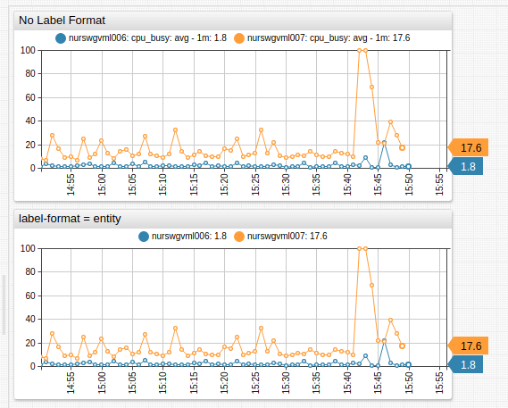
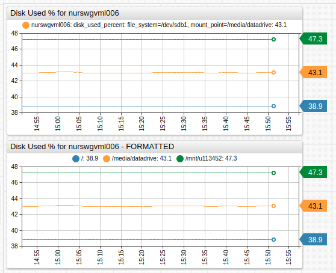
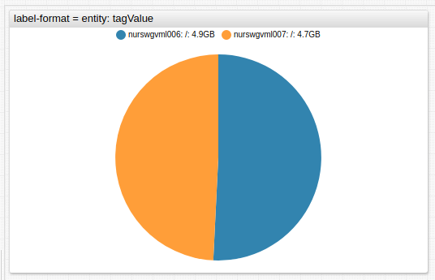

# Label Formatting

Use the `label-format` setting to customize series labels displayed in the widget legend as an alternative to specifying a custom label for each series.

The default `label-format` pattern is:

```ls
entity: metric: tags: statistics: period: dataType - forecastName: rate
```

Supported keywords in the `label-format` pattern are:

* `entity`
* `metric`
* `tags`: Semicolon-separated list of all `tag=value` pairs.
* `tagName`: Semicolon-separated list of all tag names.
* `tagValue`: Semicolon-separated list of all tag values.
* `tags.tagName`: Value of tag with name `tagName`.
* `statistics`
* `period`
* `dataType`
* `forecastName`
* `rate`
* `label`: Value of the label setting in the current series.

Create a new label format configuration using a combination of the supported keywords.

```ls
label-format = statistics : metric
```

See [Examples](#examples) for other usage.

## String Functions

Invoke built-in string functions to format series fields.

| Function | Description |
|---|---|
<a name="keepafter"></a>[`keepAfter`](#keepafter) | Removes part of the string **before** the **first** occurrence of the given substring. |
<a name="keepafterlast"></a>[`keepAfterLast`](#keepafterlast) | Removes part of the string **before** the **last** occurrence of the given substring.|
<a name="keepbefore"></a>[`keepbefore`](#keepbefore)| Removes part of the string that starts with the **first** occurrence of the given substring. |
<a name="keepbeforelast"></a>[`keepBeforeLast`](#keepbeforelast)| Removes part of the string that starts with the **last** occurrence of the given substring.|
<a name="replace"></a>[`replace`](#replace) | Replace **all** occurrences of the given string in the original string with another string.|
<a name="capFirst"></a>[`capFirst`](#capFirst)| **Capitalize** first word. |
<a name="capitalize"></a>[`capitalize`](#capitalize)| **Capitalize** all words.  |
<a name="coalesce"></a>[`coalesce`](#coalesce)| Returns the first object from arguments that is not `undefined`, not `null` and not empty.<br>Returns an empty string `""` if all elements are `null` or empty.<br> **Alias**: `ifEmpty` |
<a name="lowercase"></a>[`lowerCase`](#lowercase)| Convert to **lower** case.   |
<a name="uppercase"></a>[`upperCase`](#uppercase)| Convert to **upper** case.   |
<a name="removebeginning"></a>[`removeBeginning`](#removebeginning)| **Removes** the given substring from the **beginning** of the string.|
<a name="removeending"></a>[`removeEnding`](#removeending)| **Removes** the given substring from the **end** of the string.  |

```ls
label-format = javascript:keepAfterLast(tags.logger, '.')
#returns AuthenticationFilter
[series]
  [tags]
    logger = com.axibase.app.web.AuthenticationFilter
```



[](https://apps.axibase.com/chartlab/7316d5db)

Use nested functions to apply multiple format settings.

```ls
label-format = javascript:capitalize(replace(metric, '_', ' '))
/* replace underscores with whitespace and capitalize all words */
[series]
    metric = swap_space_used
    #swap_space_used -> Swap Space Used
```



[](https://apps.axibase.com/chartlab/be788657)

## Metadata

Use the `label-format` setting to replace `entity` and `metric` names with labels loaded from metadata.

Include the `addMeta = true` expression on the `[configuration]` level.

```ls
[configuration]
add-meta = true
/* Format label using metadata identifiers */
label-format = javascript: [coalesce(meta.entity.label, entity), ifEmpty(meta.metric.label, metric), ifEmpty(tags), (statistics && statistics !== "detail" ? statistics : ""), (period ? " - " + period : ""), ifEmpty(meta.metric.dataType), (rate ? " ∇ " + rate : "")].filter(s => s !== "").join(": ")
```



[](https://apps.axibase.com/chartlab/5d4c12e8/2/)

## Examples

### `entity`

```ls
label-format = entity
/* Display only the entity name in the legend */
[series]
  entity = nurswgvml007
  metric = cpu_busy
[series]
  entity = nurswgvml006
  metric = cpu_busy
```



[](https://apps.axibase.com/chartlab/2f806647)

### `tags.tagName`

```ls
label-format = tags.mount_point
/* Displays labels from tag mount_point in the legend */
[series]
  entity = nurswgvml006
  metric = disk_used_percent
  [tags]
    mount_point = *
    file_system = *  
```



[](https://apps.axibase.com/chartlab/9b128f40)

### `entity : tagValue`

```ls
label-format = entity: tagValue
/* Displays labels from entity followed by tagValue in the legend */
[tags]
  mount_point = /
[series]
  entity = nurswgvml006
```



[](https://apps.axibase.com/chartlab/324f89a4)
