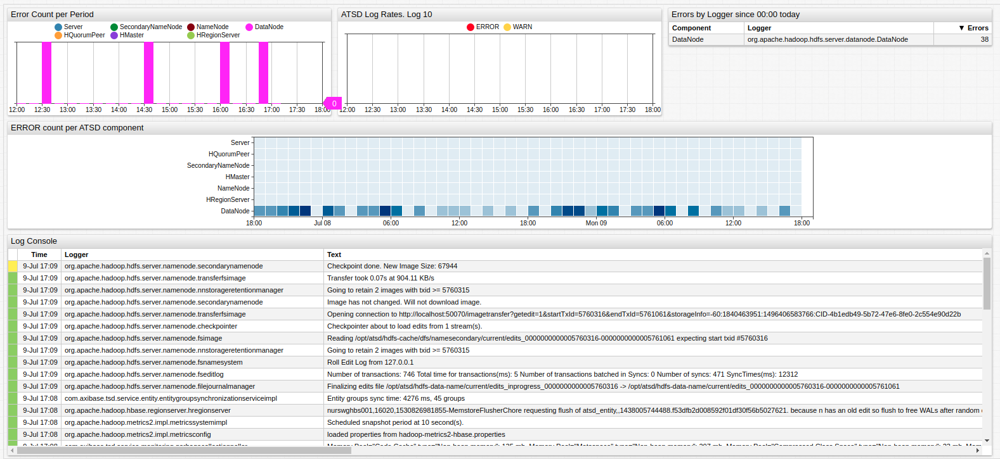
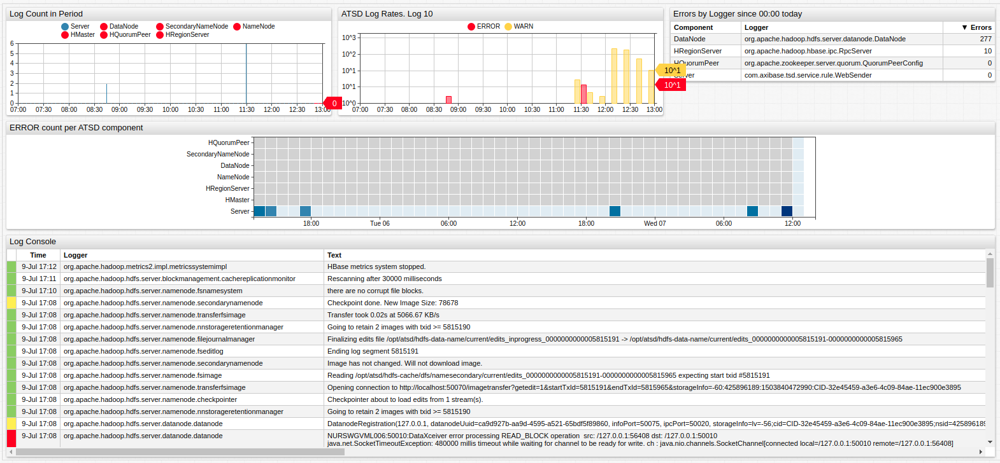

# Linking

The `on-series-click` setting links widgets displayed on the same portal for interactive behavior such as drill down.

`on-series-click` specifies an action to be performed when the user selects a series. For a Calendar widget, it is a row of summarization periods.

Trigger multiple `on-series-click` actions to update multiple widgets simultaneously.

```css
on-series-click = var seriesConfig = $.extend({}, c.config.originalConfig.series[0], {entity: series.entity, tags: series.tags});
```



[](https://apps.axibase.com/chartlab/d8ab98b3/19/#)

The `on-series-click` setting does not affect behavior of the widget on the header click handler. The syntax below demonstrates how to update headers when using linking features.

```css
/* update console */
on-series-click = consoleWidget.post = $.extend(true, {}, consoleWidget.post, { queries: [$.extend(interval, { entities: [series.entity], tags: series.tags })] }); consoleWidget.reload(); 

/* change headers */
on-series-click = $('.detailWidget').find('.widgetTitle').tex (keepAfterLast(series.tags.command, '.') + ': ' + series.entity)  
```



[](https://apps.axibase.com/chartlab/aecf6da9#)