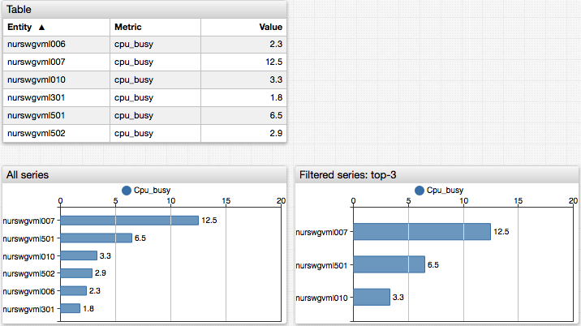

# Ranking Functions

The ranking functions can be accessed in `display` and `enabled` settings to hide or toggle loaded series based on their values.

| Function | Arguments | Description |
|----------|-----------|-------------|
| `top` | `rank` | Returns the value of the top-N element (specified with `rank`) in the sorted array of last values of all series loaded by the widget. `top(1)` returns the _largest_ value. `rank` must be a positive integer. View [example](https://apps.axibase.com/chartlab/81443acd/4/). |
| `bottom` | `rank` | Returns the value of the bottom-N element (specified with `rank`) in the sorted array of last values of all series loaded by the widget. `bottom(1)` returns the _smallest_ value. `rank` must be a positive integer. View [example](https://apps.axibase.com/chartlab/81443acd/2/).|
