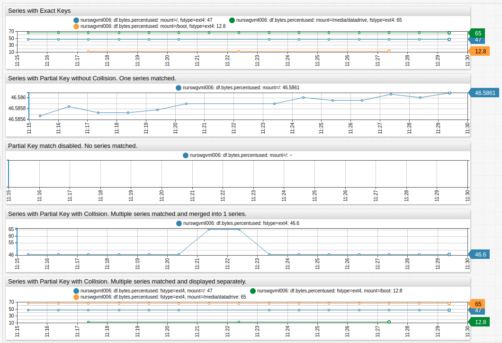

# Selecting Series

## Database Schema

Configuration syntax provides a way to load and display data for time series stored in ATSD. Series values change over time and data history is visualized with different types of graphs.

```ls
/* Widget level settings affect all series. */
[widget]
  type = chart

/*Series settings define individual series. */
  [series]
    entity = nurswgvml007
    metric = cpu_busy
  [series]
   entity = nurswgvml009
   metric = df.bytes.percentused
/* Some series contain tags */
      [tags]
        mount = /
        fstype = ext4
```

Identify each series by a composite key consisting of an entity, metric, and optional key-value pairs called tags:

* **Entity**: A physical or logical object being monitored such as the computer name `nurswgvml007`.
* **Metric**: The name of a measurable numeric attribute such as `cpu_busy` or `temperature`.
* **Tag**: optional classifier which provides an additional level of detail for measurements, such as a disk mount point for the `df.bytes.percentused` metric.

> Measure an entity with a variety of metrics.<br>
> Collect the same metric for a variety of entities.

## Exploring Series

Review any series in the database on the **Metrics > `metric_name` > Series** page or the **Entities > `entity_name` > Metrics > Series** page.

Create drop-down lists using `tag-dropdowns` syntax:

```ls
[widget]
tags-dropdowns = true
label-format = tags
```


[](https://apps.axibase.com/chartlab/9026327a)

## Selecting Specific Series

To display values for a specific series, specify the composite key in the `[series]` section of the widget configuration:

```ls
/* Series without tags */
metric = cpu_busy
entity = nurswgvml007

/* Series with tags */
metric = df.bytes.percentused
entity = nurswgvml006
[tags]
  mount = /
  fstype = ext4
```


[](https://apps.axibase.com/chartlab/cdfb34c5/3)

## Selecting Multiple Series With Tags

By default, the database returns all series matching a request, including series with extra tags not enumerated in the request.

This enables loading series using only a subset of tags that are still sufficient to uniquely identify a series:

```ls
/* Series with tags */
[series]
metric = df.bytes.percentused
entity = nurswgvml006
  [tags]
    mount = /
```

This configuration matches all series with `mount = /` key-value pair, including series that have additional tags.

To disable partial tag match, use the `exact-match = true` setting:

```ls
/* Series with tags */
metric = df.bytes.percentused
entity = nurswgvml006
exact-match = true
  [tags]
    mount = /
```

When partial match is disabled, the database returns series with exactly the same combination of tags as specified in the request.

While making the configuration more compact, partial match can produce undetermined results if the partial key matches multiple series where only one series is expected:

```ls
/* Series with Tags */
[series]
metric = df.bytes.percentused
entity = nurswgvml006
  [tags]
    fstype = ext4
```

In this example, the response contains three different series with the same file system type `ext4`, but with different mount points: `/`, `/boot/`, `/media/datadrive`.

The resulting series is merged from 3 underlying different series and provides a meaningless result.



[](https://apps.axibase.com/chartlab/59e15fe3)

To control how multiple matched series are processed, use the `multiple-series = true | false` setting.

```ls
/* Display all series with tag fstype=ext4 without merging */
multiple-series = true
[series]
  [tags]
    fstype = ext4
```

Use the `multiple-series` setting to display all series without specifying any tags in widget configuration:

```ls
/* Display all series without merging */
multiple-series = true
[series]
```

The default value of the `multiple-series` setting is `true` in the following cases:

* Multiple entities are specified: `entity = nur1, nur2`
* Multiple tag values are specified: `mount = /, /tmp`
* Entity name contains [wildcard](./wildcards.md): `entity = nur*`
* Tag value contains [wildcard](./wildcards.md): `mount = /t*`
* `entity-expression`, `entity-group`, or `tag-expression` settings are present.

```ls
/* Select series using tag value wildcards. `multiple-series` is TRUE */
  [tags]
    fstype = ext4  
    mount = *media*

/* Select series with any value for the specified tag. `multiple-series` is TRUE */
  [tags]
    fstype = ext4  
    mount = *

/* Select series with any value for the specified tag. `multiple-series` is FALSE */
  [tags]
    fstype = ext4  

/* Select series with tag values from the specified list. `multiple-series` is TRUE */
  [tags]
    fstype = cifs, autofs

/* Select series with tag values matching specified wildcard patterns: `multiple-series` is TRUE */
  [tags]
    fstype = cifs, auto*

/* Select series with tags matching an expression: `multiple-series` is TRUE */
  tag-expression = tags.mount NOT LIKE '/m*'
```


[](https://apps.axibase.com/chartlab/f4312ee7)

## Merging Series

Merging multiple series into one series can be useful in situations where the underlying series describe the same object despite having different keys. Oftentimes, such series are recorded sequentially and therefore do not overlap.

Examples:

* `/media/datadrive` file system re-mounted on a larger disk but the mount point remains the same.
* Containers with different identifiers launched on schedule to perform a daily task.
* Measurements recorded during a set of scientific experiments are tagged with experiment `ID` and input parameters.


[](https://apps.axibase.com/chartlab/cdfb34c5/15/)

## Selecting Series for Multiple Entities

Widget syntax provides a number of options to select series for multiple entities with the same metric:

```ls
/* Select specific entity by name */
entity = nurswgvml006

/* Select multiple entities by name using ? and * wildcards */
entity = nurswgvml*

/* Select all entities */
entity = *

/* Select an array of entities by name */
entities = nurswgvml006, nurswgvml007

/* Select an array of entities by name or pattern */
entities = nurswgvml111, nurswgvml00*

/* Select entities matching an expression referencing name, label entity tags, properties */
entity-expression = tags.app = 'ATSD'

/* Select entities belonging to the specified entity group */
entity-group = nur-collectors
```

> Refer to [Data API Documentation](https://axibase.com/docs/atsd/api/data/series/query.html#entity-filter) for additional information about these settings.

```ls
/* Retrieve series for entities starting with nurswgvml00 */
[series]
  entity = nurswgvml00*
  [tags]
    mount = /
    fstype = ext4
```


[](https://apps.axibase.com/chartlab/71841703)

## Retrieving Series From the Database

As an alternative to specifying series settings manually and using [wildcards](./wildcards.md), the widget syntax supports `getSeries()` and `getTags()` methods to retrieve the list of existing series from the database.

`getTags()`:

```ls
var tags = getTags('df.bytes.percentused', 'mount','nurswgvml006')

for tagValue in tags
  [series]
    [tags]
      mount = @{tagValue}
endfor
```

`getSeries()`

```ls
var seriesList = getSeries('df.bytes.percentused','nurswgvml006')

for sobj in seriesList
  [series]
    [tags]
    for tagName in Object.keys(sobj.tags)
      "@{tagName}" = @{sobj.tags[tagName]}
    endfor
endfor
```


[](https://apps.axibase.com/chartlab/cdfb34c5/14/)

## Controlling Displayed Series

The `series-limit = int` setting can limit the number of possible series returned by the database for wildcard queries. Since the limit is applied to an unsorted list of matched series, the results vary between requests, making the setting useful for exploring a dataset to prevent the widgets from loading excessive series into browser memory.

```ls
entity = *
series-limit = 10
[series]
  [tags]
    fstype = ext4
```

For more flexible visibility control on the client, use the display and enabled settings.

```ls
entity = *
display = value == top(1) || value == bottom(1)
[series]
  [tags]
    fstype = ext4
```


[](https://apps.axibase.com/chartlab/cdfb34c5/13/)

In addition, the `limit = int` setting reduces the number of samples displayed for each series. It makes queries execute faster when loading data for high-frequency series from the server, in particular during design and validation stages.