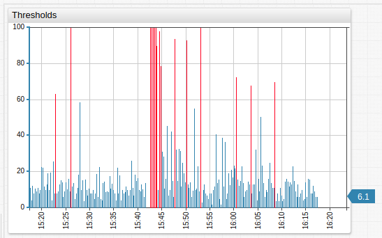
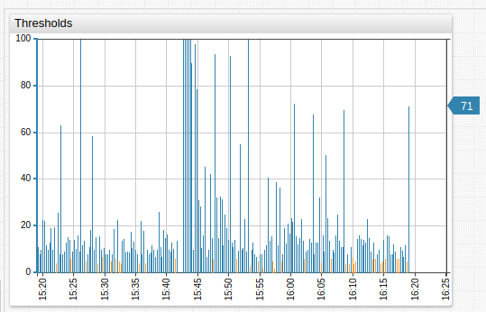
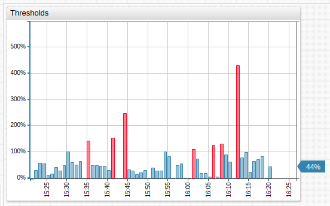

# Thresholds

Use threshold aggregators to compute the amount of time or number of occurrences a metric violates a user-defined threshold. The threshold can be defined as an upper boundary, a lower boundary, or both.

## `max-threshold`

Series violates the threshold when a value exceeds the maximum threshold.

```ls
[series]
  max-threshold = 60
  alert-expression = value > 60
  alert-style = color: red
```



[](https://apps.axibase.com/chartlab/6ca7a734)

## `min-threshold`

Series violates the threshold when a value is below the minimum threshold.

```ls
[series]
  min-threshold = 7
  alert-expression = value > 7
  alert-style = color: green
```



[](https://apps.axibase.com/chartlab/ebde46a2)

## `threshold_percent`

Percentage of time within the period when series values do not exceed the threshold. Computed as the sum of violation intervals divided by the period duration.

```ls
[series]
  statistic = threshold_percent
  max-threshold = 10
  period = 1 minute
  alert-expression = value > 100
  alert-style = color: red
```



[](https://apps.axibase.com/chartlab/cba89fc5)

## `threshold_count`

Number of sequences within the period when the series values exceeded the threshold. Consecutive observations violating the threshold are treated as a single sequence.

```ls
[series]
  statistic = threshold_count
  max-threshold = 40
  period = 1 hour
  alert-expression = value > 10
  alert-style = color: red
```


[](https://apps.axibase.com/chartlab/a975165f)

## `threshold_duration`

Total duration of intervals within the period when series values exceeded the threshold. Note that when using `threshold_duration` with an `alert-expression` the `value` argument is measured in **milliseconds**.

```ls
[series]
  statistic = threshold_duration
  min-threshold = 10
  period = 5 minute
  alert-expression = value > 180000
  alert-style = color: green
```


[](https://apps.axibase.com/chartlab/b73f5d71)