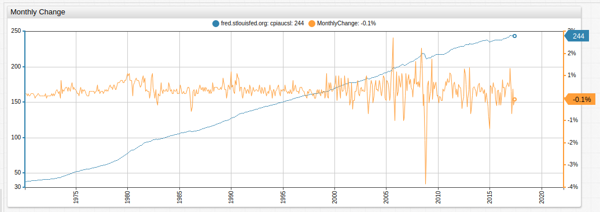
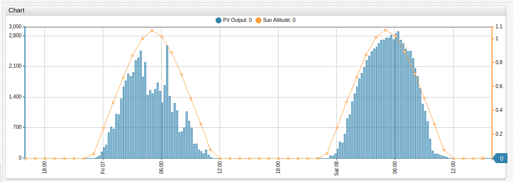
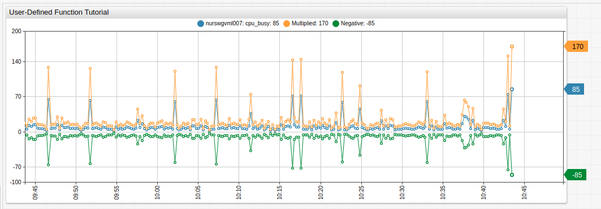
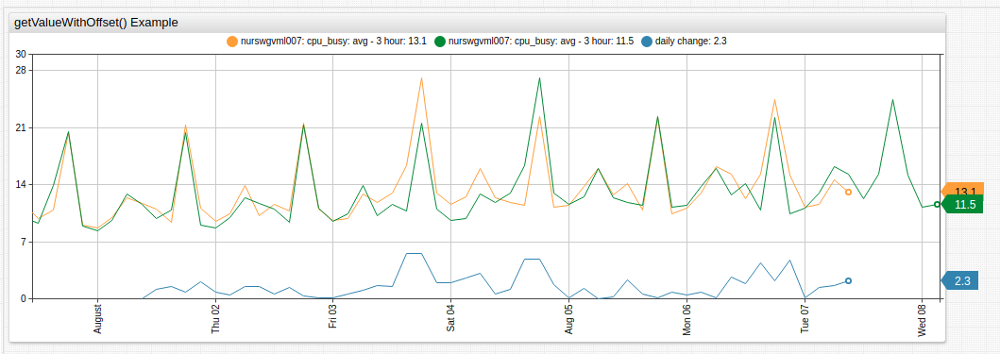
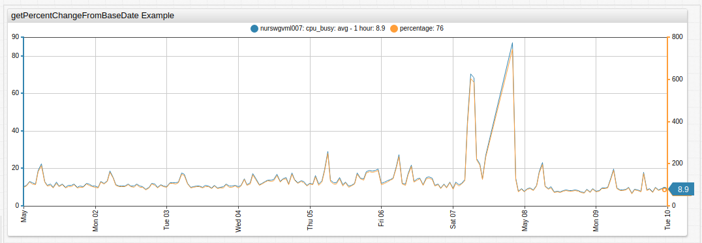
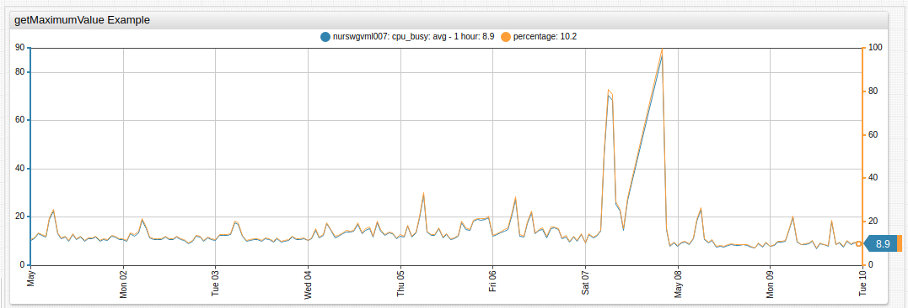

# User Defined Functions

## Overview

This document describes how to define custom time series functions and apply them in chart configurations.

## Window Functions

Use window functions to perform scalar calculations which do not require access to a series object.

Define a custom JavaScript function in the `window` object using [`script` / `endscript`](./control-structure.md) syntax in the **Editor** window.

```ls
script
  window.checkRange = function (val) {
     if (val < 0) {
       return 0;
     }
     return false;
  };
endscript
```

Use custom window function in any setting that supports referencing functions by name, for example, in `value` and `format` setting.

```ls
value = return checkRange(value);
```

## Function Libraries

Load custom JavaScript functions into the configuration with `import` setting followed by the package name and URL of the JavaScript file containing function definitions.

```ls
import example_package = https://example.org/package.js
```

When importing multiple files, assign a unique package name to each file to avoid collisions.

```ls
import example_package = https://example.org/package.js
import example_package_2 = https://example.org/package_2.js
```

The functions can be loaded from either local or remote server.

### Load Functions from Remote Server

```ls
# Specify full URL to load functions from a remote server
import fred = https://raw.githubusercontent.com/axibase/charts/master/resources/fred.js
```

> Configurations loaded via **HTTP** URL cannot load function files from **HTTPS** URLs.

**Econometric Function**:



[](https://apps.axibase.com/chartlab/d220468d/19)

**Sun Altitude Function**:



[](https://apps.axibase.com/chartlab/8e2917e2/8/)

### Load Functions from Local Server

The base directory for static files on the ATSD server is `/portal/resource/` which is mapped to the `/opt/atsd/atsd/conf/portal/` directory on the file system. Subdirectories are mapped accordingly.

Directory | Path
:---|:---
`/opt/atsd/atsd/conf/portal/` | `/portal/resource/`
`/opt/atsd/atsd/conf/portal/scripts/` | `/portal/resource/scripts/`
`/opt/atsd/atsd/conf/portal/css/`| `/portal/resource/css/`

If the path in the `import` setting contains only the file name, the file is loaded from `/opt/atsd/atsd/conf/portal/scripts/` directory. 

| `import` Setting | Request URL | Local Path |
|:----------|----:|-----------:|
| `fred.js` | `https://atsd_hostname:8443/portal/resource/scripts/fred.js` | `/opt/atsd/atsd/conf/portal/scripts/fred.js` |
| `resource/scripts/fred.js` | `https://atsd_hostname:8443/portal/resource/scripts/fred.js` | `/opt/atsd/atsd/conf/portal/scripts/fred.js` |
| `resource/libs/fred.js` | `https://atsd_hostname:8443/portal/resource/libs/fred.js` | `/opt/atsd/atsd/conf/portal/libs/fred.js` |
| `/portal/resource/libs/fred.js` | `https://atsd_hostname:8443/portal/resource/libs/fred.js` | `/opt/atsd/atsd/conf/portal/libs/fred.js` |
| `libs/fred.js` | `https://atsd_hostname:8443/portal/libs/fred.js` | `404 Not Found` error. |
| `/libs/fred.js` | `https://atsd_hostname:8443/libs/fred.js` | `404 Not Found` error. |
| `https://example.org/path/fred.js` | `https://example.org/path/fred.js` | Loaded from remote server.|


## Usage

Reference the imported function in a `value` expression by specifying the package name, the function name, and the function arguments.

```ls
# Calculate monthly change for series with alias 'raw'
value = fred.MonthlyChange('raw')
```


[](https://apps.axibase.com/chartlab/d220468d/19)

## Examples

The following functions are implemented in the [fred.js](https://apps-chartlab.axibase.com/portal/resource/scripts/fred.js) configuration file.

| **Function Name** | **Arguments** |
|-------------|----------------------|
| [`MonthlyChange`](https://apps.axibase.com/chartlab/d220468d/22/) | alias |
| [`ChangeFromYearAgo`](https://apps.axibase.com/chartlab/d220468d/23/) | alias |
| [`ChangeByOffset`](https://apps.axibase.com/chartlab/d220468d/27/) | alias, [interval](https://axibase.com/products/axibase-time-series-database/visualization/end-time/) |
| [`MonthlyPercentChange`](https://apps.axibase.com/chartlab/d220468d/25/) | alias |
| [`PercentChangeFromYearAgo`](https://apps.axibase.com/chartlab/d220468d/26/) | alias |
| [`PercentChangeByOffset`](https://apps.axibase.com/chartlab/d220468d/28/) | alias, [interval](https://axibase.com/products/axibase-time-series-database/visualization/end-time/) |
| [`CompoundedAnnualRateOfChange`](https://apps.axibase.com/chartlab/d220468d/29/) | alias |
| [`ContinuouslyCompoundedRateOfChange`](https://apps.axibase.com/chartlab/d220468d/30/) | alias |
| [`NaturalLog`](https://apps.axibase.com/chartlab/d220468d/31/) |  alias |
| [`IndexMax`](https://apps.axibase.com/chartlab/d220468d/32/) | alias |
| [`Index`](https://apps.axibase.com/chartlab/d220468d/33/) | alias, [time](https://axibase.com/products/axibase-time-series-database/visualization/end-time/) |

## Deploying Function Files

On the ATSD server, store function files in the following directory:

```txt
/opt/atsd/atsd/conf/portal/scripts/
```

JavaScript files placed into this directory are accessible by file name:

```ls
import fred = fred.js
```

Server restart is **not** required to access new or updated function files.

## Writing Functions

Function declaration must start with `exports.` followed by a valid function name. Function names are **case-sensitive**.

A function can have any number of arguments however, the first argument must be the alias of the series to which the function applies.

The current value is accessible with `value(alias)` method.

```javascript
exports.NaturalLog = function (alias) {
    var currentValue = value(alias);
    return Math.log(currentValue);
};
```

Function definition must start with the `exports.` qualifier and be implemented as a JavaScript [function](https://developer.mozilla.org/en-US/docs/Web/JavaScript/Guide/Functions).

The function must return a numeric value or `null` if the result cannot be computed.

```javascript
exports.devideBy = function (alias, num) {
  if (num == 0) {
    //if num is zero, return null
    return null;
  }
  var result = value(alias) / num;
  return result;
};
```

Function body can reference any JavaScript function such as [`Math`](https://developer.mozilla.org/en-US/docs/Web/JavaScript/Reference/Global_Objects/Math), [built-in functions](value_functions.md) supported in the `value` setting, or [utility functions](#utility-functions) listed below.

```javascript
exports.getValueRange = function (alias, period) {
  // get the maximum value within the current period
  var maxAtPeriod = max(alias, period);
  // get the minimum value within the current period
  var minAtPeriod = min(alias, period);
  // calculate the difference between maximum and minimum values
  var result = maxAtPeriod - minAtPeriod;
  // return the result to the calling function
  return result;
};
```

See additional configurations in [`examples.js`](../resources/examples.js).

**ChartLab** examples:

* [`getValueRange`](https://apps.axibase.com/chartlab/2595a144/1/)
* [`getDifferenceFromAverage`](https://apps.axibase.com/chartlab/2595a144/2/)
* [`getWeight`](https://apps.axibase.com/chartlab/2595a144/3/)

## Example

This section illustrates how to develop and deploy a basic user-defined function. For the purpose of this exercise, create a function that multiplies original sample values by a specified constant value.

### Step 1. Create JavaScript File

Name the new function `multiplyBy`. This function accepts a series alias as the first argument and numeric constant as the second argument.

Create a file `my_math.js` and store the below function definition in the file.

```javascript
/*
 This function multiples all values in the original series, identified with the alias parameter, by a constant numeric value.
*/
exports.multiplyBy = function (alias, num) {
  // multiply current value from the referenced series by number 'num'
  var result = value(alias) * num;
  // return the product to the calling function
  return result;
};
```

### Step 2. Copy JavaScript File into ATSD

Copy the `my_math.js` file to the `/opt/atsd/atsd/conf/portal/scripts` directory in the ATSD server.

Verify that the file is accessible at the following URL: `http://atsd_hostname:8443/portal/resource/scripts/my_math.js`.

### Step 3. Import Functions

Open the **Portals > Configure** page in the top menu and create a new portal.

Enter the following configuration text. Replace `cpu_busy` and `nurswgvml007` with a metric and an entity present in your ATSD instance.

```ls
[configuration]
  height-units = 2
  width-units = 2
  import mm = my_math.js

[group]
  [widget]
    type = chart
    timespan = 1 hour
    [series]
      metric = cpu_busy
      entity = nurswgvml007
      alias = s1
    [series]
      value = mm.multiplyBy('s1', 2)
```

Save the portal. View the portal to check results.



[](https://apps.axibase.com/chartlab/3b6819a6)

## Utility Functions

### `getValueWithOffset()`

Get the value of the series identified by `alias`, for the `timestamp` calculated as `current_time - offset`, where  `current_time` is the time of currently processed sample. If there is no sample with such `timestamp`, the value is linearly interpolated from neighboring samples.



[](https://apps.axibase.com/chartlab/db746e15)

**Syntax**:

```javascript
getValueWithOffset(alias, offset)
```

| **Argument** | **Type** | **Description** |
|------|-----------|------|-------------|
| `alias` | string | Alias of the series from which the value is retrieved. |
| `offset` | string | Offset with which the previous value is retrieved, specified as interval, for example `1 day`. |

### `getValueForDate()`

Get the value of the series, identified by `alias`, for the specified `datetime`.
If there is no sample recorded for the specified `datetime`, the value is linearly interpolated from the neighboring samples.



[](https://apps.axibase.com/chartlab/378550c2)

**Syntax**:

```javascript
getValueForDate(alias, datetime)
```

| **Argument** | **Type** | **Description** |
|------|-----------|------|-------------|
| `alias` | string | Alias of the series, from which the value is retrieved. |
| `datetime` | string | Time, for which value is retrieved. Can be specified as local time, ISO time, or using an [`end_time`](https://axibase.com/products/axibase-time-series-database/visualization/end-time/) expression. |

### `getMaximumValue()`

Get the maximum value of the series, identified by `alias`, for the loaded timespan.



[](https://apps.axibase.com/chartlab/2595a144/6/)

**Syntax**:

```javascript
getMaximumValue(alias)
```

| **Argument** | **Type** | **Description** |
|------|-----------|------|-------------|
| `alias` | string | Alias of the series, from which the value is retrieved. |
