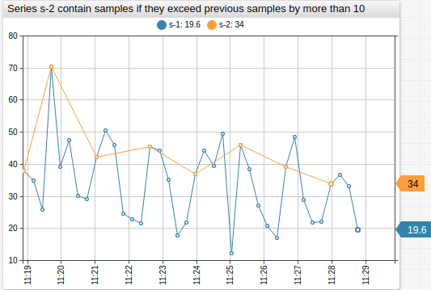

# Value Functions

## Overview

This document describes the [`value`](../widgets/shared/README.md#value) setting, which is used to create derived series.

The `value` setting is specified in the [`[series]`](../widgets/shared/README.md#series-settings) and [`threshold`](../widgets/time-chart/README.md#threshold-settings) sections.

```ls
# Define the original series, which values used in creating a derived (computed) series.
# The original series must exist in the database
[series]
  metric = cpu_busy
  entity = nurswgvml007

  # Specify an alias
  alias = s-1

  # Optionally, hide the original series
  display = false

# Define the derived series by specifying an expression in the `value` setting
[series]
  label = My New Series

  # Specify an expression called for each `time:value` sample in the original series
  value = 2 * value("s-1")
```

[](https://apps.axibase.com/chartlab/ae6323aa "View in Chart Lab")

The `value` expression is invoked **for each** `time:value` sample in the original series.

The expression must return a numeric value or `null` if the value cannot be calculated. `null` values are not displayed on the chart.

```ls
[series]
  metric = cpu_busy
  entity = nurswgvml007
  alias = s-1
[series]
  # Show values that exceed previous value by more than 10
  value = value('s-1') > previous('s-1')+10 ? value('s-1') : null
  label = s-2
```

[](https://apps.axibase.com/chartlab/ae6323aa/4/ "View in Chart Lab")

The `time()` function can be invoked within the expression to check the timestamp of the current sample measured in Unix milliseconds.

```ls
value = var diff = value('s-2') - value('s-1'); return time() > new Date().getTime() ? null : diff;
```

[](https://apps.axibase.com/chartlab/abab8160 "View in Chart Lab")

:::tip Note
`value()` calculation is not affected by the [visibility](#derived-series-from-hidden-series) of the underlying series.
:::

## Available Functions and Variables

To review all parameters, available in `value`, refer to [JavaScript Settings Scope](./js-scope.md#scope-1).

## Window Functions

Define a custom JavaScript function in the `window` object using the `script` / `endscript` section in the configuration text.

```ls
script
  window.checkRange = function (val) {
     if (val > 100) {
       return null;
     }
     return val;
  };
endscript
```

The custom function can be accessed in the `value` field by referencing it by name.

```ls
value = return checkRange(value);
```

## Examples

### Statistical Functions

[](https://apps.axibase.com/chartlab/17fba87d/3/ "View in Chart Lab")

### Metadata Functions

:::warning Note
[`add-meta`](../widgets/shared/README.md#add-meta) setting must be set to `true`.
:::

[](https://apps.axibase.com/chartlab/a337e489 "View in Chart Lab")

#### `meta`

Returns [metadata object](../configuration/meta-data.md) loaded for a series defined by `alias`.

```javascript
meta(string alias)
```

**Example**:

Fraction of `maxValue`

```ls
value = value('raw') / meta('raw').metric.maxValue
```

[](https://apps.axibase.com/chartlab/e9b05112 "View in Chart Lab")

#### `entityTag`

Returns value of the tag by name from `meta.entity.tags` object loaded for series with `alias`.

```javascript
entityTag(string alias, string tagName)
```

**Example**:

Set size to `cpu_count` entity tag

```ls
size = entityTag('cpu_count')
```

[](https://apps.axibase.com/chartlab/799f915f "View in Chart Lab")

#### `metricTag`

* Returns value of the tag by name from `meta.metric.tags` object loaded for series with `alias`.

```javascript
metricTag(string alias, string tagName)
```

**Example**:

Set threshold to `threshold_value` metric tag

```ls
value = metricTag('raw', 'threshold_value')
alert-expression = value() > metricTag('threshold_value')
```

[](https://apps.axibase.com/chartlab/4d044933 "View in Chart Lab")

### Derived Series from Hidden Series

The [`display`](../configuration/display-filters.md) and [`enabled`](../widgets/shared/README.md#enabled) settings have no impact on the calculated series.

```ls
[series]  
    entity = nurswgvml006
    alias = a

[series]  
    entity = nurswgvml007
    alias = b
    display = false

[series]
    # The result is not affected by hiding the 'b' series
    value = value('a') + value('b')
```

[](https://apps.axibase.com/chartlab/9b97ac5e/2/ "View in Chart Lab")
