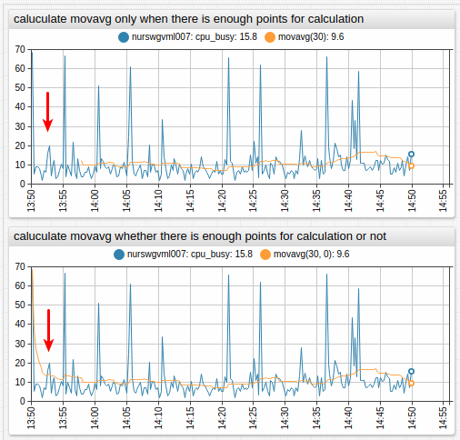

# Value Functions

## Overview

This document describes fields and functions, which can be referenced in the [`value`](../widgets/shared/README.md#value) setting to create derived series.

The `value` setting is specified in the [`[series]`](../widgets/shared/README.md#series-settings) and [`threshold`](../widgets/time-chart/README.md#threshold-settings) sections.

```ls
# Define the original series, which values used in creating a derived (computed) series.
# The original series must exist in the database
[series]
  metric = cpu_busy
  entity = nurswgvml007

  # Specify an alias
  alias = s-1

  # Optionally, hide the original series
  display = false

# Define the derived series by specifying an expression in the `value` setting
[series]
  label = My New Series

  # Specify an expression called for each `time:value` sample in the original series
  value = 2 * value("s-1")
```


[](https://apps.axibase.com/chartlab/ae6323aa)

The `value` expression is invoked **for each** `time:value` sample in the original series. The expression must return a numeric value or `null` if the value cannot be calculated. `null` values are not displayed on the chart.

```ls
[series]
  metric = cpu_busy
  entity = nurswgvml007
  alias = s-1
[series]
  # Show only values that are greater than previous value
  value = value('s-1') > previous('s-1') ? 10 + value('s-1') : null
  label = s-2
```


[](https://apps.axibase.com/chartlab/ae6323aa/2/)

## Lookup Functions

| Function | Arguments | Description |
|----------|-----------|-------------|
| `value` | `alias` | Value of the underlying series at the same timestamp. |


[](https://apps.axibase.com/chartlab/17fba87d/2/)

## Statistical Functions

* The `alias` argument is required. The `interval` argument is optional.
* If the interval argument is not specified, it depends on the [`timespan`](https://apps.axibase.com/chartlab/a7583b72/4/) setting.
* If the timespan exceeds `interval`, series values are split into calendar-aligned periods and the function is applied to each period separately.

| Function | Arguments | Description |
|----------|-----------|-------------|
| `max` | `alias`, `[interval]` | Maximum within the specified interval. |
| `min` | `alias`, `[interval]` | Minimum within the specified interval. |
| `avg` | `alias`, `[interval]` | Average within the specified interval. |
| `sum` | `alias`, `[interval]` | Sum of values within the specified interval. |
| `delta` | `alias`, `[interval]` | Difference between last value in the specified interval and last value before the interval. |
| `counter` | `alias`, `[interval]`  | Sum of positive differences between subsequent values within the specified interval. |
| `count` | `alias`, `[interval]` | Number of samples in the specified interval. |
| `last` | `alias`, `[interval]` | Value of the last sample in the specified interval. |
| `first` | `alias`, `[interval]` | Value of the first sample in the specified interval. |
| `min_value_time` | `alias`, `[interval]` | Timestamp of the maximum value in the specified interval. |
| `max_value_time` | `alias`, `[interval]` | Timestamp of the minimum value in the specified interval. |
| `median` | `alias`, `[interval]` | Same as `percentile(50)`. |
| `percentile` | `n`, `alias`, `[interval]` | `n`-th [percentile](https://axibase.com/docs/atsd/api/data/aggregation.html#percentile), for example `percentile(75, 's1')` or `percentile(99.5, 's1')`.<br>`n` is a decimal number between `(0, 100]`. |
| `movavg` | `alias`, `count`, `[minCount]` | Average value of `count` last samples. If `minCount` parameter is specified, the function returns `null` unless the number of samples exceeds `minCount`. |
| `previous` | `alias`, `[offset]` | Value of the previous sample, with optional `offset` index which defaults to `1`. |


[](https://apps.axibase.com/chartlab/17fba87d/3/)

## Metadata Functions

| Function | Arguments | Description |
|----------|-----------|-------------|
| `meta` | `alias` | [Metadata](#meta-function) object. |
| `entityTag` | `alias`, `tagName` | [Entity tag](#entitytag-function) value. |
| `metricTag` | `alias`, `tagName` | [Metric tag](#metrictag-function) value. |


[](https://apps.axibase.com/chartlab/a337e489)

## Window Functions

Define a custom JavaScript function in the `window` object using the `script` / `endscript` section in the configuration text.

```ls
script
  window.checkRange = function (val) {
     if (val > 100) {
       return null;
     }
     return val;
  };
endscript
```

The custom function can be accessed in the `value` field by referencing it by name.

```ls
value = return checkRange(value);
```

Functions in the `window` scope can be invoked in other settings that support functions, for example, in the `format` setting.

## Implementation Notes

### `movavg()` Function

* Calculates the moving average using `count` previous points in the series defined by `alias`.
* The average is calculated if at least `minCount` previous points are available.

```javascript
movavg(alias, count, [minCount])
```

| Name | Type | Description |
|:------|:------|:-------------|
| `alias` | string | **[Required]**  Alias of the series, to which `movavg` is applied. |
| `count` | number | **[Required]**  Number of points for which `movavg` is calculated. |
| `minCount` | number | Minimum number of points, for which `movavg` is calculated, default is `count`. |

Calculate `movavg` when a defined amount of points are available for calculation

```ls
value = movavg('raw', 30)
```


[](https://apps.axibase.com/chartlab/a1ad388a)

Calculate `movavg` regardless of the number of points present

```ls
value = movavg('raw', 30, 0)
```



[](https://apps.axibase.com/chartlab/b5457f1c)

---

### `meta()` Function

* Returns [metadata object](../configuration/meta-data.md) loaded for a series defined by `alias`.
* [`add-meta`](../widgets/shared/README.md#add-meta) setting must be set to `true`.

```javascript
meta(alias)
```

| Name | Type | Description |
|:------|:------|:-------------|
| `alias` | string | **[Required]** Alias of the series, from which metadata is returned. |

Fraction of `maxValue`

```ls
value = value('raw') / meta('raw').metric.maxValue
```


[](https://apps.axibase.com/chartlab/e9b05112)

---

### `entityTag()` Function

* Returns value of the tag by name from _entity_ metadata loaded for series with `alias`.
* [`add-meta`](../widgets/shared/README.md#add-meta) setting must be set to `true`.

```javascript
entityTag(alias, tagName)
```

| Name | Type | Description |
|:------|:------|:-------------|
| `alias` | string | Alias of the series, from which metadata is returned.|
| `tagName` | string | Name of tag which is retrieved from `meta.entity.tags` object. |

Set size to `cpu_count` entity tag

```ls
size = entityTag('cpu_count')
```


[](https://apps.axibase.com/chartlab/799f915f)

---

### `metricTag()` Function

* Returns value of the tag by name from _metric_ metadata loaded for series with `alias`.
* [`add-meta`](../widgets/shared/README.md#add-meta) setting must be set to `true`.

```javascript
metricTag(alias, tagName)
```

| Name | Type | Description |
|:------|:------|:-------------|
| `alias`| string | Alias of the series, from which metadata is returned. |
| `tagName` | string | Name of tag which is retrieved from `meta.metric.tags` object. |

Set threshold to `threshold_value` metric tag

```ls
value = metricTag('raw', 'threshold_value')
alert-expression = value() > metricTag('threshold_value')
```


[](https://apps.axibase.com/chartlab/4d044933)