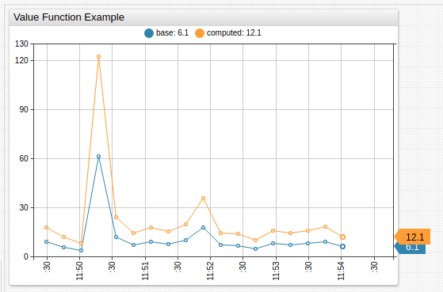
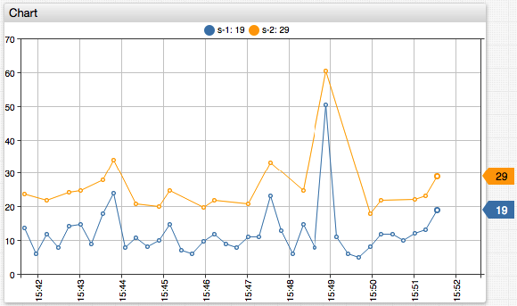

# Value Functions

## Overview

This document describes fields and functions, which can be referenced in the [`value`](../widgets/shared/README.md#value) setting to create derived series.

The `value` setting is specified in the `[series]` section.

```ls
# Define the original series, which values used in creating a derived (computed) series.
# The original series must exist in the database
[series]
  metric = cpu_busy
  entity = nurswgvml007

  # Specify an alias
  alias = s-1

  # Optionally, hide the original series
  display = false

# Define the derived series by specifying an expression in the `value` setting
[series]
  label = My New Series

  # Specify an expression called for each `time:value` sample in the original series
  value = 2 * value("s-1")
```



[](https://apps.axibase.com/chartlab/ae6323aa)

The `value` expression is invoked **for each** `time:value` sample in the original series. The expression must return a numeric value or `null` if the value cannot be calculated. `null` values are not displayed on the chart.

```ls
[series]
  metric = cpu_busy
  entity = nurswgvml007
  alias = s1
[series]
  # Show only values that are greater than previous
  value = value('s-1') > previous('s-1') ? 10 + value('s-1') : null
  label = s2
```



[](https://apps.axibase.com/chartlab/ae6323aa/2/)

## Fields

| Field | Arguments | Description |
|----------|-----------|-------------|
| `value` | `alias` | Value of the series at the current timestamp. |
| `previous` | `alias`, `count` | Value of series `count` samples ago.<br>If `count` is `1` or not set, the function returns the previous value. |
| `time` |  | Timestamp in Unix milliseconds for which the expression is invoked. |

## Statistical Functions

The default `interval` is calculated based on the [widget timespan](https://apps.axibase.com/chartlab/a7583b72/4/.

| Function | Arguments | Description |
|----------|-----------|-------------|
| `max` | `alias`, `interval` | Maximum in the specified interval. |
| `min` | `alias`, `interval` | Minimum in the specified interval. |
| `avg` | `alias`, `interval` | Average in the specified interval. |
| `sum` | `alias`, `interval` | Sum of values in the specified interval. |
| `delta` | `alias`, `interval` | Difference between last value in the specified interval and last value before the interval. |
| `counter` | `alias`, `interval`  | Sum of positive differences between subsequent values in the specified interval. |
| `count` | `alias`, `interval` | Number of samples in the specified interval. |
| `last` | `alias`, `interval` | Value of the last sample. in the specified interval. |
| `first` | `alias`, `interval` | Value of the first sample in the specified interval. |
| `min_value_time` | `alias`, `interval` | Timestamp of the maximum value in the specified interval. |
| `max_value_time` | `alias`, `interval` | Timestamp of the minimum value in the specified interval. |
| `median` | `alias`, `interval` | Same as `percentile(50)`. |
| `percentile` | `n`, `alias`, `interval` | `n`-th [percentile](https://axibase.com/docs/atsd/api/data/aggregation.html#percentile), for example `PERCENTILE(75)` or `PERCENTILE(99.5)`.<br>`n` is a decimal number between `(0, 100]`.<br>Default `n` is `50` (median).  |
| `movavg` | `alias`, `count`, `minCount` | Average value of `count` last samples. If `minCount` parameter is specified, the function returns `null` unless the number of samples exceeds this parameter. |

## Ranking Functions

| Function | Arguments | Description |
|----------|-----------|-------------|
| `top` | `rank` | Returns the value of the top-N element (specified with `rank`) in the sorted array of last values of all series loaded by the widget.<br>`top(1)` returns the _largest_ value.<br>`rank` must be a positive integer.<br>View [example](https://apps.axibase.com/chartlab/81443acd). |
| `bottom` | `rank` | Returns the value of the bottom-N element (specified with `rank`) in the sorted array of last values of all series loaded by the widget.<br>`bottom(1)` returns the _smallest_ value.<br>`rank` must be a positive integer.<br>View [example](https://apps.axibase.com/chartlab/81443acd/2/).|

## Metadata Functions

| Function | Arguments | Description |
|----------|-----------|-------------|
| `meta` | `alias` | Metadata object. |
| `entityTag` | `alias`, `tagName` | Entity tag. |
| `metricTag` | `alias`, `tagName` | Metric tag. |

## Window Functions

Define a custom JavaScript function in the `window` object using the `script` / `endscript` section in the configuration text.

```ls
script
  window.checkRange = function (val) {
     if (val > 100) {
       return null;
     }
     return val;
  };
endscript
```

The custom function can be accessed in the `value` field by referencing it by name.

```ls
value = return checkRange(value);
```

Functions in the `window` scope can be invoked in other settings that support functions, for example, in the `format` setting.