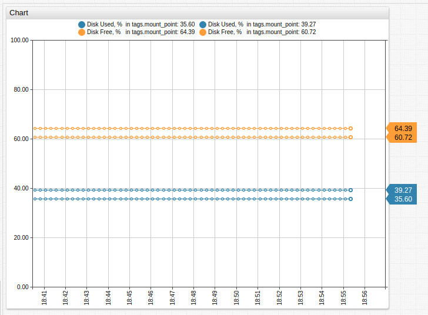
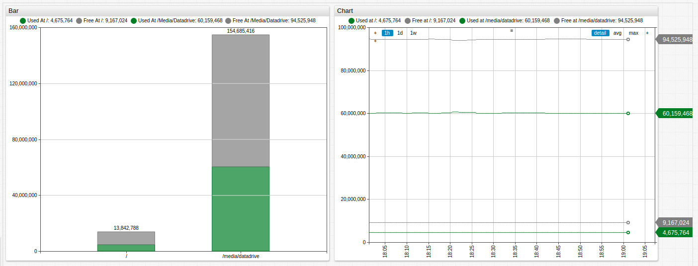

# Wildcards

Use wildcards in tag values to retrieve multiple series from the server instead of defining separate series for each tag in the widget configuration.

Specify the `*` wildcard as either `tag` value or `entity` name.

```ls
[series]
  entity = nurswgvml007
  metric = disk_used_percent
    [tags]
      mount_point = *
```

[](https://apps.axibase.com/chartlab/04b35d08/2/)

Reference wildcard series from derived series using an `alias`.



[](https://apps.axibase.com/chartlab/bf23243d)

Wildcard series are supported in all widgets including Bar Charts which provide a multiple-column setting to place derived series with the same entity and tags into separate columns.



[](https://apps.axibase.com/chartlab/d3cc8533)
