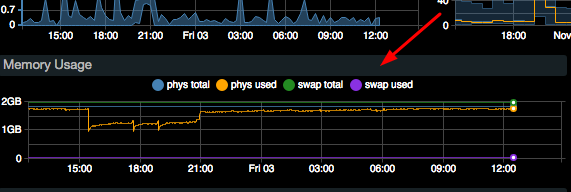
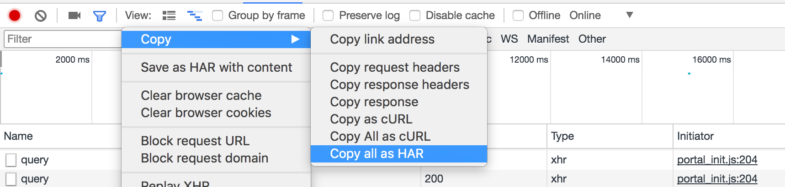
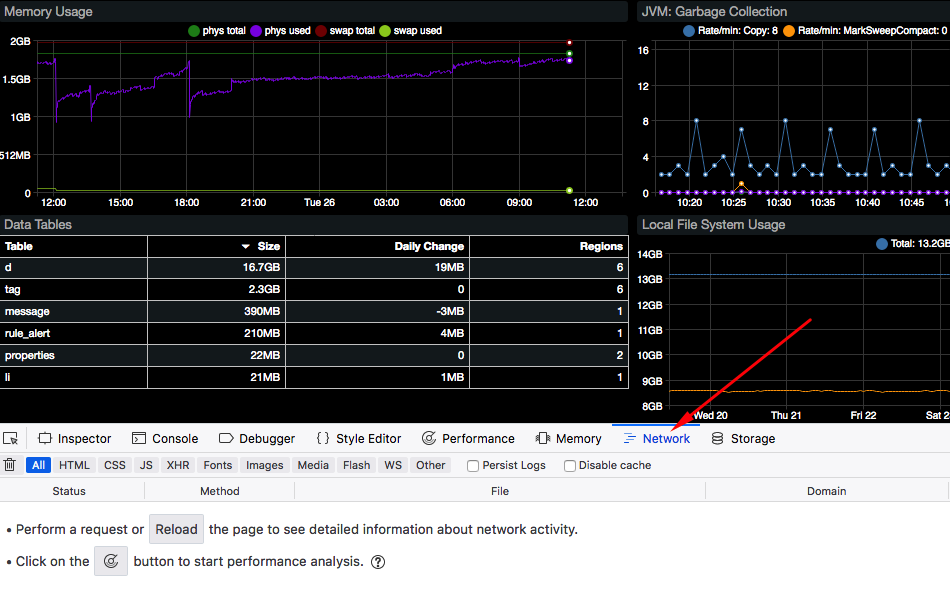
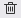
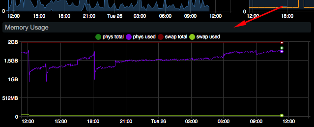
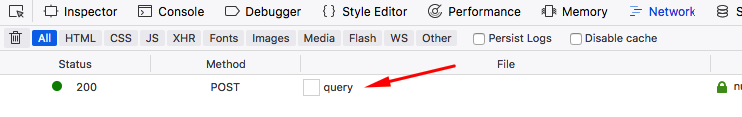
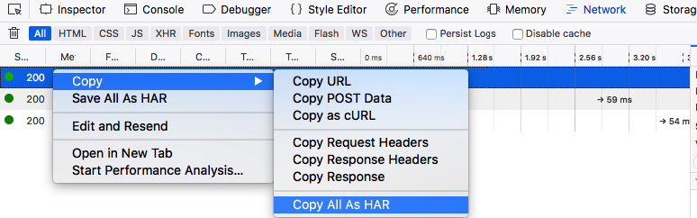
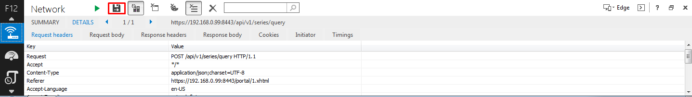
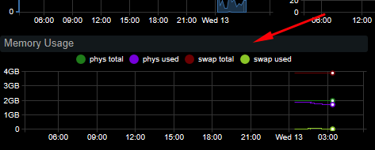
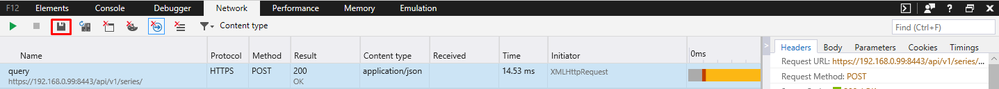

# Capture HAR

## Overview

These instructions outline the steps required to export web browser requests generated by Axibase portals in HTTP Archive format (HAR).

* [Chrome](#chrome)
* [Firefox](#firefox)
* [Internet Explorer 11](#internet-explorer-11)
* [Edge](#edge)

## Chrome

* Open a portal.
* Click `F12` on Windows or `Command+Option+I` on Mac to open Developer Tools.
* Open the **Network** panel.

  

* Click the `Clear` icon  in the toolbar to clear request history.
* Click the widget header.

  
  
* The dialog mode initiates a request to ATSD and load data for the selected widget.

  

* Right-click the request row. Select **Copy > Copy all as HAR**.

  

* Save the request output into a file such as `widget_xyz.har`.

## Firefox

* Open a portal.
* Click `F12` on Windows or `Command+Option+I` on Mac to open Developer Tools.
* Open the **Network** panel.

  

* Click the `Clear` icon  in the toolbar to clear request history.
* Click widget header.

  
  
* The dialog mode initiates a request to ATSD and load data for the selected widget.

  

* Right-click the request row. Select **Copy > Copy all as HAR**.

  

* Save the request output into a file such as `widget_xyz.har`.

## Internet Explorer 11

IE 11 is unable to generate `HAR` files, but instead saves recorded data in XML or CSV format.

* Open a portal.
* Click `F12` to open Developer Tools.
* Open the **Network** panel with `Control + 4`.

  

* Enable network traffic capture by clicking `F5`.

  

* Click widget header.

  
  
* The dialog mode initiates a request to ATSD and loads data for the selected widget.
  
  

* Double click the request row. Press **Export captured traffic**.

  

* Save Network Data.

## Edge

* Open a portal.
* Click `F12` to open Developer Tools.
* Open the **Network** panel.

  

* Click `Clear session` icon  in the toolbar to clear request history.
* Click the widget header.

  
  
* The dialog mode initiates a request into ATSD to load data for the selected widget.

  

* Select the request row. Press **Export as HAR**.

  
  
* Save the request output into a file such as `widget_xyz.har`.