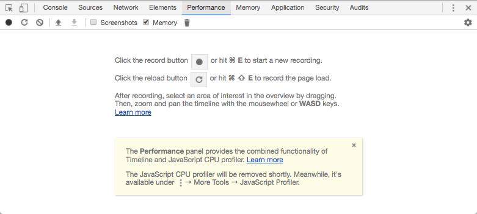
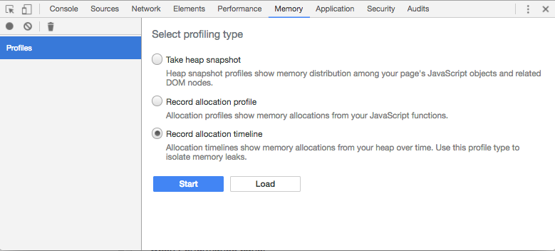
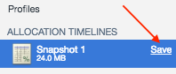

# Portal Performance Diagnostics

## Overview

The following instructions outline steps required to record JavaScript timelines and resource usage in ATSD portals.

## Google Chrome

### Capturing Performance Profile

- Open an ATSD portal.

- Click `F12` on Windows or `Command+Option+I` on Mac to open Developer Tools.

- Open the **Performance** panel.

  

- Click on Record circle icon    in the top left bar to initiate a profiling session.

- Execute steps that cause performance issues (load page, open dialog chart, click on controls).

- Click 'Stop' button to discontinue recording the session.

- Click on Arrow-Down icon    in the top toolbar to Save Profile to a json file

### Capturing Memory Profile

- Open an ATSD portal.

- Click `F12` on Windows or `Command+Option+I` on Mac to open Developer Tools.

- Open the **Memory** panel.

  

- Click on `Record allocation timeline` radio button.

- Click `Start` button.

- Execute steps that cause performance issues (load page, open dialog chart, click on controls).

- Click on the red `Record` circle   to stop recording the session.

- Click on "Save" to Save Profile to a heaptimeline file.

  
