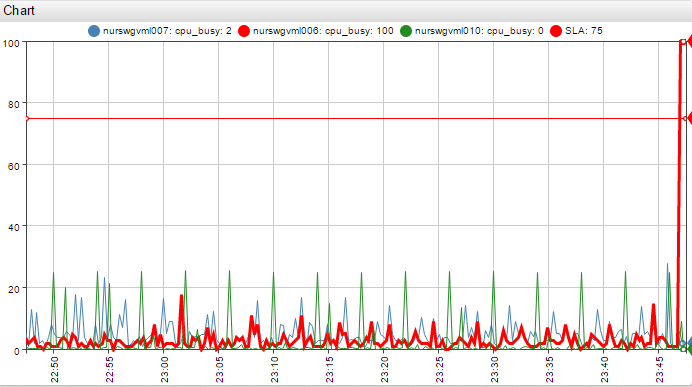
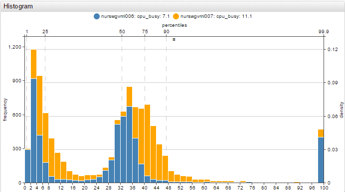
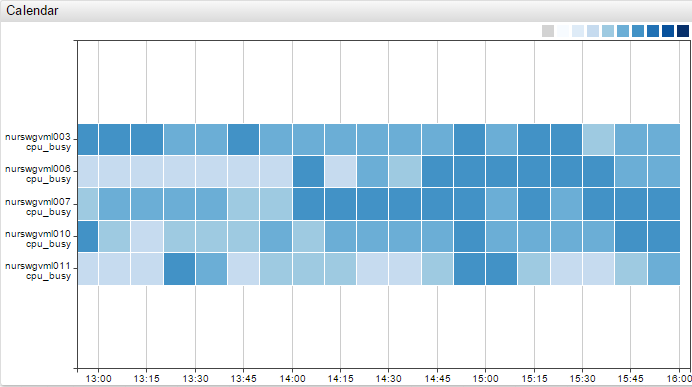
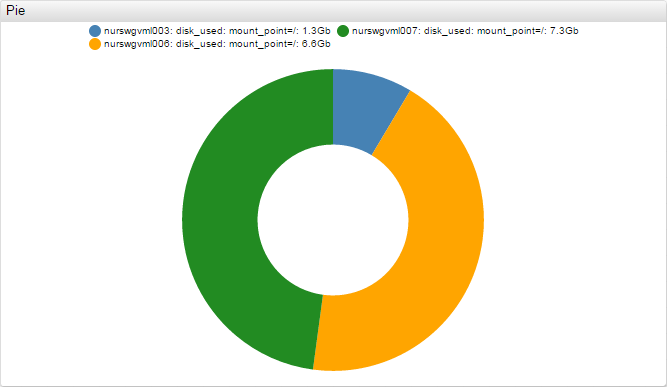
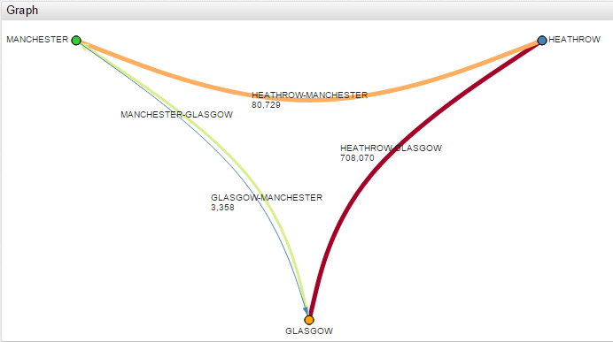
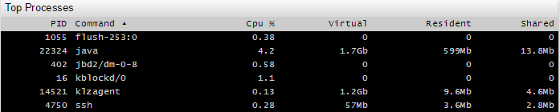

# Widgets

All widgets support [Shared Widget](./shared/README.md) syntax.

Time Chart | Gauge Chart | Bar Chart
:--:|:--:|:--:
 |  | 

Histogram Chart | Box Chart | Calendar Chart
:--:|:--:|:--:
 |  | 

Treemap Widget | Pie Chart | Graph Widget
:--:|:--:|:--:
 |  | 

Text Widget | Page Widget | Alert Console
:--:|:--:|:--:
 |  | 

Streaming Table | Property Table
:--:|:--:
 | 