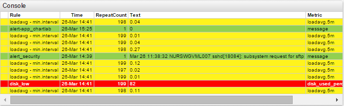
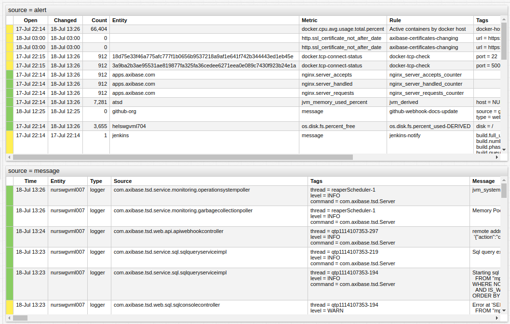
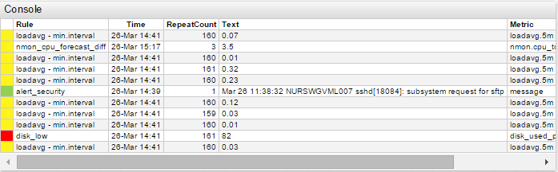

# Alert Console



## Overview

Alert Console widget displays a continuously updated list of open alerts or a list of messages recorded by the database in tabular format.

Rows are color-coded based on the severity of the underlying alert or message.

To display open alerts, set `source = alert`. To display messages, set `source = message`.

### Default Columns

Default column vary depending on source.

Default `message` columns:

* `Severity`
* `Time`
* `Entity`
* `Type`
* `Source`
* `Tags`
* `Message`

Default `alert` columns:

* `Severity`
* `Open`
* `Changed`
* `Count` (Repeat Count)
* `Entity`
* `Rule`
* `Metric`
* `Tags`
* `Text`

## Syntax

Alert Console supports both [Shared Widget](../shared/README.md) and Shared Table Syntax.

### `[widget]` Settings

Setting |Syntax |Description |Example
--|--|--|--
Source | `source = alert` | Specify the source of records.<br>Default value: `alert` | See [Examples](#examples)
Rule | `rule = cpu_busy_prod` | Name of rule for which alerts are filtered | [](https://apps.axibase.com/chartlab/0db89ed0/11/)
Entity | `entity = nurswgvml007` | The host or service for the widget.<br>Multiple entities can be used.| [](https://apps.axibase.com/chartlab/0db89ed0/7/)
Metric | `metric = loadavg.5m` | Select metrics for the widget.<br>Multiple metrics can be used.| [](https://apps.axibase.com/chartlab/0db89ed0/8/)
Severity | `severity = 6` | Severity rating of alerts displayed in the console:<br>Undefined: `0`<br>Unknown: `1`<br>Normal: `2`<br>Warning: `3`<br>Minor: `4`<br>Critical: `6`<br>Fatal: `7`| [](https://apps.axibase.com/chartlab/0db89ed0/3/)
Severity Style | `severity-style = row`| Control alert behavior. Highlight a single column or entire row.<br>Possible settings: `row`, `column`.| [](https://apps.axibase.com/chartlab/0db89ed0/4/)
Click Behavior | `onclick = filter()` | Set interaction behavior for user click.<br>Filter the tables based on the clicked values of a specific column | [](https://apps.axibase.com/chartlab/0db89ed0/5/)
Row Style | `row-style = if (value <= 7) return 'display: none'` | Style assigned to the entire row specified as JavaScript code.<br>In the syntax example all alerts with severity less than `7` are hidden.<br>Filter data prior display in the widget. | [](https://apps.axibase.com/chartlab/0db89ed0/6/)
Sort | `sort = metric DESC` | Sort console based on one or more columns.<br>Additional ascending `ASC` or descending `DESC` parameter is accepted.| [](https://apps.axibase.com/chartlab/0db89ed0/9/)
Class | `class = terminal` | Change the widget to UNIX-style console with black background.| [](https://apps.axibase.com/chartlab/0db89ed0/10/)

## Examples

### Configuration

```css
[configuration]
  height-units = 2
  width-units = 1

[group]
[widget]
    title = source = alert
    type = console
    entity = *

[group]
[widget]
    title = source = message
    type = console
    source = message
    entity = nurswgvml007
    timespan = 1 hour
```



[](https://apps.axibase.com/chartlab/eb5102c5)

### Severity Style: `row`

```css
[widget]
  severity-style = row
  type = console
```


[](https://apps.axibase.com/chartlab/0db89ed0/2/)

### Severity Style: `column`

```css
[widget]
  severity-style = column
  type = console
```



[](https://apps.axibase.com/chartlab/0db89ed0)