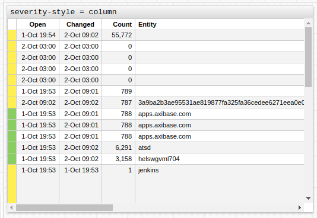

# Alert Console

## Overview

The **Alert Console** displays a continuously updated list of open [alerts](https://axibase.com/docs/atsd/rule-engine/#open-alerts) or [messages](https://axibase.com/docs/atsd/schema.html#messages) in tabular format.

```ls
[widget]
  type = console
```


[](https://apps.axibase.com/chartlab/1735445f)

## Widget Settings

* The settings apply to the `[widget]` section.
* [Shared](../shared/README.md#widget-settings) `[widget]` settings are inherited.
* [Shared Table](../shared-table/README.md#widget-settings) `[widget]` settings are inherited.

Name | Description | &nbsp;
:--|:--|:--
<a name="source"></a>[`source`](#source)| Specify the source of records.<br>Possible values: `alert`, `message`.<br>Default value: `alert`.<br>**Example**: `source = message` | [↗](https://apps.axibase.com/chartlab/1461fbb6)
<a name="rule"></a>[`rule`](#rule)| [Rule](https://axibase.com/docs/atsd/rule-engine/) for which alerts are filtered. <br>**Example**: `rule = nginx_server_accepts_counter` | [↗](https://apps.axibase.com/chartlab/3b00b4a1)
<a name="entity"></a>[`entity`](#entity)| The host or service displayed by the widget.<br>Multiple `entity` settings can be specified.<br>**Example**: `entity = nurswgvml007`| [↗](https://apps.axibase.com/chartlab/ff2ce03a)
<a name="metric"></a>[`metric`](#metric)| The metric displayed by the widget.<br>Other metrics are filtered out.<br>Multiple `metric` settings can be specified.<br>**Example**: `metric = nmon.cpu_total.busy%`| [↗](https://apps.axibase.com/chartlab/aa542ce3)
<a name="severity"></a>[`severity`](#severity)| Minimum severity rating of console alerts.<br>Possible values: `0` (Undefined), `1` (Unknown), `2` (Normal), `3` (Warning), `4` (Minor), `6` (Critical),`7` (Fatal).<br>Default value: `0`.<br>**Example**: `severity = 6`| [↗](https://apps.axibase.com/chartlab/d9a3d42b)
<a name="severity-style"></a>[`severity-style`](#severity-style)| Control alert behavior.<br>Highlight a single column or entire row.<br>Possible settings: `row`, `column`.<br>**Example**: `severity-style = row`| [↗](https://apps.axibase.com/chartlab/71113dee)
<a name="on-click"></a>[`on-click`](#on-click)| Set interaction behavior upon clicking a column.<br>**Example**: `on-click = filter()`| [↗](https://apps.axibase.com/chartlab/f7d929c9)
<a name="row-style"></a>[`row-style`](#row-style)| Style assigned to the entire row specified as JavaScript code.<br>Filter data prior display in the widget.<br>**Example**: `row-style = if (value <= 100) return 'display: none'` | [↗](https://apps.axibase.com/chartlab/470ea887)
<a name="sort"></a>[`sort`](#sort)| Sort rows by value in ascending (`ASC`) or descending (`DESC`) order.<br>The first line is sorted in alphabetical order by the name of the metric and then a string with the same name as the metric is sorted according to value in descending order.<br>**Examples**:<ul><li>`sort = DESC`<li>`sort = value ASC`</ul>|[↗](https://apps.axibase.com/chartlab/c89087e9)
<a name="class"></a>[`class`](#class)| Change the widget to Unix-style console with black background.<br>Possible values: `terminal`.<br>**Example**: `class = terminal`| [↗](https://apps.axibase.com/chartlab/5d8cb5ad)

## Default Columns

Rows are color-coded based on the severity of the underlying alert or message.

Default column vary based on source.

### Default `message` Columns

* `Severity`
* `Time`
* `Entity`
* `Type`
* `Source`
* `Tags`
* `Message`

### Default `alert` Columns

* `Severity`
* `Open`
* `Changed`
* `Count` (Repeat Count)
* `Entity`
* `Rule`
* `Metric`
* `Tags`
* `Text`

## Examples

### Advanced Configuration


[](https://apps.axibase.com/chartlab/3873ebdc)

### Severity Style: `row`


[](https://apps.axibase.com/chartlab/7e73c554)

### Severity Style: `column`



[](https://apps.axibase.com/chartlab/cc0f7333)