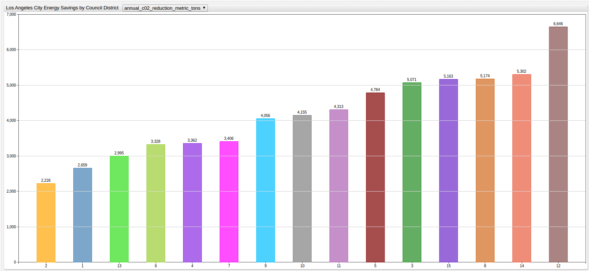

# Bar Chart

## Overview

Bar Charts group series into columns and displays them as horizontal or vertical bars.

## Syntax

Bar Charts support [Shared Widget](../shared/README.md) syntax.

### `[widget]` Settings

Name | Example | Description | &nbsp;
--|--|--|--
`horizontal` | `horizontal = true` | Display bars horizontally Default: `false`. | [↗](https://apps.axibase.com/chartlab/8fe65e1b/2/)
`stack` | `stack = false` | Disable series grouping. Default: `true`. | [↗](https://apps.axibase.com/chartlab/8fe65e1b/8/)
`group`|`group = region` `group = entity, metric`|Apply one color to series in the same group. Default: `metric`.|[↗](https://apps.axibase.com/chartlab/e56f5bbc)
`entity-label`|`entity-label = srv007`|Override grouped series legend when `group=entity`.|[↗](https://apps.axibase.com/chartlab/8fe65e1b/21/)
`metric-label`|`metric-label = CPU Busy, %`|Override grouped series legend when `group=metric`.|[↗](https://apps.axibase.com/chartlab/8fe65e1b/22/)
`colors`|`colors = green, steelblue, orange`|Series colors.|[↗](https://apps.axibase.com/chartlab/8fe65e1b/13/)
`display-values`|`display-values = false`|Show or hide bar values. Default: `true`.|[↗](https://apps.axibase.com/chartlab/8fe65e1b/7/)
`rotate-ticks`|`rotate-ticks = 45` `rotate-ticks = true`|Rotate `x` axis labels by degrees. Set to `true` to rotate ticks by `90` degrees. Default value: `0`.|[↗](https://apps.axibase.com/chartlab/8fe65e1b/29/)
`sort`|`sort = DESC` `sort = value ASC` `sort = collectd.df.space.free DESC`|Sort bars by name or value in ascending (`ASC`) or descending (`DESC`) order. In `stack` mode bars are sorted by **total** grouped value. If a column has multiple series, keyword in `sort` setting represents the sum of series values.|[↗](https://apps.axibase.com/chartlab/4642b100) [↗](https://apps.axibase.com/chartlab/4204e221/4) [↗](https://apps.axibase.com/chartlab/76ebf83b/5)
[`alert-expression`](../../syntax/alert-expression.md) and `alert-stlye`|`alert-expression = value > 10` `alert-style = fill: red; stroke: red`|Alert criteria and behavior. Optionally, apply unique alert style to each series.|[↗](https://apps.axibase.com/chartlab/8fe65e1b/20/)
`column-alert-expresions` and `column-alert-style`|`column-alert-expression = value > 10` `column-alert-style = fill: red; stroke: red`|Column alert criteria and behavior. Optionally, apply alert style to total value of series in each bar.|[↗](https://apps.axibase.com/chartlab/8fe65e1b/17/)
`hide-empty-columns`|`hide-empty-columns = true`|Show or hide columns with no data. Default value:`false`.|[↗](https://apps.axibase.com/chartlab/e4603a5f) [↗](https://apps.axibase.com/chartlab/377091ff)

### `[column]` Settings

Setting |Syntax |Description | &nbsp;
--|--|--|--
`label`|`label = Column-1`|Column legend label displayed below series columns.|[↗](https://apps.axibase.com/chartlab/8fe65e1b/3/)
`alert-expression` and `alert-style`|`alert-expression = value > 7` `alert-style = fill: red; stroke: red`|Alert criteria and behavior. Apply alert style based on total value of series inside the bar.|[↗](https://apps.axibase.com/chartlab/8fe65e1b/16/)
`column-label-format`|`column-label-format = tags.mount_point`|Column label pattern containing text and placeholders. Use any combination of: `entity`, `metric`, `tagName`, `tagValue`,`tags.{tag-name}`,`statistics`, `period` Default value: `entity: metric: tagName=tagValue: statistics - period`|[↗](https://apps.axibase.com/chartlab/8bc74658/2/)
`multiple-column`|`multiple-column = true`|Applicable to [wildcard](../../syntax/wildcards.md) configurations. Default value is `false`. If `true`, series with the same entity and tags are added into the same column. This applies to derived series which are placed in the same column alongside the underlying series.|[↗](https://apps.axibase.com/chartlab/6e37edc8/2/)

### `[series]` Settings

Settings inherited from [Shared Widget `[series]` Syntax](../shared/README.md): `entity`, `metric`, `type`, `interval`, `style`, `color`, `label`, `tooltip`, `format`, `display`, `hidden`, `refresh-interval`, `retry-refresh-interval`, `error-refresh-interval`.

## Examples

### Horizontal Bar Chart

### Horizontal Alert

### Vertical Bar Chart

### Vertical Alert

### Alert

