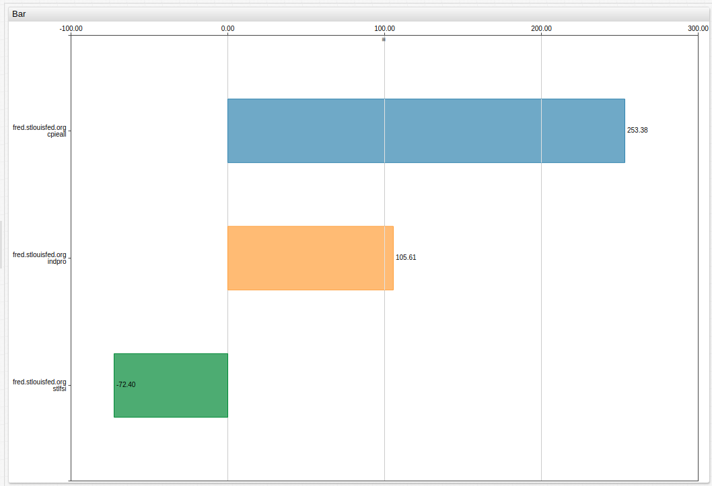
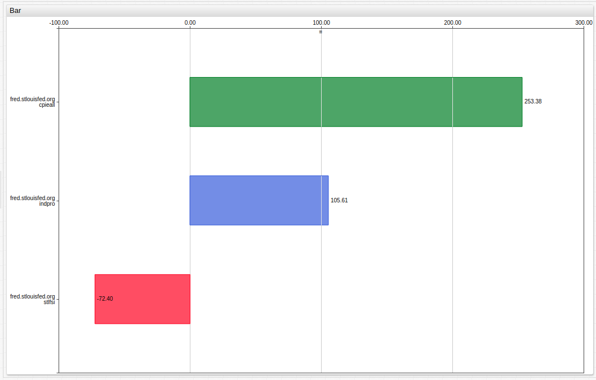
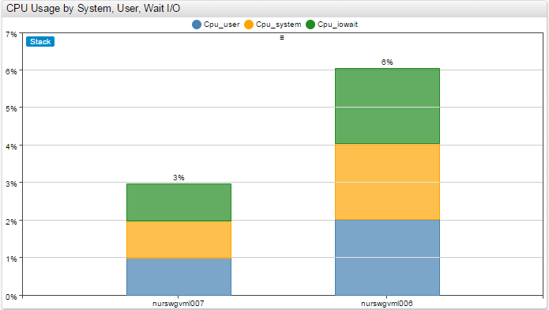
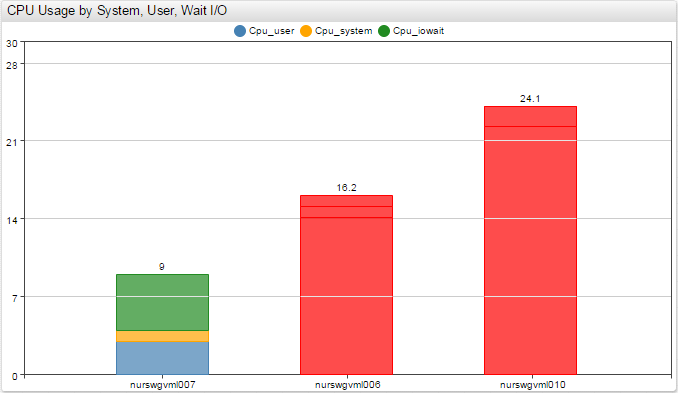
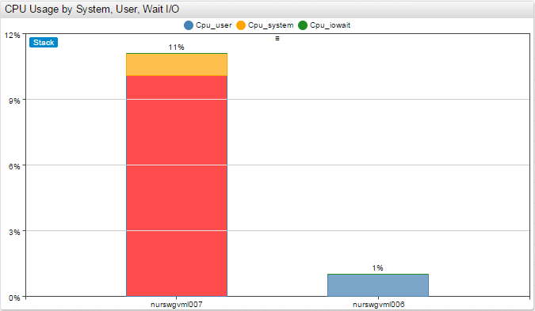

# Bar Chart

## Overview

Bar Charts group series into columns and displays them as horizontal or vertical bars.

## Syntax

Bar Charts support [Shared Widget](../shared/README.md) syntax.

### `[widget]` Settings

Setting |Syntax |Description |Example
--|--|--|--
|Horizontal|`horizontal = true`|Display bars horizontally Default: `false`.||
|Stack|`stack = false`|Disable series grouping. Default: `true`.||
|Group|`group = region` `group = entity, metric`|Grouping keys to apply the same color to series in the same group Default: `metric`.||
|Entity Label|`entity-label = srv007`|Override grouped series legend when `group=entity`.||
|Metric Label|`metric-label = CPU Busy, %`|Override grouped series legend when `group=metric`.||
|Colors|`colors = green, steelblue, orange`|Series colors.||
|Display Values|`display-values = false`|Show or hide bar total values. Default: `true`.||
|Rotate Ticks|`rotate-ticks = 45` `rotate-ticks = 90` `rotate-ticks = true`|Rotate `x` axis labels. Set in degrees. Set to `true` to rotate ticks by `90` degrees. Default value: `0`.||
|Sort|`sort = DESC` `sort = value ASC` `sort = name DESC` `sort = collectd.df.space.free DESC`|Sort bars by name or value in ascending (`ASC`) or descending (`DESC`) order. In stacking mode bars are sorted using total value. Supports sorting of columns composed from multiple series by specifying metric name. If column has multiple series, value keyword in sort settings stands for sum of series values in this column.|    |
|[Alert Expression](../../syntax/alert-expression.md) and Style|`alert-expression = value > 10` `alert-style = fill: red; stroke: red`|Apply alert style to each series separately.||
|Column Alert Expression and Style|`column-alert-expression = value > 10` `column-alert-style = fill: red; stroke: red`|Apply alert style to total value of series in each bar.||
|Hide Empty Columns|`hide-empty-columns=true`|Show or hide columns with no data to display. Default value:`false`.| |

### `[column]` Settings

Setting |Syntax |Description |Example
--|--|--|--
|Label|`label = Column-1`|Column legend displayed below bar.||
|Alert Expression and Style|`alert-expression = value > 7` `alert-style = fill: red; stroke: red`|Apply alert style based on total value of series inside the bar.||
|Column Label Format|`column-label-format = tags.mount_point`|Column label pattern containing text and placeholders. Use any combination of the following: `entity`, `metric`, `tagName`, `tagValue`,`tags.{tag-name}`,`statistics`, `period` Default value: `entity: metric: tagName=tagValue: statistics - period`||
|Multiple Column|`multiple-column = true`|Applicable to [wildcard](../../syntax/wildcards.md) configurations. Default value is `false`. If `true`, series with the same entity and tags are added into the same column. This applies to derived series which are placed in the same column alongside the underlying series.||

### `[series]` Settings

Settings inherited from [Shared Widget `[series]` Syntax](../shared/README.md): `entity`, `metric`, `type`, `interval`, `style`, `color`, `label`, `tooltip`, `format`, `display`, `hidden`, `refresh-interval`, `retry-refresh-interval`, `error-refresh-interval`.

## Examples

### Horizontal Bar Chart

### Horizontal Alert

### Vertical Bar Chart

### Vertical Alert

### Alert

