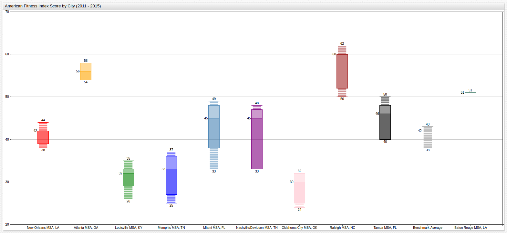
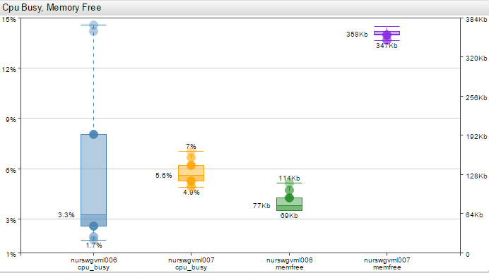
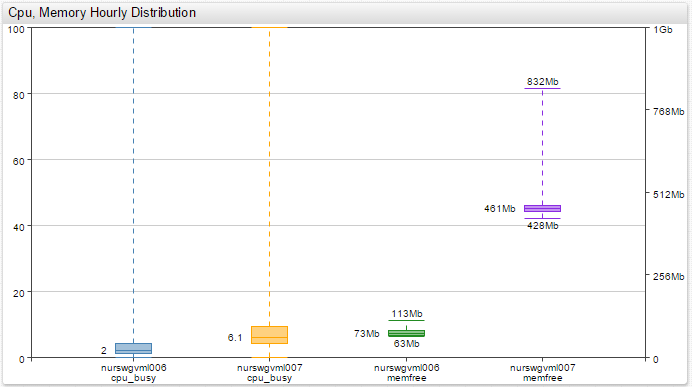
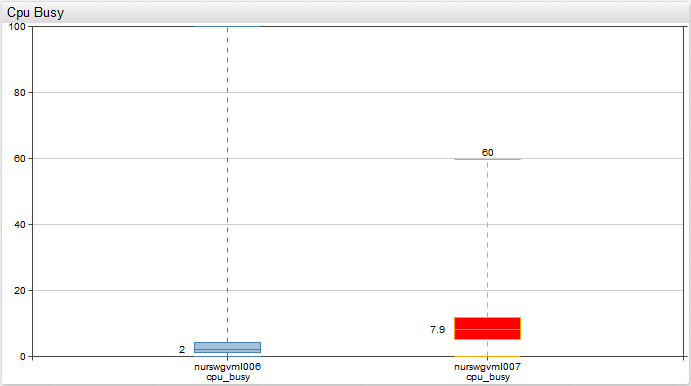
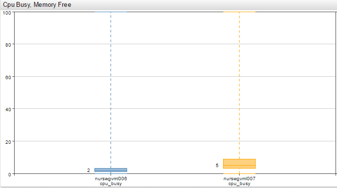
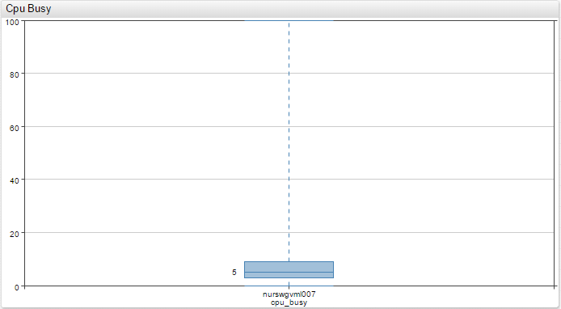
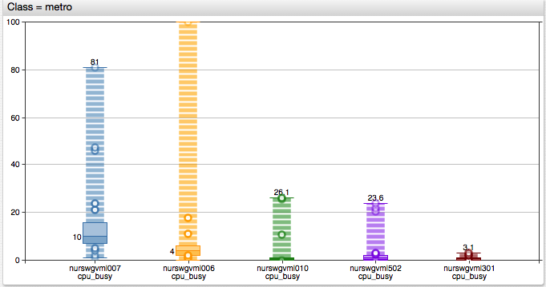

# Box Chart

## Overview

The Box Chart displays the minimum and maximum values, the median, and two percentiles in a given period of time for each series.

## Syntax

Box Charts support [Shared Widget](../shared/README.md) syntax.

### `[widget]` Settings

Setting |Syntax |Description |Example
--|--|--|--
Percentiles | `percentiles = 10%/90%` | Minimum and maximum percentiles for box chart area. Values must be between `0%` and `100%`. Default value: `25%/75%`.|  
Percentile Markers| `percentile-markers = all` `percentile-markers = top` | Display percentiles markers. Set at `[widget]` or `[series]` level. Possible values: `all`, `none`, `top`, `bottom`. Default value: `none`.|
Class | `class = metro` | Display percentile markers as circles on a dotted line, as common on subway maps.| 

### `[series]` Settings

Settings inherited from [Shared Widget `[series]` Syntax](../shared/README.md): `entity`, `metric`, `type`, `interval`, `alias`, `alert-expression`, `alert-style`, `style`, `color`, `label`, `tooltip`, `axis`, `format`, `display`, `hidden`, `refresh-interval`, `retry-refresh-interval`, `error-refresh-interval`.

## Examples

### Percentile Markers

### Dual Axis

### Alert

### Two Series

### Single Series

### `metro` Mode

