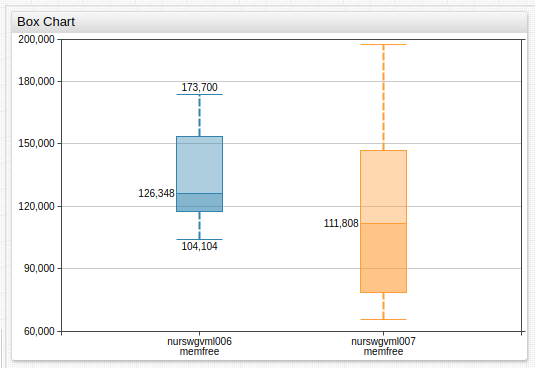
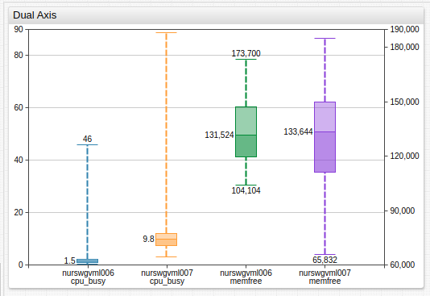
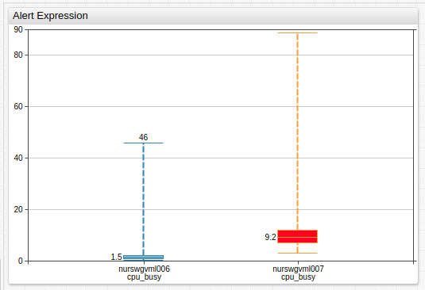

# Box Chart

## Overview

The **Box Chart** displays the minimum and maximum values, median, and customizable percentile range for the user-defined time period.

```ls
[widget]
  type = box
  timespan = 1 hour
  metric = memfree

  [series]
    entity = nurswgvml006

  [series]
    entity = nurswgvml007
```



[](https://apps.axibase.com/chartlab/81e2eaad)

### Widget Settings

* The settings apply to the `[widget]` section.
* [Shared](../shared/README.md) `[widget]` settings are inherited.

Name |Example |Description |&nbsp;
:--|:--|:--|:--
[`percentiles`](#percentiles) | `percentiles = 10%/90%` | Percentile range visualized box portion of the chart.<br>Possible values: `0%` to `100%`.<br>Default value: `25%/75%`.| [↗](https://apps.axibase.com/chartlab/5275c9a3)
[`class`](#class) | `class = metro` | Alternative visualization style.| [↗](https://apps.axibase.com/chartlab/c147cb06)

### Series Settings

* The settings apply to the `[series]` section.
* [Shared](../shared/README.md) `[setting]` settings are inherited.

Name |Example |Description |&nbsp;
:--|:--|:--|:--
[`percentile-markers`](#percentile-markers)| `percentile-markers = all`<br>`percentile-markers = top` | Percentiles marker style.<br>Possible values: `all`, `none`, `top`, `bottom`.<br>Default value: `none`.|[↗](https://apps.axibase.com/chartlab/866a4521)

## Examples

### Dual Axis



[](https://apps.axibase.com/chartlab/8544efb0)

### Alert



[](https://apps.axibase.com/chartlab/84397e8d)

### `metro` Mode


[](https://apps.axibase.com/chartlab/61dd4397)
