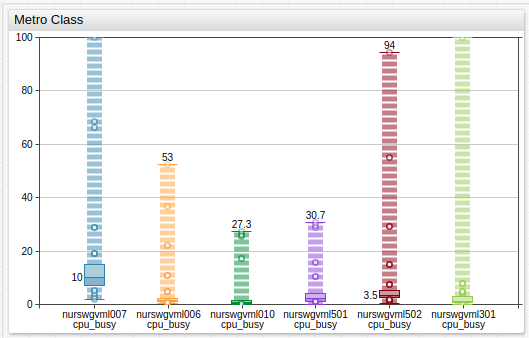

# Box Chart

## Overview

The **Box Chart** displays a distribution of observed values over a user-defined time interval. The chart shows the minimum and maximum values, the median, and a customizable percentile range.

```ls
[widget]
  type = box
  metric = memfree

  [series]
    entity = nurswgvml006
  [series]
    entity = nurswgvml007
```


[](https://apps.axibase.com/chartlab/743415a1)

### Widget Settings

* The settings apply to the `[widget]` section.
* [Shared](../shared/README.md#widget-settings) `[widget]` settings are inherited.

Name |Description |&nbsp;
:--|:--|:--
<a name="class"></a>[`class`](#class)| Display percentile markers as circles on a dotted line, as common on subway maps.<br>Possible values: `metro`.<br>**Example**: `class = metro`.| [↗](https://apps.axibase.com/chartlab/793e89f6)
<a name="rotate-ticks"></a>[`rotate-ticks`](#rotate-ticks)| Rotate labels on the time axis by `n` degrees.<br>Possible values: between `0` (horizontal) and `90` (vertical) or `true` (vertical).<br>Default value: `0`. (vertical).<br>**Example**: `rotate-ticks = 90`.| [↗](https://apps.axibase.com/chartlab/05083c97)

### Series Settings

* The settings apply to the `[series]` section.
* [Shared](../shared/README.md) `[series]` settings are inherited.

Name |Description |&nbsp;
:--|:--|:--
<a name="percentiles"></a>[`percentiles`](#percentiles)| Minimum and maximum percentiles for the shaded box area.<br>Possible values: `0%` to `100%`.<br>Default value: `25%/75%`.<br>**Example**: `percentiles = 10%/90%`.| [↗](https://apps.axibase.com/chartlab/0a83d6f5)

## Examples

### Dual Axis


[](https://apps.axibase.com/chartlab/8544efb0)

### Alert


[](https://apps.axibase.com/chartlab/84397e8d)

### `metro` Class



[](https://apps.axibase.com/chartlab/61dd4397)
