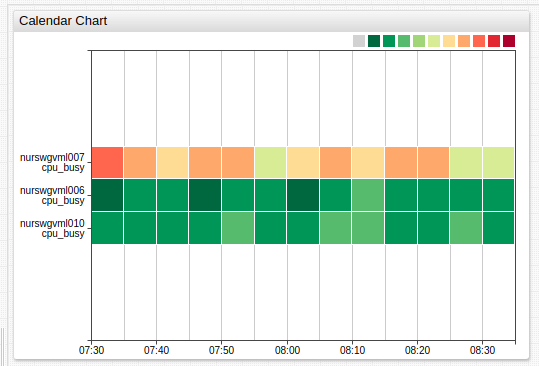
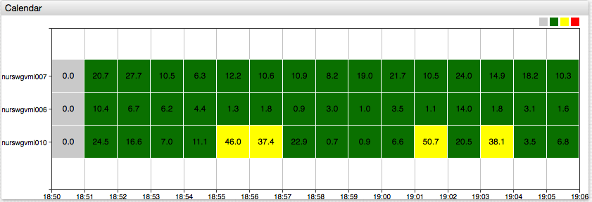
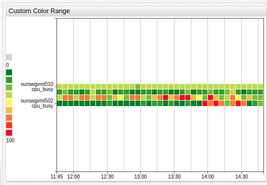
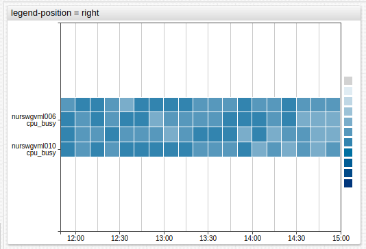
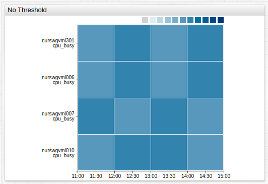
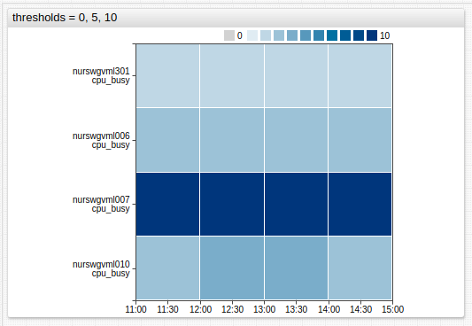
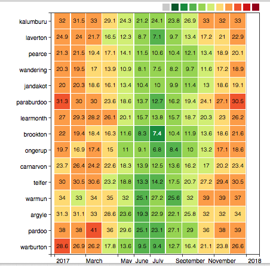

# Calendar Chart

## Overview

The **Calendar Chart** displays the deviation of aggregated series values for a calendar period from a specified threshold. Series values within each period are aggregated by client [statistical function](../../configuration/aggregators.md#server-and-client-aggregators) and assigned a color which reflects the magnitude of deviation.

```ls
[widget]
  type = calendar
  
  thresholds = 0,30,60,100
  colors = green,yellow,red

  timespan = 12 hour
  summarize-period = 1 hour
  summarize-statistic = percentile(95)

  [series]
    metric = cpu_busy
    entity = nurswgvml0*
```



[](https://apps.axibase.com/chartlab/1d891aa7/6/)

## Widget Settings

* The settings apply to the `[widget]` section.
* [Common](../shared/README.md#widget-settings) `[widget]` settings are inherited.

Name | Description | &nbsp;
:--|:--|:--
<a name="summarize-period"></a>[`summarize-period`](#summarize-period)| Period specified in [time units](https://axibase.com/docs/atsd/api/data/series/time-unit.html) to split loaded time series into calendar segments.<br>Format: `count time_unit`.<br>Default value: `5 minute`.<br>**Example**: `summarize-period = 1 hour`| [↗](https://apps.axibase.com/chartlab/6a3f5153)
<a name="summarize-statistic"></a>[`summarize-statistic`](#summarize-statistic) | Statistical function applied to values within each period.<br>Refer to [Client Aggregators](../../configuration/aggregators.md#server-and-client-aggregators) for possible values.<br>Default value: `avg`.<br>**Example**: `summarize-statistic = percentile(75)`| [↗](https://apps.axibase.com/chartlab/548fa0ae/3/)
<a name="palette-ticks"></a>[`palette-ticks`](#palette-ticks)| Display legend labels.<br>Possible values: `false`, `true`.<br>Default Value: `false`.<br>**Example**: `palette-ticks = true`| [↗](https://apps.axibase.com/chartlab/01a10bbf)
<a name="rotate-palette-ticks"></a>[`rotate-palette-ticks`](#rotate-palette-ticks)| Rotate legend labels.<br>Possible values: `false` (horizontal), `true` (vertical).<br>Default value: `false`.<br>**Example**: `rotate-palette-ticks = true`| [↗](https://apps.axibase.com/chartlab/0d232c4f)
<a name="range-merge"></a>[`range-merge`](#range-merge)| Compute a single range for all series with minimum and maximum from all loaded series.<br>Possible values: `false`, `true`.<br>Default value: `false`.<br>**Example**: `range-merge = true`| [↗](https://apps.axibase.com/chartlab/56a3859a)
<a name="sort"></a>[`sort`](#sort)| Sort rows by [`label`](../../widgets/shared/README.md#label) or value of [statistic function](#sort-by-statistic). Supported ascending (`ASC`) and descending (`DESC`) order.<br>Possible values:<br><span>&#8226;</span>`name` - sorts by label<br><span>&#8226;</span>`stat_name('count unit')`- sorts by statistic within period<br>**Example**: `sort = name DESC`| [↗](https://apps.axibase.com/chartlab/fc8bd510)<br>[↗](https://apps.axibase.com/chartlab/9a0dd4c6/2/)
<a name="centralize-ticks"></a>[`centralize-ticks`](#centralize-ticks)| Center time and date markers over summarize periods.<br>Possible values: `false`, `true`.<br>Default value: `false`.<br>**Example**: `centralize-ticks = true`| [↗](https://apps.axibase.com/chartlab/4d6c2761)
<a name="ticks-time"></a>[`ticks-time`](#ticks-time)| Tick marks on the time axis.<br>Default value: `10`.<br>**Example**: `ticks-time = 5`| [↗](https://apps.axibase.com/chartlab/4d6c2761/2/)
<a name="data-labels"></a>[`data-labels`](#data-labels)| Display values inside colored rectangles formatted according to [format](../shared/README.md#format) setting.<br>Default value: `false`.<br>**Example**: `data-labels = true`| [↗](https://apps.axibase.com/chartlab/4b2200bc/5/)

### Series Color Settings

* The settings apply to the `[widget]` or `[series]` section.
* [Common](../shared/README.md#series-settings) `[series]` settings are inherited.

Name | Description | &nbsp;
:--|:--|:--
<a name="thresholds"></a>[`thresholds`](#thresholds)| Threshold values.<br>The number of specified [`colors`](#colors) must be `1` fewer than the number of thresholds.<br>**Example**: `thresholds = 0, 50, 90, 100`| [↗](https://apps.axibase.com/chartlab/47688faa)
<a name="colors"></a>[`colors`](#colors)| Comma separated list of color [names](https://en.wikipedia.org/wiki/Web_colors) or hex codes, assigned to threshold ranges.<br>The number must be `1` fewer than the number of thresholds.<br>**Example**: `colors = green, yellow, red`<br>Recommended color palette tools: [`colorhexa`](https://www.colorhexa.com/ffffff-to-0c9150), [`material.io`](https://material.io/design/color/#tools-for-picking-colors).| [↗](https://apps.axibase.com/chartlab/5b7cc24e)
<a name="color-range"></a>[`color-range`](#color-range)|Color palette assigned to threshold ranges.<br>Possible values: [color names](https://en.wikipedia.org/wiki/Web_colors).<br>Built-in ranges: `red`, `blue`, `black`.<br>**Example**: `color-range = black`|[↗](https://apps.axibase.com/chartlab/7517e646)
<a name="gradient-count"></a>[`gradient-count`](#gradient-count)| Number of gradients per threshold range.<br>Default value: `3`.<br>**Example**: `gradient-count = 2`| [↗](https://apps.axibase.com/chartlab/a789a6cc)

### Sort By Statistic

Aggregated series can be sorted using statistic, calculated for last aggregated values within the particular period, specified as the number of [time units](https://axibase.com/docs/atsd/api/data/series/time-unit.html):

```elm
stat_name('count unit')
# For example:
sum('5 minute')
```

Period can be both quoted and unquoted. Supported statistic functions:

* `sum` - sum of values during the period
* `min` - minimum value during the period
* `max` - maximum value during the period
* `avg` - average of values during the period
* `first` - first value received during the period
* `last` - Last value received during the period

[](https://apps.axibase.com/chartlab/9a0dd4c6/3/)

## Examples

### Data Labels



[](https://apps.axibase.com/chartlab/4b2200bc/5/)

### Custom Color Range



[](https://apps.axibase.com/chartlab/3d52aae0/2/)

### Legend Position



[](https://apps.axibase.com/chartlab/f354914c/2/)

### No Threshold



[](https://apps.axibase.com/chartlab/7d6224b8)

### Threshold



[](https://apps.axibase.com/chartlab/5f49b168)

### Multiple Weather Stations



[](https://apps.axibase.com/chartlab/34de0a1d/2/)
