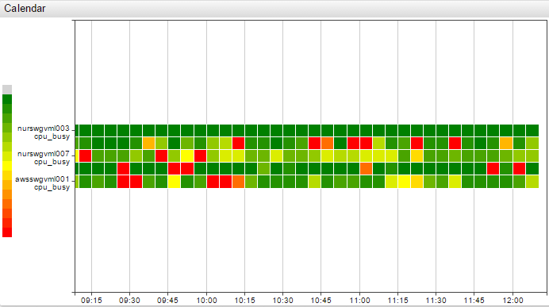
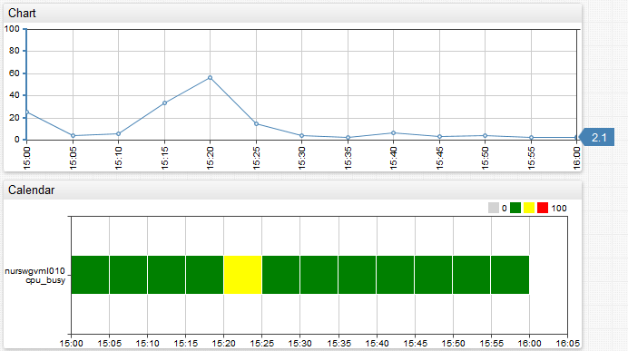
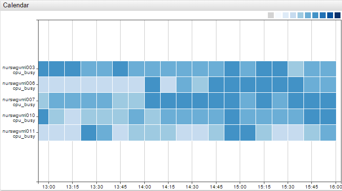
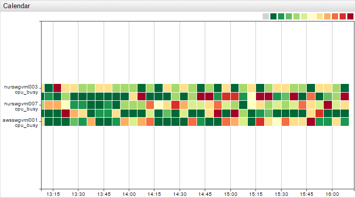

# Calendar Chart



## Overview

The Calendar Chart displays deviation of aggregated series values for each calendar period from the specified threshold. Series values within each period are [aggregated](../../configuration/aggregators.md) with a statistical function, `avg` by default, and the aggregated period value is then assigned a certain color which reflects the magnitude of the deviation.

## Syntax

Calendar Charts support [Shared Widget](../shared/README.md) syntax.

### `[widget]` Settings

Setting |Syntax |Description |Example
--|--|--|--
Period Summary | `summarize-period = 1 hour`<br>`summarize-period = 15 minute` | Period by which loaded time series data is split.<br>Possible values: `auto`, <code>count [time_unit](https://axibase.com/docs/atsd/api/data/series/time-unit.html)</code>. | [](https://apps.axibase.com/chartlab/fb935e05/14/)
Statistic Summary | `summarize-statistic = percentile_75`<br>`summarize-statistic = avg` | Statistical function applied to values within each period.<br>Possible values: `avg`, `max`, `min`, `sum`, `count`, `percentile_99`, `percentile_95`, `percentile_90`, `percentile_75`, `percentile_50` (median).<br>Median is an alias for `percentile_50`.<br>Default value: `avg`.| [](https://apps.axibase.com/chartlab/fb935e05/23/)
Color Range | `color-range = green orange`<br>`color-range = green yellow red`| Customize calendar colors. More than two colors can be set.|[](https://apps.axibase.com/chartlab/fb935e05/15/)
Gradient Count | `gradient-count = 3` | Specify the number of gradient colors between each color in Color Range. | [](https://apps.axibase.com/chartlab/fb935e05/16/)
Palette Ticks | `palette-ticks = true` | Display legend labels.<br>Possible values: `true`, `false`<br>Default Value: `false` | [](https://apps.axibase.com/chartlab/0f9e807b/3/)
Rotate Palette Ticks | `rotate-palette-ticks = true` | Rotate legend labels.<br>Possible values: `true`, `false`.<br>`true`: Vertical.<br>`false`: Horizontal.<br>Default value: `false`.| [](https://apps.axibase.com/chartlab/0f9e807b/2/)
Range Merge | `range-merge = true` | If threshold is not defined, different set of ranges is computed for each series based on observed min and max values within the loaded timespan.<br> `range-merge` computes a single set of ranges for all series in the widget by using `min` and `max` for all loaded series.<br>Default value:`false`. | [](https://apps.axibase.com/chartlab/0f9e807b/4/)
Sort | `sort = name DESC` | Sort series values by `name`, either ascending `ASC` or descending `DESC`. Customize `name` with `label-format` or `label` settings.

### `[series]` Settings

Inherited settings from [Shared Widget Syntax](../shared/README.md): `entity`, `metric`, `type`, `interval`, `style`, `color`, `label`, `tooltip`, `format`, `refresh-interval`, `retry-refresh-interval`, `error-refresh-interval`.

Setting |Syntax |Description |Example
--|--|--|--
Thresholds | `thresholds = 0, 25, 50, 75, 100` | Define threshold value.<br>Default threshold for arithmetic mean of all metric values for the entire time-span.| [](https://apps.axibase.com/chartlab/fb935e05/21/)

## Examples

### Custom Colors

```ls
colors = green, yellow, red
thresholds = 0, 50, 75, 100
```



[](https://apps.axibase.com/chartlab/0a936368/2/)

### Left Legend

```ls
legend-position = left
```


[](https://apps.axibase.com/chartlab/fb935e05/13/)

### No Threshold



[](https://apps.axibase.com/chartlab/fb935e05)

### Threshold

```ls
thresholds = 10, 20, 30, 40, 50, 60, 70, 80, 90, 100
```



[](https://apps.axibase.com/chartlab/fb935e05/2/)