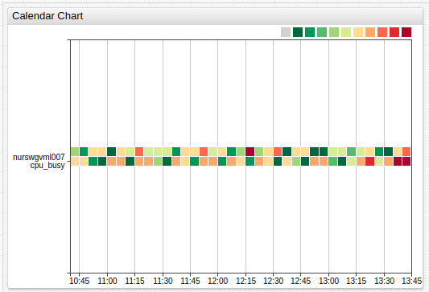

# Calendar Chart

## Overview

The **Calendar Chart** displays the deviation of aggregated series values for a calendar period from a specified threshold. Series values within each period are aggregated by [statistical function](../../configuration/aggregators.md) and assigned a color which reflects the magnitude of deviation.

```ls
[widget]
  type = calendar
  timespan = 3 hour
  metric = cpu_busy
  statistic = percentile_95
  period = 5 minute

  [series]
    entity = nurswgvml006
  [series]
    entity = nurswgvml007
```



[](https://apps.axibase.com/chartlab/357c4674)

## Widget Settings

* The settings apply to the `[widget]` section.
* [Shared](../shared/README.md#widget-settings) `[widget]` settings are inherited.

Name | Example | Description | &nbsp;
:--|:--|:--|:--
<a name="summarize-period"></a>[`summarize-period`](#summarize-period) | `summarize-period = 1 hour` | Calendar period specified as the number of [time units](https://axibase.com/docs/atsd/api/data/series/time-unit.html).<br>Possible values: `count time_unit`.<br>Default value: `5 minutes`. | [↗](https://apps.axibase.com/chartlab/48d84a37)
<a name="summarize-statistic"></a>[`summarize-statistic`](#summarize-statistic) | `summarize-statistic = percentile_75` | [Statistical function](../../configuration/aggregators.md) applied to values within each period.<br>Possible values: `avg`, `max`, `min`, `sum`, `count`, `percentile_99`, `percentile_95`, `percentile_90`, `percentile_75`, `percentile_50`, `median`.<br>Default value: `avg`.| [↗](https://apps.axibase.com/chartlab/06662c4f)
<a name="color-range"></a>[`color-range`](#color-range) | `color-range = green yellow orange`| Calendar colors.<br>Each color contains the amount of gradients specified by `gradient-count`<br>Possible values: [color name](https://en.wikipedia.org/wiki/Web_colors).<br>Default value: `red`, `yellow`, `green`, |[↗](https://apps.axibase.com/chartlab/0561d82c)
<a name="gradient-count"></a>[`gradient-count`](#gradient-count) | `gradient-count = 2` | Number of gradients between each color defined by `color-range`.<br>Default value: `3`. | [↗](https://apps.axibase.com/chartlab/29cfdf81)
<a name="palette-ticks"></a>[`palette-ticks`](#palette-ticks) | `palette-ticks = true` | Display legend labels.<br>Possible values: `true`, `false`.<br>Default Value: `false`. | [↗](https://apps.axibase.com/chartlab/3e669a88)
<a name="rotate-palette-ticks"></a>[`rotate-palette-ticks`](#rotate-palette-ticks) | `rotate-palette-ticks = true` | Rotate legend labels.<br>`true` rotates ticks to vertical.<br>Possible values: `true`, `false`.<br>Default value: `false`.| [↗](https://apps.axibase.com/chartlab/1b5eae65)
<a name="range-merge"></a>[`range-merge`](#range-merge) | `range-merge = true` | Compute a single range for all series with minimum and maximum from all loaded series.<br>Possible values: `true`, `false`.<br>Default value: `false`. | [↗](https://apps.axibase.com/chartlab/6a95615b)
<a name="sort"></a>[`sort`](#sort) | `sort = name DESC` | Sort entities by name or value in ascending (`ASC`) or descending (`DESC`) order.<br> | [↗](https://apps.axibase.com/chartlab/7f49de68)

### Series Settings

* The settings apply to the `[series]` section.
* [Shared](../shared/README.md#series-settings) `[series]` settings are inherited.

Name | Example | Description | &nbsp;
:--|:--|:--|:--
<a name="thresholds"></a>[`thresholds`](#thresholds) | `thresholds = 0, 25, 50, 75, 100` | Threshold values by which series values are assigned colors.| [↗](https://apps.axibase.com/chartlab/ab6e3dca)

## Examples

### Custom Color Range


[](https://apps.axibase.com/chartlab/3d52aae0)

### Legend Position


[](https://apps.axibase.com/chartlab/f354914c)

### No Threshold


[](https://apps.axibase.com/chartlab/19a746a2)

### Threshold


[](https://apps.axibase.com/chartlab/c5986b1b)
