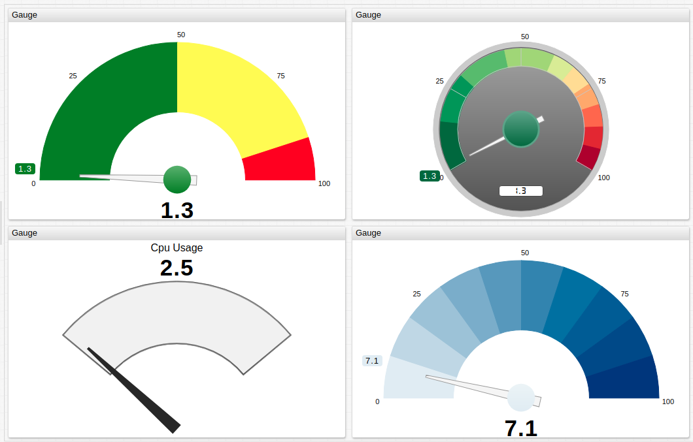
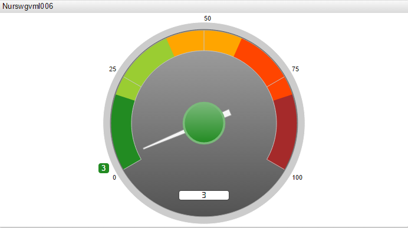
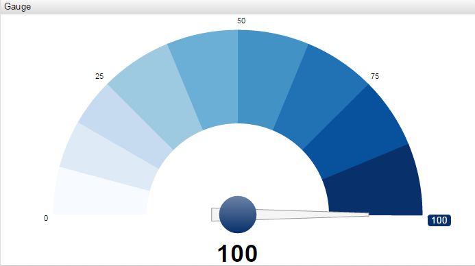
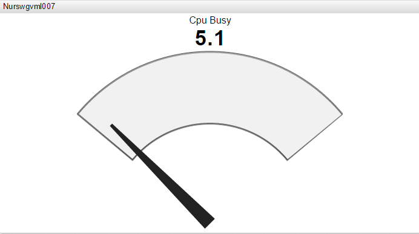
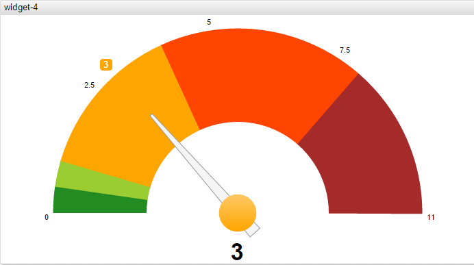
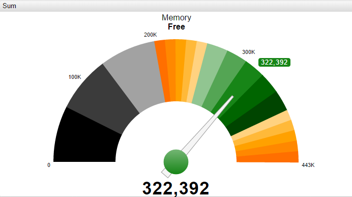

# Gauge Chart

Gauge Chart displays last series value on a gauge with colored threshold ranges. If the gauge widget contains multiple series, it displays the sum of the series values.

## Syntax

Gauge Charts support [Shared Widget](../shared/README.md) syntax.

### `[widget]` Settings

|Setting |Syntax |Description |Example |
|--- |--- |--- |--- |
|Mode|`mode = sleek`|Gauge layout mode. Possible values: `sleek`, `half`.||
|Thresholds|`thresholds = 0, 50, 90, 100`|Comma-separated threshold values or expressions to split the gauge axis into multiple ranges. Each range is assigned a color with the `colors` or `color-range` setting. ||
|Colors|`colors = green, yellow, red`|Determines colors of threshold ranges. The number of colors must be equal to the number of thresholds minus `1`: `50` (green), `50-90` (yellow), `90-100` (red).||
|Color Range|`color-range = black`|Color palette automatically assigned to threshold ranges. Possible values: `blue`, `red`, `black`.||
|Gradient Intensity|`gradient-intensity = -25% / 75%`|Color intensity of the first and the last sector in each range. Possible values: `-.2`/`.7` (or `-20%`/`70%`).||
|Gradient Count|`gradient-count = 5, 2, 1`|Number of gradients in each range. ||
|Caption|`caption = KPI`|Text displayed on top of the gauge.  Caption can be split into multiple lines. HTML markup is supported.||
|Caption Style|`caption-style = color: silver`|CSS style applied to caption.||
|Ticks|`ticks = 4`|Number of major ticks on gauge axis.||
|Minor Ticks|`minor-ticks = 4`|Number of minor ticks between major ticks.||
|Display Ticks|`display-ticks = true`|Display ticks on the axis. `true` by default.||
|Counter Position|`counter-position = none`|Counter position. Possible values: `top`, `bottom`, `none`.||
|Display Tip|`display-tip = true`|Display last value marker. Possible values: `true`, `false`.||
|Format Tip|`format-tip = d3.format("0.1f")``format-tip = kilobytes`|Last value format.||
|Format Axis|`format-axis = Math.round(value * 10)/10 + "%"`|Value axis format.||
|Format Counter|`format-counter = d3.format("0.3f")`|Counter format.||
|Ring Width|`ring-width = 0.2`|Width of the colored ring area, measured as `%` of radius. Possible values are between `0` and `1`.||
|Border Width|`border-width = 0.3`|Offset between gauge ring and parent container,measured as `%` of radius. Possible values are between `0` and `1`.||
|Pin Radius|`pin-radius = 0.2`|Radius of the inner circle holding the arrow, measured as `%` of radius. Possible values are between `0` and `1`.||
|Arrow Length|`arrow-length = 0.3`|Length of the gauge arrow, measured as `%` of radius. Possible values are between `0` and `1`.||

## Examples

### Default Style

### Range

### Sleek

### Half Style

### Advanced Sum

