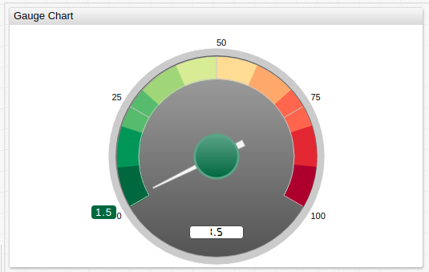
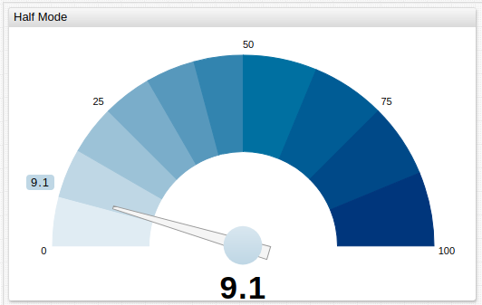
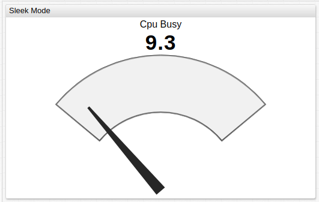
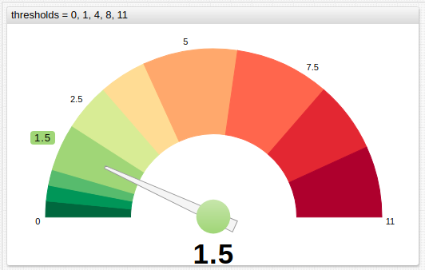
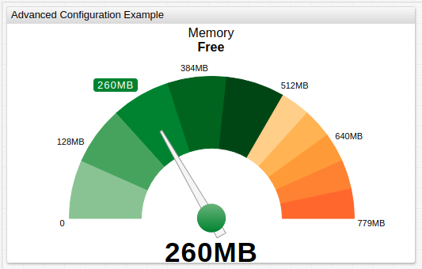

# Gauge Chart

## Overview

The **Gauge Chart** displays [last](https://apps.axibase.com/chartlab/2969abb3/3/) series value on a circle with colored sectors and a dial.

If the widget contains multiple series, the gauge displays  the [total](https://apps.axibase.com/chartlab/2969abb3/2/) value of included series.

```ls
[widget]
  type = gauge
  mode = half
  thresholds = 0, 50, 90, 100
  colors = green, yellow, red

  [series]
    entity = nurswgvml007
    metric = cpu_busy
```



[](https://apps.axibase.com/chartlab/8014162f)

## Widget Settings

* The settings apply to the `[widget]` section.
* [Common](../shared/README.md#widget-settings) `[widget]` settings are inherited.

Name | Description | &nbsp;
:--|:--|:--
|<a name="mode"></a>[`mode`](#mode)|Gauge type. The visible sector is set to `240` degrees in `default` mode, and to `180` degrees in other modes.<br>Possible values: `default`, `sleek`, `half`.<br>Default value: `default`.<br>**Example**: `mode = sleek`|[↗](https://apps.axibase.com/chartlab/527286dc/2/)|
|<a name="thresholds"></a>[`thresholds`](#thresholds)| Numeric thresholds to split the circle into multiple sectors, each assigned a different color.<br>The thresholds can be static or [calculated](#calculated-thresholds).<br>The number of thresholds must be `1` greater then the number of [`colors`](#colors).<br>**Example**: `thresholds = 0, 50, 90, 100`| [↗](https://apps.axibase.com/chartlab/527286dc/3/)|
|<a name="colors"></a>[`colors`](#colors)| Comma separated list of color [names](https://en.wikipedia.org/wiki/Web_colors) or hex codes, assigned to threshold sectors.<br>The number must be `1` fewer than the number of thresholds.<br>**Example**: `colors = green, yellow, red`<br>Recommended color palette tools: [`colorhexa`](https://www.colorhexa.com/ffffff-to-0c9150), [`material.io`](https://material.io/design/color/#tools-for-picking-colors).| [↗](https://apps.axibase.com/chartlab/527286dc/3/)|
|<a name="color-range"></a>[`color-range`](#color-range)|Color palette applied to threshold sectors.<br>Possible values: `red`, `blue`, `black`.<br>**Example**: `color-range = red`|[↗](https://apps.axibase.com/chartlab/527286dc/4/)|
|<a name="gradient-count"></a>[`gradient-count`](#gradient-count)|Number of gradient sub-sectors within each threshold sector.<br>**Example**: `gradient-count = 3`|[↗](https://apps.axibase.com/chartlab/8014162f/3/)|
|<a name="gradient-intensity"></a>[`gradient-intensity`](#gradient-intensity)|Gradient contrast.<br>Possible values: `[-100%,100%] / [-100%,100%]`.<br>**Example**: `gradient-intensity = -20% / 50%`|[↗](https://apps.axibase.com/chartlab/8014162f/2/)|
|<a name="caption"></a>[`caption`](#caption)|Text displayed on top of the gauge.<br>HTML markup is supported.<br>**Example**: `caption = Operating System`|[↗](https://apps.axibase.com/chartlab/8c28ca09)|
|<a name="caption-style"></a>[`caption-style`](#caption-style)|Caption CSS style.<br>**Example**: `caption-style = font-size: 64px`|[↗](https://apps.axibase.com/chartlab/32435859)|
|<a name="ticks"></a>[`ticks`](#ticks)|Number of major ticks placed on the circle arc.<br>Default value: `5`.<br>**Example**: `ticks = 2`|[↗](https://apps.axibase.com/chartlab/2030dce2/2/)|
|<a name="minor-ticks"></a>[`minor-ticks`](#minor-ticks)|Ratio of minor ticks per major tick. Supported only in `default` mode.<br>Default value: `0`.<br>**Example**: `minor-ticks = 4`|[↗](https://apps.axibase.com/chartlab/2030dce2/4/)|
|<a name="display-ticks"></a>[`display-ticks`](#display-ticks)|Show numeric values on major ticks.<br>Possible values: `false`, `true`.<br>Default value: `true`.<br>**Example**: `display-ticks = true`|[↗](https://apps.axibase.com/chartlab/d27397ab/2/)|
|<a name="counter-position"></a>[`counter-position`](#counter-position)|Counter position. The counter displays series value.<br>Possible values: `top`, `bottom`, `none`.<br>Default value: depends on `mode`.<br>**Example**: `counter-position = none`|[↗](https://apps.axibase.com/chartlab/8014162f/4/)|
|<a name="display-tip"></a>[`display-tip`](#display-tip)| Show colored rectangle containing series value on the arch or at the tip of the value arrow.<br>Possible values: `false`, `true`.<br>Default value: `true`.<br>**Example**: `display-tip = false`|[↗](https://apps.axibase.com/chartlab/8014162f/5/)|
|<a name="format-tip"></a>[`format-tip`](#format-tip)|Apply [formatting](../../syntax/format-settings.md) to the series value displayed on the arch or at the tip of the value arrow.<br>**Example**: `format-tip = kilobyte`|[↗](https://apps.axibase.com/chartlab/f84ddeb3)|
|<a name="format-axis"></a>[`format-axis`](#format-axis)|Apply [formatting](../../syntax/format-settings.md) to tick values.<br>**Example**: `format-axis = fixed(2)`|[↗](https://apps.axibase.com/chartlab/b5d44b15)|
|<a name="format-counter"></a>[`format-counter`](#format-counter)|Apply [formatting](../../syntax/format-settings.md) to counter value.<br>**Example**: `format-counter = numeric`|[↗](https://apps.axibase.com/chartlab/b6172091)|
|<a name="ring-width"></a>[`ring-width`](#ring-width)|Gauge ring width.<br>Percent of total possible width.<br>Possible values: `[0%, 100%]`.<br>**Example**: `ring-width = 20%`|[↗](https://apps.axibase.com/chartlab/8014162f/6/)|
|<a name="border-width"></a>[`border-width`](#border-width)|Offset between gauge ring and container.<br>Percent of total possible radius.<br>Possible values: `[0%, 100%]`.<br>**Example**: `border-width = 20%`|[↗](https://apps.axibase.com/chartlab/8014162f/7/)|
|<a name="pin-radius"></a>[`pin-radius`](#pin-radius)|Pin circle radius.<br>Percent of total possible radius.<br>Possible values: `[0%, 100%]`.<br>**Example**: `pin-radius = 20%`|[↗](https://apps.axibase.com/chartlab/8014162f/8/)|
|<a name="arrow-length"></a>[`arrow-length`](#arrow-length)|Length of gauge arrow.<br>Percent of total possible length.<br>Possible values: `[0%, 100%]`.<br>**Example**: `arrow-length = 30%`|[↗](https://apps.axibase.com/chartlab/8014162f/9/)|

## Examples

### Default Style


[](https://apps.axibase.com/chartlab/11ee4071)

### `half` Mode



[](https://apps.axibase.com/chartlab/2fd9e1b1)

### `sleek` Mode



[](https://apps.axibase.com/chartlab/05c9711c)

### Thresholds



[](https://apps.axibase.com/chartlab/8014162f/10/)

### Calculated Thresholds



[](https://apps.axibase.com/chartlab/a22d8ee0/2/)
