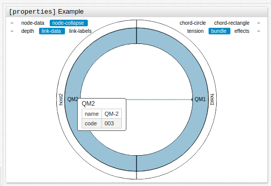
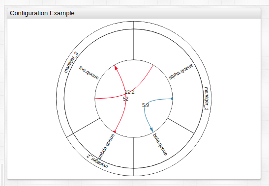
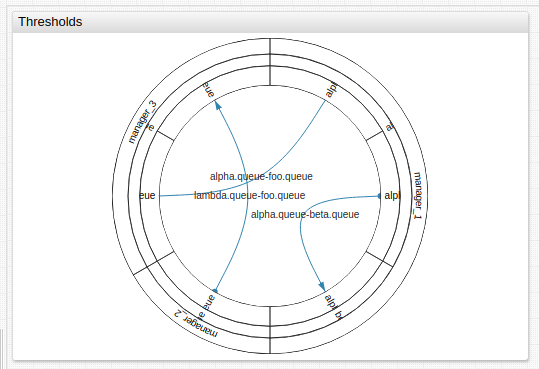

# Graph Widget

## Overview

The **Graph Widget** displays the topology and relationships of servers, virtual machines, and managers alongside corresponding statuses.

```ls
[widget]
  type = graph
  link-data = true
  timespan = 1 year
  metric = uk-air.total_pax_this_period

  [node]
    id = HEATHROW
  [node]
    id = GLASGOW
  [node]
    id = MANCHESTER
```


[](https://apps.axibase.com/chartlab/00e6e2b6)

## Widget Settings

* The settings apply to the `[widget]` section.
* [Shared](../shared/README.md#widget-settings) `[widget]` settings are inherited.

Name | Description | &nbsp;
:--|:--|:--
<a name="mode"></a>[`mode`](#mode)|Determines the overall look of the widget.<br>Possible values: `hierarchy`, `non-hierarchy`.<br>Default value: `non-hierarchy`.<br>**Example**: `mode = hierarchy`| [↗](https://apps.axibase.com/chartlab/5d36563f)
<a name="layout"></a>[`layout`](#layout)| Widget layout in `non-hierarchy` mode.<br>Possible values: `circle`, `rectangle`.<br>Default value: `circle`.<br>**Example**: `layout = rectangle`|[↗](https://apps.axibase.com/chartlab/22757262)
<a name="tension"></a>[`tension`](#tension)|Edge degree curvature.<br>Corresponds to the parameter `C` in the formula for the cardinal spline.<br>Possible values: `0` (straight line) to `1`.<br>Default value: `0.9`.<br>**Example**: `tension = 0.33`| [↗](https://apps.axibase.com/chartlab/9014f8fa)
<a name="duration"></a>[`duration`](#duration)|The duration of a animation during graph geometry change, in milliseconds.<br>Default value: `1000`.<br>**Example**: `duration = 1500`|[↗](https://apps.axibase.com/chartlab/9f9642b3)
<a name="arrows"></a>[`arrows`](#arrows)| Arrows on directed edges<br>Possible values: `false`, `true`.<br>Default value: `false`.<br>**Example**: `arrows = true`|[↗](https://apps.axibase.com/chartlab/6aadc44d)
<a name="node-connect"></a>[`node-connect`](#node-connect)|Connect vertices on the perimeter<br>Possible values: `false`, `true`.<br>Default value: `true`.<br>**Example**: `node-connect = false`|[↗](https://apps.axibase.com/chartlab/013991de)
<a name="link-thresholds"></a>[`link-thresholds`](#link-thresholds)|Threshold for time series attached to the edges.<br>Supports both JavaScript and `percentile` functions.<br>**Example**: `link-thresholds = percentile(50), percentile(75), percentile(95)`|[↗](https://apps.axibase.com/chartlab/0db82ce6)
<a name="link-colors"></a>[`link-colors`](#link-colors)| Color to indicate the threshold of time series.<br>Attached to the edges and separated by commas.<br>**Example**: `link-colors = red, yellow, green`|[↗](https://apps.axibase.com/chartlab/37ca684a)
<a name="link-widths"></a>[`link-widths`](#link-widths)|Width to indicate the thresholds of the time series tied to the edges and separated by commas or spaces.<br>**Example**: `link-widths = 5`|[↗](https://apps.axibase.com/chartlab/5440ef8a)
<a name="node-thresholds"></a>[`node-thresholds`](#node-thresholds)|Threshold for time series tied to vertices.<br>Supports JavaScript, `percentile` functions, or can be set as an array.<br>**Example**: `node-thresholds = percentile(10), percentile(50), percentile(95)`|[↗](https://apps.axibase.com/chartlab/ef4bb318)
<a name="node-colors"></a>[`node-colors`](#node-colors)| Color to indicate the threshold of time series that are bound to vertices and separated by commas.<br>**Example**: `node-colors = red, yellow, green`|[↗](https://apps.axibase.com/chartlab/fe1ab0cb)
<a name="node-radiuses"></a>[`node-radiuses`](#node-radiuses)|Radii of the lighting for the display of the time series thresholds linked to the vertices and separated by commas or spaces.<br>**Example**: ``|[↗](https://apps.axibase.com/chartlab/ef869af2)
<a name="node-radius"></a>[`node-radius`](#node-radius)|Radius of the vertex in pixels.<br>Not valid in `hierarchy` mode.<br>**Example**: `node-radius = 10`|[↗](https://apps.axibase.com/chartlab/d93d35a7)
<a name="padding"></a>[`padding`](#padding)|Offset from the edge of the container in pixels.<br>**Example**: `padding = 50`|[↗](https://apps.axibase.com/chartlab/4dd7594d)
<a name="disconnected-node-display"></a>[`disconnected-node-display`](#disconnected-node-display)|Show vertices without edge.<br>Possible values: `false`, `true`.<br>Default value: `true`.<br>**Example**: `disconnected-node-display = false`|[↗](https://apps.axibase.com/chartlab/5446e321)
<a name="node-labels"></a>[`node-labels`](#node-labels)|Display vertex labels.<br>Possible values: `false`, `true`.<br>Default value: `false`.<br>**Example**: `node-labels = false`|[↗](https://apps.axibase.com/chartlab/544d0dca)
<a name="link-labels"></a>[`link-labels`](#link-labels)|Display edge labels.<br>Possible values: `false`, `true`.<br>Default value: `false`.<br>**Example**: `link-labels = true`|[↗](https://apps.axibase.com/chartlab/0d07fa1d)
<a name="link-data"></a>[`link-data`](#link-data)|Series last value next to the `link-label`.<br>**Example**: `link-data = true`|[↗](https://apps.axibase.com/chartlab/425fd03b)
<a name="link-color-range"></a>[`link-color-range`](#link-color-range)|Color scheme for `link-threshold`.<br>Possible settings: `red`, `blue`, `black`. <br>**Example**: `link-color-range = red`|[↗](https://apps.axibase.com/chartlab/341dbf95)
<a name="link-label-zoom-threshold"></a>[`link-label-zoom-threshold`](#link-label-zoom-threshold)|Parameter value is a value of scale when labels appear based on edge threshold.<br>`value > 1`: Labels appear on zoom in.<br>**Example**: `link-label-zoom-threshold = 2`|[↗](https://apps.axibase.com/chartlab/6a523bda)
<a name="node-label-zoom-threshold"></a>[`node-label-zoom-threshold`](#node-label-zoom-threshold)|Parameter value is a value of scale when labels appear based on vertex threshold.<br>`value > 1`: Labels appear on zoom in.<br>**Example**: `node-label-zoom-threshold = 2`|[↗](https://apps.axibase.com/chartlab/60ebf1e7)
<a name="auto-padding"></a>[`auto-padding`](#auto-padding)|Add padding if labels overflow container.<br>Possible values: `false`, `true`.<br>Default value: `true`.<br>**Example**: `auto-padding = false`|[↗](https://apps.axibase.com/chartlab/c1fa0bc2)
<a name="link-width-order"></a>[`link-width-order`](#link-width-order)|Sort links according to their width.<br> Possible values: `top`, `bottom`, `undefined`.<br>Default value: `undefined`.<br>**Example**: `link-width-order = top`|[↗](https://apps.axibase.com/chartlab/ad3a2781)

### Controls

Name | Description | &nbsp;
:--|:--|:--
<a name="node-data"></a>[`node-data`](#node-data)|Show or hide time series last value information next to the corresponding image of the vertices.<br>Possible values: `false`, `true`.<br>**Example**: `data = true`|[↗](https://apps.axibase.com/chartlab/d972a5e3)
<a name="depth"></a>[`depth`](#depth)|Set the depth of the displayed vertex hierarchy.<br>Specify a value from `1` to a maximum height of the vertex tree plus `1`, the last level corresponds to the edges.<br>Possible values: Number.<br>Default value: Equal to the height of the displayed vertex tree.<br>**Example**: `depth = 3`|[↗](https://apps.axibase.com/chartlab/682a03bd)
<a name="bundle"></a>[`bundle`](#bundle)|Hierarchical contraction of edges ([Danny Holten](https://www.researchgate.net/publication/6715561_Hierarchical_Edge_Bundles_Visualization_of_Adjacency_Relations_in_Hierarchical_Data) algorithm).<br>Possible values: `false`, `true`.<br>Default value: `true`.<br>**Example**: `bundle = false`| [↗](https://apps.axibase.com/chartlab/aabc20b6)
<a name="effects"></a>[`effects`](#effects)|Animation when changing the geometry of the graph.<br>Possible values: `false`, `true`.<br>Default value: `false`.<br>**Example**: `effects = true`|[↗](https://apps.axibase.com/chartlab/ee78f08e)
<a name="node-collapse"></a>[`node-collapse`](#node-collapse)|Collapse sector peaks when clicked.<br>Possible values: `false`, `true`.<br>Default value: `true`.<br>**Example**: `node-collapse = true`|[↗](https://apps.axibase.com/chartlab/e393e0b7)
<a name="link-animate"></a>[`link-animate`](#link-animate)|Animation of directed edges.<br>Possible values: `false`, `true`.<br>Default value: `false`.<br>**Example**: `link-animate = true`|[↗](https://apps.axibase.com/chartlab/12c5b90f)

## Node Settings

* The settings apply to the `[node]` section.

Name | Description | &nbsp;
:--|:--|:--
<a name="id"></a>[`id`](#id)|**Required** Unique name of the vertex.<br>**Example**: `id = HEATHROW`|[↗](https://apps.axibase.com/chartlab/0a96b61c)
<a name="parent"></a>[`parent`](#parent)|ID of parent vertex.<br>**Example**: `parent = HEATHROW`|[↗](https://apps.axibase.com/chartlab/48b10426)

### Link Settings

* The settings apply to the `[link]` section.

Name | Description | &nbsp;
:--|:--|:--
<a name="id"></a>[`id`](#id) |Unique edge name.<br>**Example**: `id = HEATHROW - GLASGOW` |[↗](https://apps.axibase.com/chartlab/bae6c276)
<a name="nodes"></a>[`nodes`](#nodes) |Vertices connected by an edge.<br> ID of vertices, separated by a comma or hyphen for undirected edges, `-}` or `{-` for directed edges.<br> If vertex ID contains a hyphen, it must be shielded using `""` double quotes.<br>**Example**: `nodes = HEATHROW-MANCHESTER` |[↗](https://apps.axibase.com/chartlab/67ffe142)
<a name="series"></a>[`series`](#series)| `alias` of time series associated with the edge.<br>**Example**: `series = s1`|[↗](https://apps.axibase.com/chartlab/81319892)
<a name="tooltip"></a>[`tooltip`](#tooltip)|Link tooltip.<br>**Example**: `tooltip = Passenger Information`|[↗](https://apps.axibase.com/chartlab/e6c001e9)
<a name="label"></a>[`label`](#label) |Label text.<br>Default value: `element-id`.<br>**Example**: `label = Airport Usage`|[↗](https://apps.axibase.com/chartlab/6712e2bd)

### Series Settings

* The settings apply to the `[series]` section.
* [Shared](../shared/README.md#series-settings) `[series]` settings are inherited.

Name | Description | &nbsp;
:--|:--|:--
<a name="links"></a>[`links`](#links)|List of edges associated with this series is defined by an ID or edge ID of the corresponding vertices with a hyphen.<br> When edge ID contains a hyphen, it must be shielded with `""` double quotes.<br>**Example**: `links = HEATHROW - MANCHESTER`|[↗](https://apps.axibase.com/chartlab/46cda821)
<a name="node-alert-style"></a>[`node-alert-style`](#node-alert-style) | Style of vertices when [`alert-expression`](../shared/README.md#alert-expression) is `true`.<br>**Example**: `node-alert-style = fill: red`|[↗](https://apps.axibase.com/chartlab/1dc8957c)
<a name="link-alert-style"></a>[`link-alert-style`](#link-alert-style)|Style of edges when [`alert-expression`](../shared/README.md#alert-expression) is `true`.<br>**Example**: `link-alert-style = stroke: red`|[↗](https://apps.axibase.com/chartlab/e955ff68)

### Properties Settings

* The settings apply to the `[property]` section.
* In `[node]` or `[series]` section, define properties displayed on mouseover.
* If a value contains `=` or `\` escape them with a backslash: `\=` or `\\`, respectively.
* Use the `>` context setting displayed in the tooltip before the `[properties]` tooltip table.
  * Within the `>` context setting, create a table using standard HTML parameters: `>` table class, `tbody`, `tr`, `td`.

```ls
[properties]
  name = QM-2
  code = 003
```



[](https://apps.axibase.com/chartlab/c38cf147)

## Examples

### Structure

The structure of the graph is defined by the description of its vertices and edges. Use [`[node]`](#node-settings) settings to describe each vertex, and define the hierarchy of vertices with the [`parent`](#parent) setting, which sets the predecessor. Use [`[link]`](#link-settings) settings to describe the edges. Adjacent edges, with vertices, are determined by `[node]` settings.

Link series to edges or vertices by indicating the `alias` in the series parameter of `[link]` or `[node]` settings. Alternatively, list the loaded edges or vertices in the links or nodes of the [`[series]`](#series-settings) settings.


[](https://apps.axibase.com/chartlab/46b84848)

## Alert Expression

In the event of an [`alert-expression`](../shared/README.md#alert-expression) response on the time series of the vertex or edge to which the time series is tied. [`alert-style`](../shared/README.md#alert-style) setting value can be either string or script. If `alert-style` is script, the variable alert is available, and it is equal to the value that the alert returns. The following styles are applied (in a specified order) in the parameters below:

### Example Syntax

```ls
/* Modify stroke width of series line on alert */
link-alert-style = if (alert > 99) return 'stroke-width:3px';

/* modify color of node on alert */
node-alert-style = if (alert > 99) return 'fill:red';
```

### Configuration Example 2



[](https://apps.axibase.com/chartlab/4184f86f)

## Thresholds

Set thresholds for time series which are tied to vertices or edges using [`link-thresholds`](#link-thresholds) or [`node-thresholds`](#node-thresholds) parameters in [`[widget]`](#widget-settings) settings.

Color and width parameters are applied to the edge and vertices based on [`link-widths`](#link-widths) and [`link-colors`](#link-colors), additionally [`node-radiuses`](#node-radiuses) and [`node-colors`](#node-colors) in [`[widget]`](#widget-settings) settings.

[`alert-expression`](../shared/README.md#alert-expression) styles are superimposed over threshold styles.



[](https://apps.axibase.com/chartlab/09d4bf2b)
